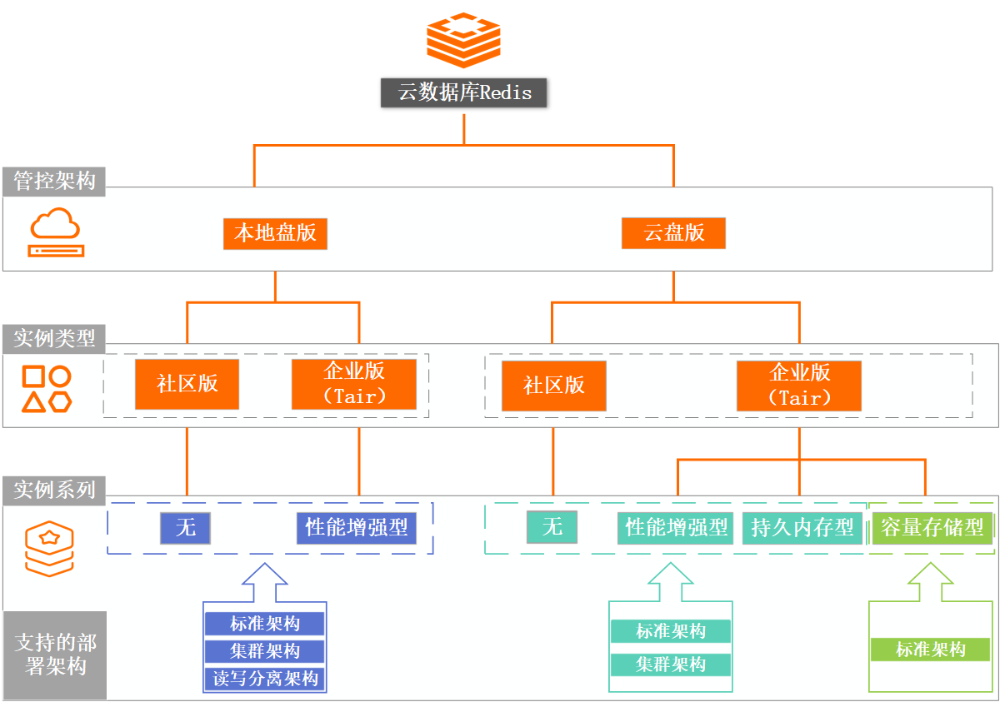
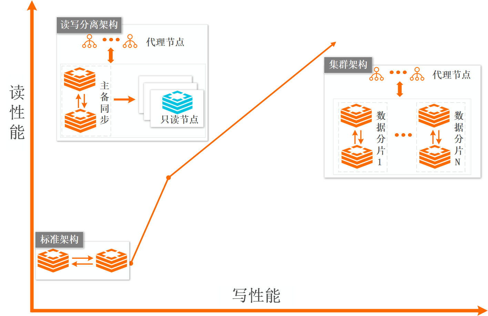
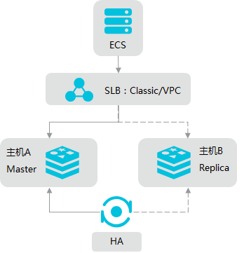
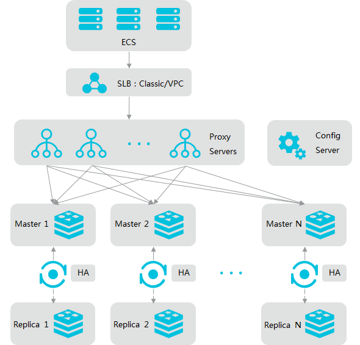
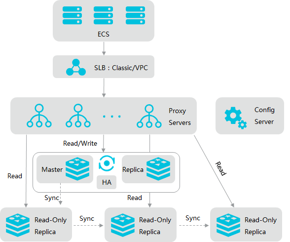
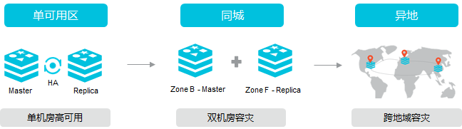

# redis-aliyun 

云数据库Redis版（ApsaraDB for Redis）是兼容开源Redis协议标准、提供混合存储的数据库服务，基于双机热备架构及集群架构，可满足高吞吐、低延迟及弹性变配等业务需求。

## 为什么选择云数据库Redis版

-   硬件部署在云端，提供完善的基础设施规划、网络安全保障和系统维护服务，您可以专注于业务创新。
-   支持String（字符串）、List（链表）、Set（集合）、Sorted Set（有序集合）、Hash（哈希表）、Stream（流数据）等多种数据结构，同时支持Transaction（事务）、Pub/Sub（消息订阅与发布）等高级功能。
-   在社区版的基础上推出企业级缓存服务产品，提供\*性能增强型、持久内存型、容量存储型\*供您选择。

Redis企业版作为云数据库Redis社区版的基础上开发的强化版Redis服务，从访问延时、持久化需求、整体成本这三个核心维度考量，基于DRAM、NVM和ESSD云盘等存储介质，推出了多种不同形态的产品，为您提供更强的性能、更多的数据结构和更灵活的存储方式，满足不同场景下的业务需求。

-   性能增强型：采用多线程模型，集成阿里巴巴Tair的部分特性，支持多种Tair数据结构，对于部分特殊业务有很高的适用性。
-   持久内存型：基于Intel傲腾™持久内存，为您提供大容量、兼容Redis的内存数据库产品。数据持久化不依赖传统磁盘，保证每个操作持久化的同时提供近乎Redis社区版的吞吐和延时，极大提升业务数据可靠性。
-   容量存储型：基于云盘ESSD研发，兼容Redis核心数据结构与接口，可提供大容量、低成本、强持久化的数据库服务，适用于兼容Redis、需要大容量且较高访问性能的温冷数据存储场景。

## 选型

当前云数据库Redis的本地盘实例功能较为完整，云盘版实例为云原生基础架构，支持集群无感扩缩容，可通过自定义分片数量的方式来实现扩缩容，未来会以云盘版为主要演进方向，详细对比如下。

## 选择系列

性能增强型：以性能为中心的关键业务场景。

-   性能增强型采用多线程模型，性能约为同规格社区版实例的3倍。
-   性能增强型提供多种增强型数据结构模块（modules），包括TairString（含CAS和CAD命令）、TairHash、TairGIS、TairBloom、TairDoc、TairZset和TairRoaring，使业务无需再关心存储的结构和时效性，能够极大提升业务开发效率。
-   超高兼容性：100%兼容原生Redis，无需修改业务代码。
-   支持诸多企业级特性：通过数据闪回按时间点恢复数据、代理查询缓存、全球分布式缓存等。

持久内存型：需要高性能且高数据持久化要求，且成本作为次要考虑因素的数据缓存与存储场景。

-   超高性价比：相同容量下对比Redis社区版，价格降低30%左右，性能可达原生Redis的90%。
-   掉电数据不丢失：强大的命令级持久化保障，每个写操作持久化成功后返回，可将其作为内存数据库（非缓存）使用。
-   大规格优化：解决大规格下执行AOF重写调用fork引起的延时抖动等问题。
-   高兼容性：兼容绝大部分原生Redis的数据结构和命令。

容量存储型：大存储、低访问密度、低访问延迟要求，且成本作为首要考虑因素的数据存储场景。

-   低成本：最低为Redis社区版的15%。
-   云盘存储：数据分布在ESSD云盘，容量可达百TB级别，拥有高数据可靠性。
-   大规格优化：解决了原生Redis固有的fork问题而预留部分内存的问题。
-   高兼容性：兼容大部分原生Redis的数据结构和命令。

## 部署架构

**标准架构**

架构：采用主从（master-replica）双副本架构，由主节点提供日常服务访问，备节点提供高可用。当主节点发生故障，系统会自动在30秒内切换至备节点，保障业务平稳运行。

场景：对Redis协议兼容性要求较高的业务。将Redis作为持久化数据存储使用的业务。单个Redis性能压力可控的场景。Redis命令相对简单，排序和计算之类的命令较少的场景。

**集群架构**

架构：由代理节点、数据分片和配置服务器组件构成，可通过增加数据分片的方式实现横向扩展。每个数据分片均为双副本（分别部署在不同机器上）高可用架构，主节点发生故障后，系统会自动进行主备切换保证服务高可用。

场景：数据量较大的场景。整体读写请求的QPS压力较大的场景。吞吐密集型、高性能应用场景。

**读写分离架构**

架构：由代理节点、主从节点和只读节点构成。只读节点采取链式复制架构，扩展只读节点个数可使整体实例性能呈线性增长。

架构：读请求QPS压力较大的场景（如热点数据集中）。对Redis协议兼容性要求较高的业务场景，例如规避集群架构的使用限制。

**说明**

由于数据同步至只读节点存在一定延迟，不适用于数据一致性要求高的场景，可选用集群架构。

## 容灾方案

## 优势

**安全防护**

事前防护：

-   VPC网络隔离。
-   白名单控制访问。
-   自定义账号与权限。

事中保护：SSL加密访问。

事后审计：审计日志。

**备份恢复**

企业版（性能增强型）支持数据闪回功能，可以恢复指定时间点的数据。

**运维管理**

-   支持十余组监控指标，最小监控粒度为5秒。
-   支持报警设置。
-   可根据需求创建多种架构的实例，支持变配到其它架构和规格。
-   提供基于快照的大key分析功能，精度高，无性能损耗。

**部署和扩容**

即时开通，弹性扩容。

**高可用**

-   单可用区高可用方案。
-   同城容灾方案。
-   高可用性由独立的中心化模块保障，决策效率高且稳定，不会出现脑裂（split brain）现象。

**内核优化**

-   企业版提供多线程的增强性能实例，性能为同规格标准版实例的3倍。
-   企业版提供容量存储型和持久内存型实例，支持大容量存储和命令级别持久化。

## 性能与监控

CloudDBA的性能趋势功能可以监控Redis实例在某个时间段的基础性能及其运行趋势，包括CPU使用率、使用内存量、QPS（每秒访问次数）、总连接数、响应时间、网络流量、Key命中信息等。

## 禁用高风险命令

您可以在控制台上通过设置`#no~loosedisabled~-commands`参数来禁用一些可能影响Redis服务性能、危害数据安全的命令。

在业务场景中，无限制地允许命令使用可能带来诸多问题。一些Redis命令会直接清空大量甚至全部数据，例如*flushall*、*flushdb*等；*keys*、*hgetall*等命令的不当使用则会阻塞单线程的Redis服务，降低Redis服务的性能。

为保障业务稳定、高效率地运行，您可以根据实际情况禁用特定的命令，降低业务风险。

## 排查Redis实例CPU使用率高的问题

**查找并禁用高消耗命令**

Redis实例的CPU使用率升高会影响整体的吞吐量和应用的响应速度，极端情况下甚至会导致应用不可用。当平均CPU使用率高于50%、连续5分钟内的CPU平均峰值使用率高于90%时，您需要及时关注并排查该问题，以保障应用的稳定运行。

高消耗命令：即时间复杂度为O(N)或更高的命令。通常情况下，命令的时间复杂度越高，在执行时会消耗较多的资源，从而导致CPU使用率上升。

审计日志功能会记录对Redis数据执行的修改和删除操作信息，通过分析指定时间段内的命令及趋势，可帮助您找出高消耗的命令。

慢日志功能会记录执行超过指定时间阈值的命令，通过分析慢日志的语句和执行时长可帮助您找出高消耗命令。

评估并禁用高风险命令和高消耗命令，例如*FLUSHALL*、*KEYS*、*HGETALL*等

**优化热点Key**

启用代理查询缓存功能（Proxy Query Cache），代理节点会缓存热点Key对应的请求和查询结果，当在有效时间内收到同样的请求时直接返回结果至客户端，无需和后端的数据分片交互，可改善对热点Key的发起大量读请求导致的访问倾斜。

在分析相应节点的慢日志和审计日志的基础上，再分析各节点的热点Key，从而消除或缓解热点Key。

**优化短连接**

频繁地建立连接，导致Redis实例的大量资源消耗在连接处理上。具体表现为CPU使用率较高，连接数较高，但QPS（每秒访问次数）未达到预期的情况。

解决方法：

将短连接调整为长连接，例如使用JedisPool连接池连接。具体操作，请参见Jedis客户端。

调整实例为性能增强型（具备短连接优化特性）。

**关闭AOF**

现象：

Redis实例默认开启了AOF（append-only file），当实例处于高负载状态时，频繁地执行AOF会一定程度上导致CPU使用率升高。

解决方法：

在业务允许的前提下，您可以考虑关闭持久化。另外将Redis数据备份时间设定到低访问/维护时间窗口内，降低影响。

## 排查Redis实例内存使用率高的问题

云数据库Redis可提供高效的数据库服务，当内存不足时，可能导致Key频繁被逐出、响应时间上升、QPS（每秒访问次数）不稳定等问题，进而影响业务运行。通常情况下，当内存使用率超过95%时需要及时关注。

**步骤一：分析内存使用情况**

1.  查询指定时段的内存使用率信息
2.  查询历史累计逐出的Key总数和命令的最大时延，分析是否呈现明显的上升趋势。
3.  当Redis的内存使用率不符合预期时，可执行下述步骤详细分析内存使用情况
    1.  在Redis命令行中，执行*MEMORY STATS*命令查询内存使用详情
    2.  在Redis命令行中，执行*MEMORY USAGE*命令查询指定Key消耗的内存（单位为字节）。
    3.  在Redis命令行中，执行*MEMORY DOCTOR*命令获取内存诊断建议。

**步骤二：优化内存使用率**

1.  查询现有的Key是否符合业务预期，及时清理无用的Key。
2.  通过缓存分析功能，分析大Key分布和Key的TTL过期策略。
3.  根据业务需求，设置合理的过期Key主动删除的执行频率（即调整*hz*参数的值）
4.  根据业务需求，设置合理的过期Key主动删除的执行频率（即调整*hz*参数的值）

## 排查Redis实例流量使用率高的问题

Redis实例作为更靠近应用服务的数据层，通常会执行较多的数据存取并消耗网络带宽。不同的实例规格对应的最大带宽有所不同，当超过该规格的最大带宽时，将对应用服务的数据访问性能造成影响。

**步骤一：查询流量使用率**

查询实例在指定时段的流量使用率。

**步骤二：优化流量使用率**

1.  调整实例的带宽，降低对业务的影响并获得较长的时间窗口来排查问题。

**说明**

您也可以开启带宽弹性伸缩，当带宽使用率达到阈值后会自动增加或减少实例的带宽，帮助您轻松应对突发或计划中的流量高峰，专注于业务提升。

1.  当业务的访问量与预期带宽消耗不匹配，例如流量使用率的增长趋势和QPS的增长趋势明显不一致。您可以通过缓存分析功能，发现实例中存在的大Key。

对大Key（通常大于10 KB）进行优化，例如将大Key拆分、减少对大Key的访问、删除不必要的大Key等。

1.  对于集群架构的企业版（性能增强型）实例，可开启代理查询缓存功能（Proxy Query Cache）以应对因热点Key引发的流量过大或倾斜的问题。

2.  \*可选：\*对于集群架构的实例，可使用直连模式来应对业务上的网络超大流量。

3.  经过上述步骤优化后，流量使用率依旧较高，可评估升级至更大内存的规格，以承载更大的网络流量。

## 大Key和热Key

大Key

通常以Key的大小和Key中成员的数量来综合判定，例如：

-   Key本身的数据量过大：一个String类型的Key，它的值为5 MB。
-   Key中的成员数过多：一个ZSET类型的Key，它的成员数量为10,000个。
-   Key中成员的数据量过大：一个Hash类型的Key，它的成员数量虽然只有1,000个但这些成员的Value（值）总大小为100MB。

热Key

通常以其接收到的Key被请求频率来判定，例如：

-   QPS集中在特定的Key：Redis实例的总QPS（每秒查询率）为10,000，而其中一个Key的每秒访问量达到了7,000。
-   带宽使用率集中在特定的Key：对一个拥有上千个成员且总大小为1 MB的HASH Key每秒发送大量的*HGETALL*操作请求。
-   CPU使用时间占比集中在特定的Key：对一个拥有数万个成员的Key（ZSET类型）每秒发送大量的*ZRANGE*操作请求。

为更好地改善对热点Key的发起大量读请求导致的访问倾斜，云数据库Redis新增代理查询缓存功能（Proxy Query Cache），启用该功能后，代理节点会缓存热点Key对应的请求和查询结果，当在有效时间内收到同样的请求时直接返回结果至客户端，无需和后端的数据分片交互。
