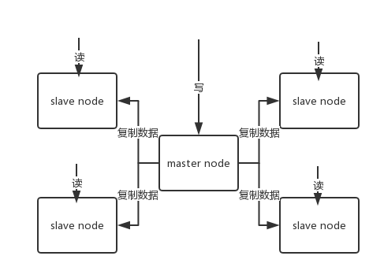
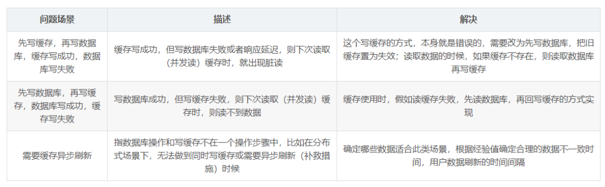

# redis-qa

## 什么是Redis

Redis(Remote Dictionary Server) 是一个使用 C语言编写的，开源的（BSD许可）高性能非关系型（NoSQL）的键值对数据库。

Redis可以存储键和五种不同类型的值之间的映射。键的类型只能为字符串，值支持五种数据类型：字符串、列表、集合、散列表、有序集合。

与传统数据库不同的是 Redis的数据是存在内存中的，所以读写速度非常快，因此 redis被广泛应用于缓存方向，每秒可以处理超过10万次读写操作，是已知性能最快的Key-Value DB。另外，Redis 也经常用来做分布式锁。除此之外，Redis 支持事务、持久化、LUA脚本、LRU驱动事件、多种集群方案。

## Redis有哪些优缺点

优点

-   读写性能优异， Redis能读的速度是110000次/s，写的速度是81000次/s。
-   支持数据持久化，支持AOF和RDB两种持久化方式。
-   支持事务，Redis的所有操作都是原子性的，同时Redis还支持对几个操作合并后的原子性执行。
-   数据结构丰富，除了支持string类型的value外还支持hash、set、zset、list等数据结构。
-   支持主从复制，主机会自动将数据同步到从机，可以进行读写分离。

缺点

-   数据库容量受到物理内存的限制，不能用作海量数据的高性能读写，因此Redis适合的场景主要局限在较小数据量的高性能操作和运算上。
-   Redis 不具备自动容错和恢复功能，主机从机的宕机都会导致前端部分读写请求失败，需要等待机器重启或者手动切换前端的IP才能恢复。
-   主机宕机，宕机前有部分数据未能及时同步到从机，切换IP后还会引入数据不一致的问题，降低了系统的可用性。
-   Redis 较难支持在线扩容，在集群容量达到上限时在线扩容会变得很复杂。为避免这一问题，运维人员在系统上线时必须确保有足够的空间，这对资源造成了很大的浪费。

## Redis为什么这么快

1. 完全基于内存，绝大部分请求是纯粹的内存操作，非常快速。数据存在内存中，类似于HashMap，HashMap 的优势就是查找和操作的时间复杂度都是O(1)；
2. 据结构简单，对数据操作也简单，Redis 中的数据结构是专门进行设计的；
3. 采用单线程，避免了不必要的上下文切换和竞争条件，也不存在多进程或者多线程导致的切换而消耗CPU，不用去考虑各种锁的问题，不存在加锁释放锁操作，没有因为可能出现死锁而导致的性能消耗；
4. 使用多路 I/O 复用模型，非阻塞 IO；
5. 使用底层模型不同，它们之间底层实现方式以及与客户端之间通信的应用协议不一样，Redis直接自己构建了 VM 机制，因为一般的系统调用系统函数的话，会浪费一定的时间去移动和请求；

## 什么是Redis持久化？Redis有哪几种持久化方式？优缺点是什么？

持久化就是把内存的数据写到磁盘中去，防止服务宕机了内存数据丢失。

Redis 提供了两种持久化方式:RDB（默认）和AOF

## Redis的过期键的删除策略

我们都知道，Redis是key-value数据库，我们可以设置Redis中缓存的key的过期时间。Redis的过期策略就是指当Redis中缓存的key过期了，Redis如何处理。

过期策略通常有以下三种：

-   定时过期：每个设置过期时间的key都需要创建一个定时器，到过期时间就会立即清除。该策略可以立即清除过期的数据，对内存很友好；但是会占用大量的CPU资源去处理过期的数据，从而影响缓存的响应时间和吞吐量。
-   惰性过期：只有当访问一个key时，才会判断该key是否已过期，过期则清除。该策略可以最大化地节省CPU资源，却对内存非常不友好。极端情况可能出现大量的过期key没有再次被访问，从而不会被清除，占用大量内存。
-   定期过期：每隔一定的时间，会扫描一定数量的数据库的expires字典中一定数量的key，并清除其中已过期的key。该策略是前两者的一个折中方案。通过调整定时扫描的时间间隔和每次扫描的限定耗时，可以在不同情况下使得CPU和内存资源达到最优的平衡效果。

(expires字典会保存所有设置了过期时间的key的过期时间数据，其中，key是指向键空间中的某个键的指针，value是该键的毫秒精度的UNIX时间戳表示的过期时间。键空间是指该Redis集群中保存的所有键。)

Redis中同时使用了惰性过期和定期过期两种过期策略。

## Redis的内存淘汰策略有哪些

Redis的内存淘汰策略是指在Redis的用于缓存的内存不足时，怎么处理需要新写入且需要申请额外空间的数据。

全局的键空间选择性移除

-   noeviction：当内存不足以容纳新写入数据时，新写入操作会报错。
-   allkeys-lru：当内存不足以容纳新写入数据时，在键空间中，移除最近最少使用的key。（这个是最常用的）
-   allkeys-random：当内存不足以容纳新写入数据时，在键空间中，随机移除某个key。

设置过期时间的键空间选择性移除

-   volatile-lru：当内存不足以容纳新写入数据时，在设置了过期时间的键空间中，移除最近最少使用的key。
-   volatile-random：当内存不足以容纳新写入数据时，在设置了过期时间的键空间中，随机移除某个key。
-   volatile-ttl：当内存不足以容纳新写入数据时，在设置了过期时间的键空间中，有更早过期时间的key优先移除。

**总结**

Redis的内存淘汰策略的选取并不会影响过期的key的处理。内存淘汰策略用于处理内存不足时的需要申请额外空间的数据；过期策略用于处理过期的缓存数据。

## Redis 主从架构

单机的 redis，能够承载的 QPS大概就在上万到几万不等。对于缓存来说，一般都是用来支撑读高并发的。因此架构做成主从(master-slave)架构，一主多从，主负责写，并且将数据复制到其它的
slave节点，从节点负责读。所有的读请求全部走从节点。这样也可以很轻松实现水平扩容，支撑读高并发。

redis-master-slave

redis replication -> 主从架构 -> 读写分离 -> 水平扩容支撑读高并发

redis replication 的核心机制

-   redis 采用异步方式复制数据到 slave 节点，不过 redis2.8 开始，slave node 会周期性地确认自己每次复制的数据量；
-   一个 master node 是可以配置多个 slave node 的；
-   slave node 也可以连接其他的 slave node；
-   slave node 做复制的时候，不会 block master node 的正常工作；
-   slave node 在做复制的时候，也不会 block 对自己的查询操作，它会用旧的数据集来提供服务；但是复制完成的时候，需要删除旧数据集，加载新数据集，这个时候就会暂停对外服务了；
-   slave node 主要用来进行横向扩容，做读写分离，扩容的 slave node 可以提高读的吞吐量。

注意，如果采用了主从架构，那么建议必须开启 master node的持久化，不建议用 slave node 作为 master node的数据热备，因为那样的话，如果你关掉 master 的持久化，可能在 master 宕机重启的时候数据是空的，然后可能一经过复制， slave node 的数据也丢了。

另外，master的各种备份方案，也需要做。万一本地的所有文件丢失了，从备份中挑选一份 rdb去恢复master，这样才能确保启动的时候，是有数据的，即使采用了后续讲解的高可用机制，slave node 可以自动接管 master node，但也可能 sentinel 还没检测到 masterfailure，master node 就自动重启了，还是可能导致上面所有的 slave node数据被清空。

## 使用过Redis分布式锁么，它是怎么实现的？

先拿setnx来争抢锁，抢到之后，再用expire给锁加一个过期时间防止锁忘记了释放。

**如果在setnx之后执行expire之前进程意外crash或者要重启维护了，那会怎么样？**

set指令有非常复杂的参数，这个应该是可以同时把setnx和expire合成一条指令来用的！

## 缓存穿透

一般的缓存系统，都是按照key去缓存查询，如果不存在对应的value，就应该去后端系统查找（比如DB）。一些恶意的请求会故意查询不存在的key,请求量很大，就会对后端系统造成很大的压力。这就叫做缓存穿透。

如何避免？

1：对查询结果为空的情况也进行缓存，缓存时间设置短一点，或者该key对应的数据insert了之后清理缓存。

2：对一定不存在的key进行过滤。可以把所有的可能存在的key放到一个大的Bitmap中，查询时通过该bitmap过滤。

## 缓存雪崩

当缓存服务器重启或者大量缓存集中在某一个时间段失效，这样在失效的时候，会给后端系统带来很大压力。导致系统崩溃。

如何避免？

1：在缓存失效后，通过加锁或者队列来控制读数据库写缓存的线程数量。比如对某个key只允许一个线程查询数据和写缓存，其他线程等待。
2：做二级缓存，A1为原始缓存，A2为拷贝缓存，A1失效时，可以访问A2，A1缓存失效时间设置为短期，A2设置为长期
3：不同的key，设置不同的过期时间，让缓存失效的时间点尽量均匀。

## 缓存击穿

缓存击穿是指缓存中没有但数据库中有的数据（一般是缓存时间到期），这时由于并发用户特别多，同时读缓存没读到数据，又同时去数据库去取数据，引起数据库压力瞬间增大，造成过大压力。和缓存雪崩不同的是，缓存击穿指并发查同一条数据，缓存雪崩是不同数据都过期了，很多数据都查不到从而查数据库。

解决方案

1.  设置热点数据永远不过期。
2.  加互斥锁

## 缓存预热

缓存预热就是系统上线后，将相关的缓存数据直接加载到缓存系统。这样就可以避免在用户请求的时候，先查询数据库，然后再将数据缓存的问题！用户直接查询事先被预热的缓存数据！

解决方案

1.  直接写个缓存刷新页面，上线时手工操作一下；
2.  数据量不大，可以在项目启动的时候自动进行加载；
3.  定时刷新缓存；

## 如何保证缓存与数据库双写时的数据一致性？

你只要用缓存，就可能会涉及到缓存与数据库双存储双写，你只要是双写，就一定会有数据一致性的问题，那么你如何解决一致性问题？

一般来说，就是如果你的系统不是严格要求缓存+数据库必须一致性的话，缓存可以稍微的跟数据库偶尔有不一致的情况，最好不要做这个方案，读请求和写请求串行化，串到一个内存队列里去，这样就可以保证一定不会出现不一致的情况

串行化之后，就会导致系统的吞吐量会大幅度的降低，用比正常情况下多几倍的机器去支撑线上的一个请求。

还有一种方式就是可能会暂时产生不一致的情况，但是发生的几率特别小，就是\*先更新数据库，然后再删除缓存。\*

## keys scan

使用keys指令可以扫出指定模式的key列表。

对方接着追问：如果这个redis正在给线上的业务提供服务，那使用keys指令会有什么问题？

这个时候你要回答redis关键的一个特性：redis的单线程的。keys指令会导致线程阻塞一段时间，线上服务会停顿，直到指令执行完毕，服务才能恢复。这个时候可以使用scan指令，scan指令可以无阻塞的提取出指定模式的key列表，但是会有一定的重复概率，在客户端做一次去重就可以了，但是整体所花费的时间会比直接用keys指令长。
