# redis 

<https://redis.io/docs/>

知识点：

-   计算：使用高keys、lua、通配符等高操作
-   存储：
    -   大key如hash类，会使集群单节点存储出问题
    -   失效时间设置不合理
-   网络: 高并发下value过大导致带宽占满
-   配置和版本：
    -   客户端连接配置小，高并发出现查询延时
    -   gateway限流filter不支持集群版本
-   持久化
    -   RDB
    -   AOF

## redis介绍

### 文件事件处理器（file event handler）

Redis 基于 Reactor 模式开发了自己的网络事件处理器：

这个处理器被称为文件事件处理器（file event handler） 文件事件处理器使用I/O 多路复用（multiplexing）程序来同时监听多个套接字，并根据套接字目前执行的任务来为套接字关联不同的事件处理器。

当被监听的套接字准备好执行连接应答（accept）、读取（read）、写入（write）、关闭（close）等操作时与操作相对应的文件事件就会产生，这时文件事件处理器就会调用套接字之前关联好的事件处理器来处理这些事件。

文件事件处理器以单线程方式运行，但通过使用I/O多路复用程序来监听多个套接字，文件事件处理器既实现了高性能的网络通信模型， 又可以很好地与redis服务器中其他同样以单线程方式运行的模块进行对接， 这保持了Redis内部单线程设计的简单性。

### Redis线程模型

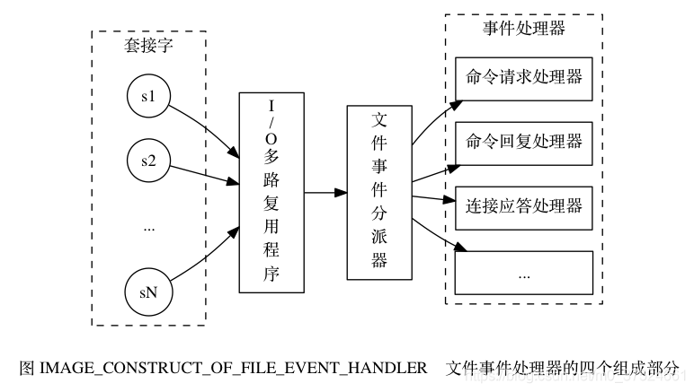

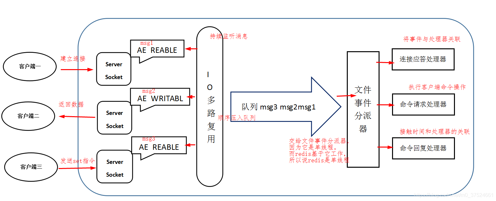

Redis客户端对服务端的每次调用都经历了发送命令，执行命令，返回结果三个过程。其中执行命令阶段，由于Redis是单线程来处理命令的，所有每一条到达服务端的命令不会立刻执行，所有的命令都会进入一个队列中，然后逐个被执行。并且多个客户端发送的命令的执行顺序是不确定的。但是可以确定的是不会有两条命令被同时执行，不会产生并发问题，这就是Redis的单线程基本模型。

### Redis是单线程模型为什么效率还这么高？

1.  纯内存访问：数据存放在内存中，内存的响应时间大约是100纳秒，这是Redis每秒万亿级别访问的重要基础。
2.  非阻塞I/O：Redis采用epoll做为I/O多路复用技术的实现，再加上Redis自身的事件处理模型将epoll中的连接，读写，关闭都转换为了时间，不在I/O上浪费过多的时间。
3.  单线程避免了线程切换和竞态产生的消耗。
4.  Redis采用单线程模型，每条命令执行如果占用大量时间，会造成其他线程阻塞，对于Redis这种高性能服务是致命的，所以Redis是面向高速执行的数据库

## Redis持久化

<https://redis.io/docs/management/persistence/>

持久化就是把内存的数据写到磁盘中去，防止服务宕机了内存数据丢失。

Redis 提供了两种持久化方式:RDB（默认）和AOF

**RDB：**

rdb是Redis DataBase缩写

功能核心函数rdbSave(生成RDB文件)和rdbLoad（从文件加载内存）两个函数

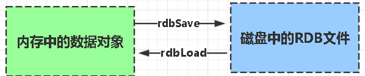

优点：

-    只有一个文件 dump.rdb，方便持久化。
-    容灾性好，一个文件可以保存到安全的磁盘。
-   性能最大化，fork子进程来完成写操作，让主进程继续处理命令，所以是IO最大化。使用单独子进程来进行持久化，主进程不会进行任何IO操作，保证了redis的高性能
-    相对于数据集大时，比AOF的启动效率更高。

缺点：

-   1、数据安全性低。RDB 是间隔一段时间进行持久化，如果持久化之间redis发生故障，会发生数据丢失。所以这种方式更适合数据要求不严谨的时候)
-   2、AOF（Append-only file)持久化方式：是指所有的命令行记录以redis命令请求协议的格式完全持久化存储)保存为 aof 文件。

**AOF:**

Aof是Append-only file缩写

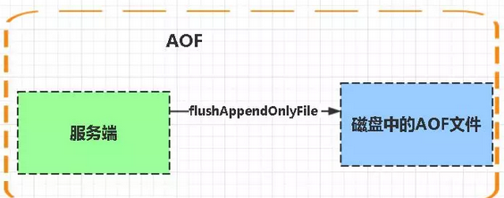

优点：

-    数据安全，aof 持久化可以配置 appendfsync 属性，有always，每进行一次命令操作就记录到aof文件中一次。
-    通过 append 模式写文件，即使中途服务器宕机，可以通过redis-check-aof工具解决数据一致性问题。
-    AOF机制的ewrite模式。AOF 文件没被rewrite 之前（文件过大时会对命令进行合并重写），可以删除其中的某些命令（比如误操作的 flushall）)

缺点：

-    AOF 文件比 RDB 文件大，且恢复速度慢。
-    数据集大的时候，比 rdb 启动效率低。

每当执行服务器(定时)任务或者函数时flushAppendOnlyFile 函数都会被调用，这个函数执行以下两个工作aof写入保存：

-   WRITE：根据条件，将 aof~buf~ 中的缓存写入到 AOF 文件
-   SAVE：根据条件，调用 fsync 或 fdatasync 函数，将 AOF 文件保存到磁盘中。

**存储结构:**

内容是redis通讯协议(RESP)格式的命令文本存储。

*比较*：

1.  aof文件比rdb更新频率高，优先使用aof还原数据。
2.  aof比rdb更安全也更大
3.  rdb性能比aof好
4.  如果两个都配了优先加载AOF

## Redis支持的数据类型

### String字符串

格式: set key value

string类型是二进制安全的。意思是redis的string可以包含任何数据。比如jpg图片或者序列化的对象。

string类型是Redis最基本的数据类型，一个键最大能存储512MB。

### Hash（哈希）

格式: hmset name key1 value1 key2 value2

Redis hash 是一个键值(key=>value)对集合。

Redis
hash是一个string类型的field和value的映射表，hash特别适合用于存储对象。

### List（列表）

Redis 列表是简单的字符串列表，按照插入顺序排序。你可以添加一个元素到列表的头部（左边）或者尾部（右边）

格式: lpush name value

在 key 对应 list 的头部添加字符串元素

格式: rpush name value

在 key 对应 list 的尾部添加字符串元素

格式: lrem name index

key 对应 list 中删除 count 个和 value 相同的元素

格式: llen name

返回 key 对应 list 的长度

### Set（集合）

格式: sadd name value

Redis的Set是string类型的无序集合。

集合是通过哈希表实现的，所以添加，删除，查找的复杂度都是O(1)。

### zset(sorted set：有序集合)

格式: zadd name score value

Redis zset 和 set 一样也是string类型元素的集合,且不允许重复的成员。

不同的是每个元素都会关联一个double类型的分数。redis正是通过分数来为集合中的成员进行从小到大的排序。

zset的成员是唯一的,但分数(score)却可以重复。

## redis 主从复制的核心原理

当启动一个 slave node 的时候，它会发送一个 `PSYNC` 命令给 master node。

如果这是 slave node 初次连接到 master node，那么会触发一次=full resynchronization= 全量复制。此时 master会启动一个后台线程，开始生成一份 `RDB` 快照文件，

同时还会将从客户端 client 新收到的所有写命令缓存在内存中。=RDB=文件生成完毕后，master会将这个=RDB=发送给 slave，slave会先写入本地磁盘，然后再从本地磁盘加载到内存中，

接着 master 会将内存中缓存的写命令发送到 slave，slave 也会同步这些数据。

slave node 如果跟 master node有网络故障，断开了连接，会自动重连，连接之后 master node 仅会复制给slave 部分缺少的数据。

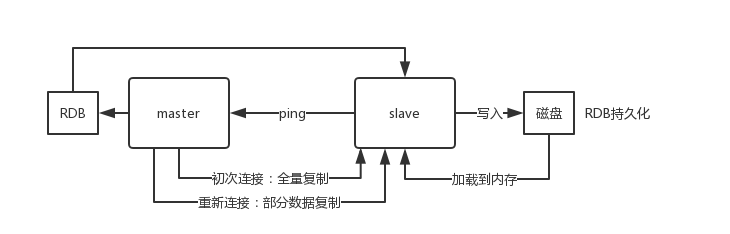

redis-master-slave-replication

过程原理

1.  当从库和主库建立MS关系后，会向主数据库发送SYNC命令
2.  主库接收到SYNC命令后会开始在后台保存快照(RDB持久化过程)，并将期间接收到的写命令缓存起来
3.  当快照完成后，主Redis会将快照文件和所有缓存的写命令发送给从Redis
4.  从Redis接收到后，会载入快照文件并且执行收到的缓存的命令
5.  之后，主Redis每当接收到写命令时就会将命令发送从Redis，从而保证数据的一致

缺点

-   所有的slave节点数据的复制和同步都由master节点来处理，会照成master节点压力太大，使用主从从结构来解决

## Redis 有哪些架构模式

### 单机版

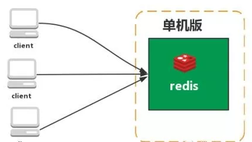

特点：简单

问题：

1、内存容量有限 2、处理能力有限 3、无法高可用。

### 基于客户端分配

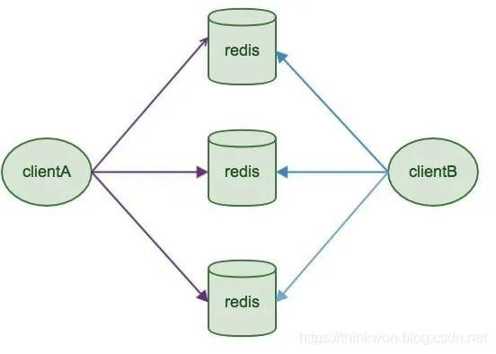

**简介**

Redis Sharding是Redis Cluster出来之前，业界普遍使用的多Redis实例集群方法。其主要思想是采用哈希算法将Redis数据的key进行散列，通过hash函数，特定的key会映射到特定的Redis节点上。Java redis客户端驱动jedis，支持Redis Sharding功能，即ShardedJedis以及结合缓存池的ShardedJedisPool

优点

-   优势在于非常简单，服务端的Redis实例彼此独立，相互无关联，每个Redis实例像单服务器一样运行，非常容易线性扩展，系统的灵活性很强

缺点

-   由于sharding处理放到客户端，规模进一步扩大时给运维带来挑战。
-   客户端sharding不支持动态增删节点。服务端Redis实例群拓扑结构有变化时，每个客户端都需要更新调整。连接不能共享，当应用规模增大时，资源浪费制约优化

### 主从复制

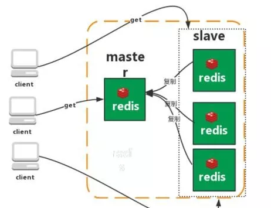

Redis 的复制（replication）功能允许用户根据一个 Redis 服务器来创建任意多个该服务器的复制品，其中被复制的服务器为主服务器（master），而通过复制创建出来的服务器复制品则为从服务器（slave）。 只要主从服务器之间的网络连接正常，主从服务器两者会具有相同的数据，主服务器就会一直将发生在自己身上的数据更新同步给从服务器，从而一直保证主从服务器的数据相同。

特点：

1.  master/slave 角色
2.  master/slave 数据相同
3.  降低 master 读压力在转交从库

问题：

无法保证高可用

没有解决 master 写的压力

### 哨兵

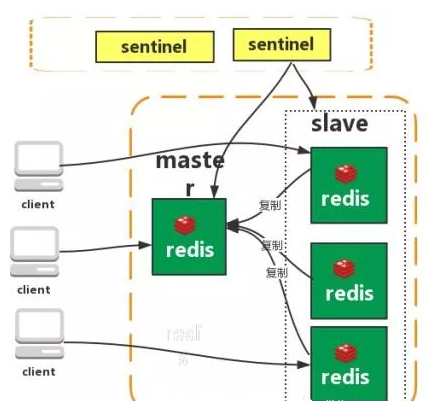

Redis sentinel 是一个分布式系统中监控 redis主从服务器，并在主服务器下线时自动进行故障转移。其中三个特性： 监控（Monitoring）： Sentinel会不断地检查你的主服务器和从服务器是否运作正常。

提醒（Notification）： 当被监控的某个 Redis 服务器出现问题时， Sentinel可以通过 API 向管理员或者其他应用程序发送通知。

自动故障迁移（Automatic failover）： 当一个主服务器不能正常工作时，Sentinel 会开始一次自动故障迁移操作。

特点：

1、保证高可用 2、监控各个节点 3、自动故障迁移

缺点：主从模式，切换需要时间丢数据

没有解决 master 写的压力

### 集群（proxy型）

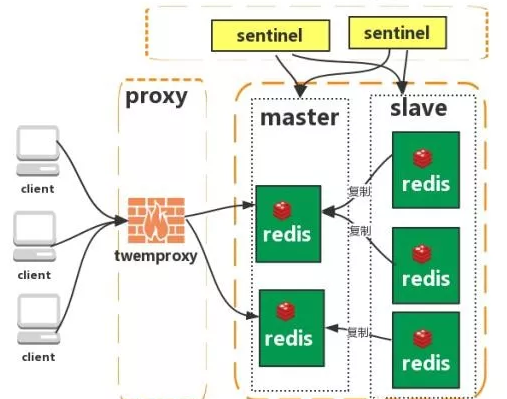

Twemproxy 是一个 Twitter 开源的一个 redis 和 memcache快速/轻量级代理服务器； Twemproxy 是一个快速的单线程代理程序，支持Memcached ASCII 协议和 redis 协议。

特点：

1. 多种 hash算法：MD5、CRC16、CRC32、CRC32a、hsieh、murmur、Jenkins
2. 支持失败节点自动删除 
3. 后端 Sharding 分片逻辑对业务透明，业务方的读写方式和操作单个 Redis一致

缺点：增加了新的 proxy，需要维护其高可用。

failover逻辑需要自己实现，其本身不能支持故障的自动转移可扩展性差，进行扩缩容都需要手动干预

### 集群（直连型）

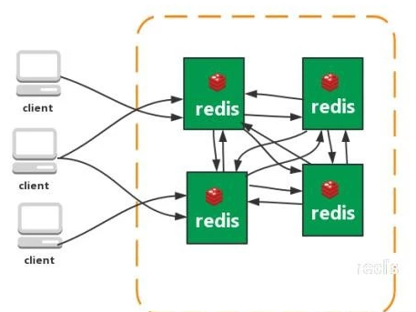

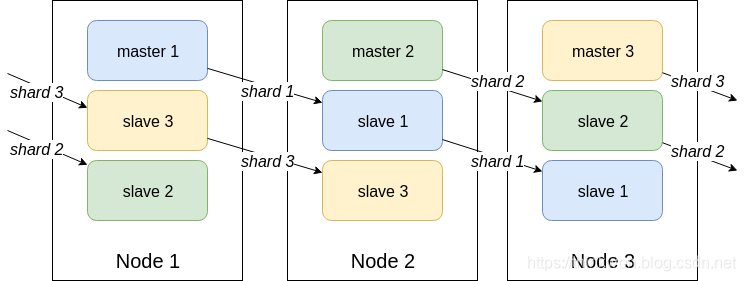

从redis3.0之后版本支持redis-cluster集群，Redis-Cluster采用无中心结构，每个节点保存数据和整个集群状态,每个节点都和其他所有节点连接。

特点：

1. 无中心架构（不存在哪个节点影响性能瓶颈），少了 proxy 层。 2、数据按照 slot存储分布在多个节点，节点间数据共享，可动态调整数据分布。
3. 可扩展性，可线性扩展到 1000 个节点，节点可动态添加或删除。
4. 高可用性，部分节点不可用时，集群仍可用。通过增加 Slave 做备份数据副本
5. 实现故障自动 failover，节点之间通过 gossip协议交换状态信息，用投票机制完成 Slave到 Master 的角色提升。

缺点：

1、资源隔离性较差，容易出现相互影响的情况。
2、数据通过异步复制,不保证数据的强一致性

**简介**

Redis Cluster是一种服务端Sharding技术，3.0版本开始正式提供。Redis Cluster并没有使用一致性hash，而是采用slot(槽)的概念，一共分成16384个槽。将请求发送到任意节点，接收到请求的节点会将查询请求发送到正确的节点上执行

**方案说明**

1.  通过哈希的方式，将数据分片，每个节点均分存储一定哈希槽(哈希值)区间的数据，默认分配了16384个槽位
2.  每份数据分片会存储在多个互为主从的多节点上
3.  数据写入先写主节点，再同步到从节点(支持配置为阻塞同步)
4.  同一分片多个节点间的数据不保持一致性
5.  读取数据时，当客户端操作的key没有分配在该节点上时，redis会返回转向指令，指向正确的节点
6.  扩容时时需要需要把旧节点的数据迁移一部分到新节点

在 redis cluster 架构下，每个 redis 要放开两个端口号，比如一个是6379，另外一个就是 加1w 的端口号，比如 16379。

16379 端口号是用来进行节点间通信的，也就是 cluster bus 的东西，clusterbus 的通信，用来进行故障检测、配置更新、故障转移授权。cluster bus用了另外一种二进制的协议，=gossip= 协议，用于节点间进行高效的数据交换，占用更少的网络带宽和处理时间。

节点间的内部通信机制

基本通信原理

集群元数据的维护有两种方式：集中式、Gossip 协议。redis cluster节点间采用 gossip 协议进行通信。

分布式寻址算法

-   hash 算法（大量缓存重建）
-   一致性 hash 算法（自动缓存迁移）+ 虚拟节点（自动负载均衡）
-   redis cluster 的 hash slot 算法

优点

-   无中心架构，支持动态扩容，对业务透明
-   具备Sentinel的监控和自动Failover(故障转移)能力
-   客户端不需要连接集群所有节点，连接集群中任何一个可用节点即可
-   高性能，客户端直连redis服务，免去了proxy代理的损耗

缺点

-   运维也很复杂，数据迁移需要人工干预
-   只能使用0号数据库
-   不支持批量操作(pipeline管道操作)
-   分布式逻辑和存储模块耦合等
