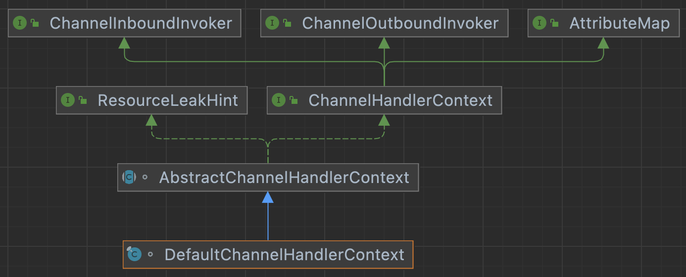

# netty笔记

## demo

``` xml
<dependency>
  <groupId>io.netty</groupId>
  <artifactId>netty-all</artifactId>
  <version>4.1.77.Final</version>
</dependency>
```

``` java

public class NettyServer {

    public static void main(String[] args) {
        int port =8088;
        EventLoopGroup bossGroup = new NioEventLoopGroup();
        EventLoopGroup workerGroup = new NioEventLoopGroup(100);
        try {
            ServerBootstrap b = new ServerBootstrap();
            b.group(bossGroup, workerGroup)
                    .channel(NioServerSocketChannel.class)
                    .option(ChannelOption.SO_BACKLOG, 1024)
                    .childHandler(new FirstServerHandler());
            ChannelFuture f = b.bind(port).sync();
            f.addListener(future -> System.out.println("netty server:"+port+future.isSuccess()));
            f.channel().closeFuture().sync();

        } catch (InterruptedException e) {
            e.printStackTrace();
        } finally {
            // 优雅退出，释放线程池资源
            bossGroup.shutdownGracefully();
            workerGroup.shutdownGracefully();
        }
    }

    @ChannelHandler.Sharable
    static class FirstServerHandler  extends ChannelInboundHandlerAdapter {
        @Override
        public void channelRead(ChannelHandlerContext ctx, Object msg) {
            ByteBuf buf = (ByteBuf) msg;
            byte[] req = new byte[buf.readableBytes()];
            buf.readBytes(req);
            String body = new String(req, StandardCharsets.UTF_8);
            System.out.println(new Date() +":from client:"+body);
            String r ="server echo: " + body;
            ByteBuf resp = Unpooled.copiedBuffer(r.getBytes());
            ctx.write(resp);
        }

        @Override
        public void channelReadComplete(ChannelHandlerContext ctx) throws Exception {
            ctx.flush();
        }

        @Override
        public void exceptionCaught(ChannelHandlerContext ctx, Throwable cause) {
            ctx.close();
        }
    }
}
```

``` java

public class NettyClient {
    public static void main(String[] args) {
        String host = "127.0.0.1";
        int port = 8088;
        EventLoopGroup group = new NioEventLoopGroup();
        try {
            Bootstrap b = new Bootstrap();
            b.group(group).channel(NioSocketChannel.class)
                    .option(ChannelOption.TCP_NODELAY, true)
                    .handler(new ChannelInitializer<SocketChannel>() {
                        @Override
                        public void initChannel(SocketChannel ch) {
                            ch.pipeline().addLast(new FirstClientHandler());
                        }
                    });
            ChannelFuture f = b.connect(host, port).sync();
            f.addListener(future -> System.out.println("netty client:"+port+future.isSuccess()));
            f.channel().closeFuture().sync();
        } catch (InterruptedException e) {
            e.printStackTrace();
        } finally {
            group.shutdownGracefully();
        }
    }

    static class FirstClientHandler  extends ChannelInboundHandlerAdapter {
        @Override
        public void channelActive(ChannelHandlerContext ctx) {
            System.out.println("channelActive....");
            String msg = "client active:"+new Date();
            ByteBuf buffer = ctx.alloc().buffer();
            buffer.writeBytes(msg.getBytes(StandardCharsets.UTF_8));
            ctx.channel().writeAndFlush(buffer);
        }
        @Override
        public void channelRead(ChannelHandlerContext ctx, Object msg) {
            ByteBuf byteBuf = (ByteBuf) msg;
            System.out.println(byteBuf.toString(Charset.forName("utf-8")));
        }
    }
}
```

## 架构图


## 源码分析

核心逻辑：

-   NioServerSocketChannel(NSSC)
    -   AbstractNioChannel
        -   SelectableChannel ch：ServerSocketChannel
    -   AbstractChannel
        -   EventLoop eventLoop
        -   DefaultChannelPipeline pipeline
-   NioSocketChannel(NSC)
    -   AbstractNioChannel
        -   SelectableChannel ch：SocketChannel
    -   AbstractChannel
        -   EventLoop eventLoop
        -   DefaultChannelPipeline pipeline
-   ANSC: NSSC Accept 生成的NSC
-   NioEventLoopGroup：NioEventLoop组
-   NioEventLoop: 异步执行类
    -   selector
    -   void register(…）: AbstractNioChannel.doRegister()
    -   void run(): 无限循环，核心方法
-   Bootstrap
    -   AbstractBootstrap: 注册NSC
        -   group
        -   handler
        -   options
        -   attrs
-   ServerBootstrap
    -   AbstractBootstrap: 注册NSSC
        -   group
        -   handler
        -   options
        -   attrs
    -   childGroup: 注册ANSC
    -   childHandler: 生成ANSC的pipeline
    -   childOptions
    -   childAttrs
-   NSSC的创建：
    -   ServerBootstrap.bind()
    -   AbstractBootstrap.initAndRegister()
-   客户端NSC的创建：
    -   Bootstrap.connect()
    -   AbstractBootstrap.initAndRegister()
-   NSSC和NSC注册EventLoop
    -   AbstractBootstrap.initAndRegister()
        -   都是注册到AbstractBootstrap.group上
-   NSSC的Accept过程
    -   NioEventLoop.processSelectedKeys()
        -   NioServerSocketChannel.doReadMessages()
            -   SocketUtils.accept(javaChannel())
            -   new NioSocketChannel(this, ch)
        -   pipeline.fireChannelRead()
            -   ServerBootstrapAcceptor.channelRead()
-   pipeline的创建(通过ChannelInitializer创建)
    -   ServerBootstrapAcceptor.channelRead的childGroup.register
    -   AbstractUnsafe.register的register0
        -   register0的 pipeline.invokeHandlerAddedIfNeeded()
            -   DefaultChannelPipeline.callHandlerAdded0
                -   ChannelInitializer.handlerAdded 调用initChannel

### EventLoop

EventLoopGroup本质上是一个线程池，相对java线程池，添加了selector的逻辑。

``` java
public static void main(String[] args) {
    EventLoopGroup loop = new NioEventLoopGroup(2);
    System.out.println("main thread:"+Thread.currentThread());
    loop.scheduleAtFixedRate(
            ()->System.out.println("EventLoopGroup Test:"+Thread.currentThread()),
            0,5, TimeUnit.SECONDS);
    loop.next().scheduleAtFixedRate(
            ()->System.out.println("EventLoop Test:"+Thread.currentThread()),
            0,5, TimeUnit.SECONDS);
}
```


### NioEventLoopGroup

-   I EventExecutorGroup: 继承自java的ScheduledExecutorService和Iterable
    -   EventExecutor next()
-   I EventLoopGroup
    -   EventLoop next()
    -   ChannelFuture register(Channel channel)
    -   ChannelFuture register(ChannelPromise promise)
-   C NioEventLoopGroup:主要是构造器方法
    -   rebuildSelectors: 为了解决epoll 100% CPU bug，重建selector的方法
    -   setIoRatio: 设置NioEventLoop IO cpu占比
-   ABS MultithreadEventLoopGroup: 主要是对EventLoop的几个方法包了一层
    -   public EventLoop next()
    -   ChannelFuture register(Channel channel)
    -   ChannelFuture register(ChannelPromise promise)
-   ABS MultithreadEventExecutorGroup: 主模板类
    -   EventExecutor\[\] children
    -   Set\<EventExecutor\> readonlyChildren: 对children的包装
    -   AtomicInteger terminatedChildren
    -   Promise\<?\> terminationFuture
    -   EventExecutorChooserFactory.EventExecutorChooser chooser
    -   next(): chooser.next()
-   AbstractEventExecutorGroup: 主要对next出的EventExecutor包了一层


### NioEventLoop


-   NioEventLoop
    -   int ioRatio: io操作占CPU百分比
    -   Selector selector:
        netty封装的select，SelectedSelectionKeySetSelector
    -   Selector unwrappedSelector: java的select
    -   SelectedSelectionKeySet selectedKeys
    -   SelectStrategy selectStrategy
    -   void register(final SelectableChannel ch, final int interestOps,
        final NioTask\<?\> task)
    -   protected void run(): 无限循环，核心方法

### ServerBootstrap


-   I Channel: 继承了三个接口 AttributeMap, ChannelOutboundInvoker,
    Comparable
    -   ByteBufAllocator alloc();
    -   ChannelFuture closeFuture();
    -   ChannelConfig config();
    -   EventLoop eventLoop();
    -   Channel flush();
    -   ChannelId id();
    -   boolean isActive();
    -   boolean isOpen();
    -   boolean isRegistered();
    -   boolean isWritable();
    -   SocketAddress localAddress();
    -   ChannelMetadata metadata();
    -   Channel parent(): ??? 什么是父channel
    -   ChannelPipeline pipeline();
    -   Channel read();
    -   Channel flush();
    -   I Unsafe: 非安全操作，用户代码不能调用
        -   void beginRead();
        -   void bind(SocketAddress localAddress, ChannelPromise
            promise);
        -   void close(ChannelPromise promise);
        -   void connect(SocketAddress remoteAddress, SocketAddress
            localAddress, ChannelPromise promise);
        -   void deregister(ChannelPromise promise);
        -   void disconnect(ChannelPromise promise);
        -   void flush();
        -   SocketAddress localAddress();
        -   ChannelOutboundBuffer outboundBuffer();
        -   RecvByteBufAllocator.Handle recvBufAllocHandle();
        -   void register(EventLoop eventLoop, ChannelPromise promise);
        -   SocketAddress remoteAddress();
        -   ChannelPromise voidPromise();
        -   void write(Object msg, ChannelPromise promise);
-   ABS AbstractBootstrap
    -   EventLoopGroup group
    -   SocketAddress localAddress
    -   Map\<ChannelOption\<?\>, Object\> options
    -   Map\<AttributeKey\<?\>, Object\> attrs
    -   volatile ChannelHandler handler
    -   ChannelFuture bind(String inetHost, int inetPort)
    -   B channel(Class\<? extends C\> channelClass):
        设置创建channel的类
    -   B channelFactory(ChannelFactory\<? extends C\> channelFactory):
        设置创建channel的工厂类
    -   B handler(ChannelHandler handler)
    -   ChannelFuture register()
    -   ChannelFuture doBind(final SocketAddress localAddress)
    -   ChannelFuture initAndRegister()
    -   
-   C ServerBootstrap
    -   Map\<ChannelOption\<?\>, Object\> childOptions
    -   Map\<AttributeKey\<?\>, Object\> childAttrs
    -   ServerBootstrapConfig config
    -   EventLoopGroup childGroup: work线程组
    -   ChannelHandler childHandler
    -   ServerBootstrap childHandler(ChannelHandler childHandler)
    -   ServerBootstrap group(EventLoopGroup parentGroup, EventLoopGroup
        childGroup)
    -   void init(Channel channel)
-   I ChannelOutboundInvoker
    -   ChannelFuture bind(SocketAddress localAddress);
    -   ChannelFuture bind(SocketAddress localAddress, ChannelPromise
        promise);
    -   ChannelFuture close();
    -   ChannelFuture connect(SocketAddress remoteAddress);
    -   ChannelFuture deregister();
    -   ChannelFuture disconnect();
    -   ChannelOutboundInvoker flush();
    -   ChannelOutboundInvoker read();
    -   ChannelFuture write(Object msg);

### ServerSocketChannel的创建

AbstractBootstrap.initAndRegister()核心方法，创建channel，注册selector

ServerBootstrap.bind()调用AbstractBootstrap.bind():

-   ChannelFuture bind(int inetPort)
-   ChannelFuture doBind(final SocketAddress localAddress)
-   ChannelFuture initAndRegister():创建ServerSocketChannel
    -   ServerBootstrap.init(Channel channel):
        对ServerChannel的pipeline添加ServerBootstrapAcceptor
    -   AbstractChannel
        -   AbstractUnsafe.register(): 异步调用register0()
        -   register0()
            -   AbstractNioChannel.doRegister(): 将channel注册到selector

AbstractBootstrap 这里用的group()，所以注册到了bossGroup里的EventLoop里

``` java
ChannelFuture initAndRegister()
  ChannelFuture regFuture = config().group().register(channel);
```

### 客户端SocketChannel的创建

Bootstrap.connect()

-   doResolveAndConnect()
-   AbstractBootstrap.initAndRegister()

最终调用的还是父类的公共方法

### 服务器端socket创建

NioEventLoop核心run方法是一个无限循环，主逻辑

-   processSelectedKeys();
    -   processSelectedKeysPlain(selector.selectedKeys())
    -   processSelectedKey(k, (AbstractNioChannel) a);
        -   AbstractNioMessageChannel.read()
            -   NioServerSocketChannel.doReadMessages():
                这里会生成SocketChannel
                -   SocketUtils.accept(javaChannel());
                -   new NioSocketChannel(this, ch):
                    会创建默认的pipeline，只有head和tail
            -   pipeline.fireChannelRead(readBuf.get(i));
                ServerSocketChannel的pipeline处理SocketChannel
                -   ServerBootstrapAcceptor.channelRead();
                    最终调用这里对创建的channel做的注册
-   runAllTasks()

ServerBootstrapAcceptor

``` java
public void channelRead(ChannelHandlerContext ctx, Object msg) {
  childGroup.register(child).addListener(new ChannelFutureListener() {
```

### socket的读

AbstractNioByteChannel

-   void read(): 在读取到byteBuf后
-   pipeline.fireChannelRead(byteBuf):
    pipeline为DefaultChannelPipeline实例
    -   AbstractChannelHandlerContext
        -   invokeChannelRead(head, msg):
            static方法，调用head的实例方法开启事件链传播
        -   invokeChannelRead(Object msg):
            DefaultChannelHandlerContext中取出handler执行之
-   pipeline.fireChannelReadComplete();

### socket的写

AbstractChannelHandlerContext

-   ChannelFuture write(Object msg)
-   next.invokeWrite(m, promise): 开启写事件传播，第一个为HeadContext

### AbstractChannel

-   ABC AbstractChannel
    -   Channel parent: channel对应的NioServerSocketChannel
    -   ChannelId id
    -   DefaultChannelPipeline pipeline
    -   SocketAddress localAddress
    -   SocketAddress remoteAddress
    -   EventLoop eventLoop
    -   EventLoop eventLoop()
    -   ChannelPipeline pipeline()
    -   Channel read()
    -   ChannelFuture write(Object msg)
    -   ABC AbstractUnsafe: 核心模板
        -   void bind(final SocketAddress localAddress, final
            ChannelPromise promise)
        -   void register(EventLoop eventLoop, final ChannelPromise
            promise)
        -   void write(Object msg, ChannelPromise promise)

### NioServerSocketChannel


-   NioServerSocketChannel
-   ABS AbstractNioMessageChannel
-   ABS AbstractNioChannel
    -   SelectableChannel ch: 实际的javaChannel
    -   SelectionKey selectionKey
    -   ChannelPromise connectPromise
    -   Future\<?\> connectTimeoutFuture
    -   SocketAddress requestedRemoteAddress
    -   void doRegister(): 实际注册selector的方法

### NioSocketChannel

-   NioSocketChannel
    -   ServerSocketChannel parent()
    -   int doReadBytes(ByteBuf byteBuf)
    -   int doWriteBytes(ByteBuf buf)
-   AbstractNioByteChannel: 主要是读写的一些操作
-   AbstractNioChannel: 参考NioServerSocketChannel部分


### DefaultChannelPipeline

DefaultChannelPipeline

-   AbstractChannelHandlerContext head
-   AbstractChannelHandlerContext tail
-   Channel channel
-   ChannelPipeline addFirst(ChannelHandler handler)
-   ChannelPipeline addLast(ChannelHandler handler)
-   ChannelPipeline fireChannelXXX():
    AbstractChannelHandlerContext.invokeChannelXXX(head)
-   ChannelFuture bind(SocketAddress localAddress): 调用tail实现
-   ChannelFuture connect(SocketAddress remoteAddress): 调用tail实现
-   ChannelFuture close(): 调用tail实现
-   ChannelFuture deregister(): 调用tail实现
-   ChannelFuture write(Object msg): 调用tail实现
-   ChannelFuture writeAndFlush(Object msg) : 调用tail实现
-   C HeadContext
-   C TailContext

### ChannelHandlerContext

-   AbstractChannelHandlerContext
    -   AbstractChannelHandlerContext next
    -   AbstractChannelHandlerContext prev
    -   DefaultChannelPipeline pipeline
    -   EventExecutor executor
-   DefaultChannelHandlerContext
    -   ChannelHandler handler
    -   ChannelHandler handler()


