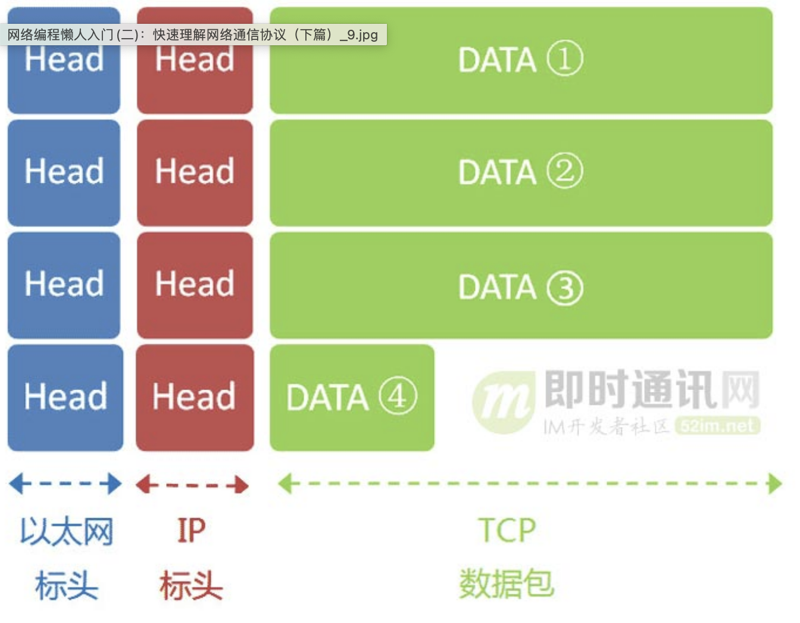
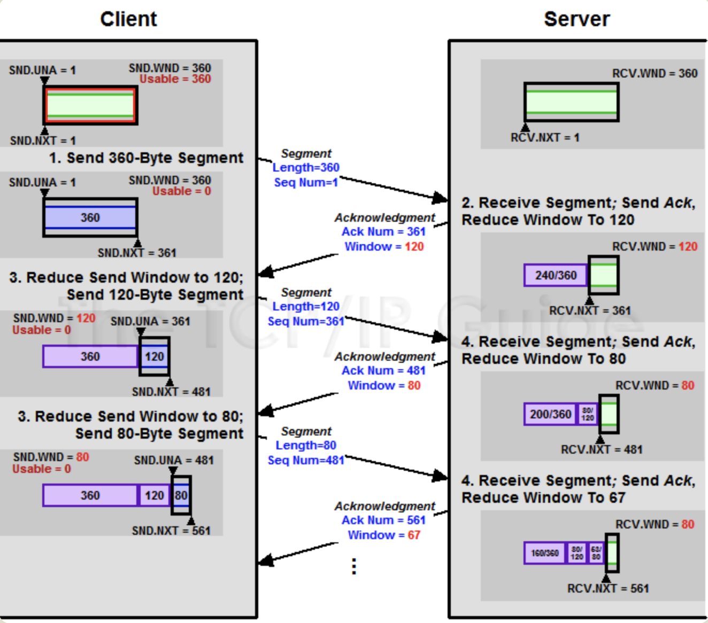
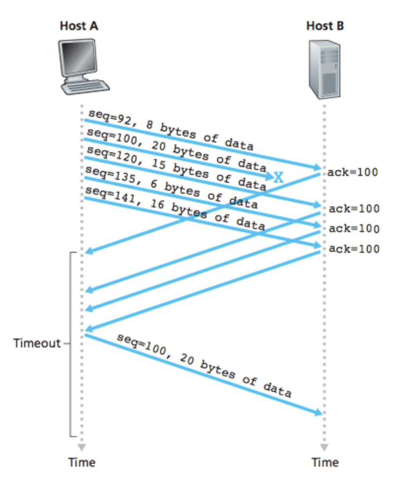

# 网络编程入门

-   [互联网协议入门（一）](https://www.ruanyifeng.com/blog/2012/05/internet_protocol_suite_part_i.html)
-   [互联网协议入门（二）](https://www.ruanyifeng.com/blog/2012/06/internet_protocol_suite_part_ii.html)
-   [TCP 协议简介](https://www.ruanyifeng.com/blog/2017/06/tcp-protocol.html)

## 快速理解网络通信协议

互联网的实现，分成好几层。每一层都有自己的功能，就像建筑物一样，每一层都靠下一层支持。用户接触到的，只是最上面的一层，根本没有感觉到下面的层。要理解互联网，必须从最下层开始，自下而上理解每一层的功能。

如何分层有不同的模型，有的模型分七层，有的分四层。我觉得，把互联网分成五层，比较容易解释：

如上图所示，最底下的一层叫做"实体层"（Physical Layer），最上面的一层叫做"应用层"（Application Layer），中间的三层（自下而上）分别是"链接层"（Link Layer）、"网络层"（Network Layer）和"传输层"（Transport Layer）。越下面的层，越靠近硬件；越上面的层，越靠近用户。

它们叫什么名字，其实并不重要。只需要知道，互联网分成若干层就可以了。

每一层都是为了完成一种功能。为了实现这些功能，就需要大家都遵守共同的规则。大家都遵守的规则，就叫做"协议"（protocol）。

互联网的每一层，都定义了很多协议。这些协议的总称，就叫做"互联网协议"（Internet Protocol Suite）。它们是互联网的核心，下面介绍每一层的功能，主要就是介绍每一层的主要协议。

### 实体层

我们从最底下的一层开始。

电脑要组网，第一件事要干什么？当然是先把电脑连起来，可以用光缆、电缆、双绞线、无线电波等方式。

这就叫做"实体层"，它就是把电脑连接起来的物理手段。它主要规定了网络的一些电气特性，作用是负责传送0和1的电信号。

### 链接层

1.  定义

    单纯的0和1没有任何意义，必须规定解读方式：多少个电信号算一组？每个信号位有何意义？

    这就是"链接层"的功能，它在"实体层"的上方，确定了0和1的分组方式。

2.  以太网协议

    早期的时候，每家公司都有自己的电信号分组方式。逐渐地，一种叫做"以太网"（Ethernet）的协议，占据了主导地位。

    以太网规定，一组电信号构成一个数据包，叫做"帧"（Frame）。每一帧分成两个部分：标头（Head）和数据（Data）。

    

    "标头"包含数据包的一些说明项，比如发送者、接受者、数据类型等等；"数据"则是数据包的具体内容。

    "标头"的长度，固定为18字节。"数据"的长度，最短为46字节，最长为1500字节。因此，整个"帧"最短为64字节，最长为1518字节。如果数据很长，就必须分割成多个帧进行发送。

3.  MAC地址

    上面提到，以太网数据包的"标头"，包含了发送者和接受者的信息。那么，发送者和接受者是如何标识呢？

    以太网规定，连入网络的所有设备，都必须具有"网卡"接口。数据包必须是从一块网卡，传送到另一块网卡。网卡的地址，就是数据包的发送地址和接收地址，这叫做MAC地址。

    每块网卡出厂的时候，都有一个全世界独一无二的MAC地址，长度是48个二进制位，通常用12个十六进制数表示。

    前6个十六进制数是厂商编号，后6个是该厂商的网卡流水号。有了MAC地址，就可以定位网卡和数据包的路径了。

4.  广播

    定义地址只是第一步，后面还有更多的步骤：

    1）首先：一块网卡怎么会知道另一块网卡的MAC地址？
    
    回答是有一种ARP协议，可以解决这个问题。这个留到后面介绍，这里只需要知道，以太网数据包必须知道接收方的MAC地址，然后才能发送。

    2）其次：就算有了MAC地址，系统怎样才能把数据包准确送到接收方？
    
    回答是以太网采用了一种很"原始"的方式，它不是把数据包准确送到接收方，而是向本网络内所有计算机发送，让每台计算机自己判断，是否为接收方。

    

    上图中，1号计算机向2号计算机发送一个数据包，同一个子网络的3号、4号、5号计算机都会收到这个包。它们读取这个包的"标头"，找到接收方的MAC地址，然后与自身的MAC地址相比较，如果两者相同，就接受这个包，做进一步处理，否则就丢弃这个包。这种发送方式就叫做"广播"（broadcasting）。

    有了数据包的定义、网卡的MAC地址、广播的发送方式，"链接层"就可以在多台计算机之间传送数据了。

### 网络层

1.  网络层的由来

    以太网协议，依靠MAC地址发送数据。理论上，单单依靠MAC地址，上海的网卡就可以找到洛杉矶的网卡了，技术上是可以实现的。

    但是，这样做有一个重大的缺点。以太网采用广播方式发送数据包，所有成员人手一"包"，不仅效率低，而且局限在发送者所在的子网络。也就是说，如果两台计算机不在同一个子网络，广播是传不过去的。这种设计是不合理的，否则互联网上每一台计算机都会收到所有包，那会引起灾难。

    互联网是无数子网络共同组成的一个巨型网络，很像想象上海和洛杉矶的电脑会在同一个子网络，这几乎是不可能的。

    

    因此，必须找到一种方法，能够区分哪些MAC地址属于同一个子网络，哪些不是。如果是同一个子网络，就采用广播方式发送，否则就采用"路由"方式发送。（"路由"的意思，就是指如何向不同的子网络分发数据包，这是一个很大的主题，本文不涉及。）遗憾的是，MAC地址本身无法做到这一点。它只与厂商有关，与所处网络无关。

    这就导致了"网络层"的诞生。它的作用是引进一套新的地址，使得我们能够区分不同的计算机是否属于同一个子网络。这套地址就叫做"网络地址"，简称"网址"。

    于是，"网络层"出现以后，每台计算机有了两种地址，一种是MAC地址，另一种是网络地址。两种地址之间没有任何联系，MAC地址是绑定在网卡上的，网络地址则是管理员分配的，它们只是随机组合在一起。

    网络地址帮助我们确定计算机所在的子网络，MAC地址则将数据包送到该子网络中的目标网卡。因此，从逻辑上可以推断，必定是先处理网络地址，然后再处理MAC地址。

2.  IP协议

    规定网络地址的协议，叫做IP协议。它所定义的地址，就被称为IP地址。目前，广泛采用的是IP协议第四版，简称IPv4。

    IPv4这个版本规定，网络地址由32个二进制位组成：

    

    习惯上，我们用分成四段的十进制数表示IP地址，从0.0.0.0一直到255.255.255.255。

    互联网上的每一台计算机，都会分配到一个IP地址。这个地址分成两个部分，前一部分代表网络，后一部分代表主机。比如，IP地址172.16.254.1，这是一个32位的地址，假定它的网络部分是前24位（172.16.254），那么主机部分就是后8位（最后的那个1）。处于同一个子网络的电脑，它们IP地址的网络部分必定是相同的，也就是说172.16.254.2应该与172.16.254.1处在同一个子网络。

    但是，问题在于单单从IP地址，我们无法判断网络部分。还是以172.16.254.1为例，它的网络部分，到底是前24位，还是前16位，甚至前28位，从IP地址上是看不出来的。

    那么，怎样才能从IP地址，判断两台计算机是否属于同一个子网络呢？这就要用到另一个参数"子网掩码"（subnet mask）。

    所谓"子网掩码"，就是表示子网络特征的一个参数。它在形式上等同于IP地址，也是一个32位二进制数字，它的网络部分全部为1，主机部分全部为0。比如，IP地址172.16.254.1，如果已知网络部分是前24位，主机部分是后8位，那么子网络掩码就是11111111.11111111.11111111.00000000，写成十进制就是255.255.255.0。

    知道"子网掩码"，我们就能判断，任意两个IP地址是否处在同一个子网络。方法是将两个IP地址与子网掩码分别进行AND运算（两个数位都为1，运算结果为1，否则为0），然后比较结果是否相同，如果是的话，就表明它们在同一个子网络中，否则就不是。

    比如，已知IP地址172.16.254.1和172.16.254.233的子网掩码都是255.255.255.0，请问它们是否在同一个子网络？两者与子网掩码分别进行AND运算，结果都是172.16.254.0，因此它们在同一个子网络。

    总结一下，IP协议的作用主要有两个，一个是为每一台计算机分配IP地址，另一个是确定哪些地址在同一个子网络。

3.  IP数据包

    根据IP协议发送的数据，就叫做IP数据包。不难想象，其中必定包括IP地址信息。但是前面说过，以太网数据包只包含MAC地址，并没有IP地址的栏位。那么是否需要修改数据定义，再添加一个栏位呢？

    回答是不需要，我们可以把IP数据包直接放进以太网数据包的"数据"部分，因此完全不用修改以太网的规格。这就是互联网分层结构的好处：上层的变动完全不涉及下层的结构。

    具体来说，IP数据包也分为"标头"和"数据"两个部分：

    

    "标头"部分主要包括版本、长度、IP地址等信息，"数据"部分则是IP数据包的具体内容。它放进以太网数据包后，以太网数据包就变成了下面这样：

    

    IP数据包的"标头"部分的长度为20到60字节，整个数据包的总长度最大为65,535字节。因此，理论上，一个IP数据包的"数据"部分，最长为65,515字节。前面说过，以太网数据包的"数据"部分，最长只有1500字节。因此，如果IP数据包超过了1500字节，它就需要分割成几个以太网数据包，分开发送了。

4.  ARP协议

    关于"网络层"，还有最后一点需要说明。因为IP数据包是放在以太网数据包里发送的，所以我们必须同时知道两个地址，一个是对方的MAC地址，另一个是对方的IP地址。通常情况下，对方的IP地址是已知的（后文会解释），但是我们不知道它的MAC地址。

    所以，我们需要一种机制，能够从IP地址得到MAC地址。

    这里又可以分成两种情况：

    1）第一种情况：如果两台主机不在同一个子网络，那么事实上没有办法得到对方的MAC地址，只能把数据包传送到两个子网络连接处的"网关"（gateway），让网关去处理；
    2）第二种情况：如果两台主机在同一个子网络，那么我们可以用ARP协议，得到对方的MAC地址。ARP协议也是发出一个数据包（包含在以太网数据包中），其中包含它所要查询主机的IP地址，在对方的MAC地址这一栏，填的是FF:FF:FF:FF:FF:FF，表示这是一个"广播"地址。它所在子网络的每一台主机，都会收到这个数据包，从中取出IP地址，与自身的IP地址进行比较。如果两者相同，都做出回复，向对方报告自己的MAC地址，否则就丢弃这个包。

    总之，有了ARP协议之后，我们就可以得到同一个子网络内的主机MAC地址，可以把数据包发送到任意一台主机之上了。

### 传输层

1.  传输层的由来

    有了MAC地址和IP地址，我们已经可以在互联网上任意两台主机上建立通信。

    接下来的问题是，同一台主机上有许多程序都需要用到网络，比如，你一边浏览网页，一边与朋友在线聊天。当一个数据包从互联网上发来的时候，你怎么知道，它是表示网页的内容，还是表示在线聊天的内容？

    也就是说，我们还需要一个参数，表示这个数据包到底供哪个程序（进程）使用。这个参数就叫做"端口"（port），它其实是每一个使用网卡的程序的编号。每个数据包都发到主机的特定端口，所以不同的程序就能取到自己所需要的数据。

    "端口"是0到65535之间的一个整数，正好16个二进制位。0到1023的端口被系统占用，用户只能选用大于1023的端口。不管是浏览网页还是在线聊天，应用程序会随机选用一个端口，然后与服务器的相应端口联系。

    "传输层"的功能，就是建立"端口到端口"的通信。相比之下，"网络层"的功能是建立"主机到主机"的通信。只要确定主机和端口，我们就能实现程序之间的交流。因此，Unix系统就把主机+端口，叫做"套接字"（socket）。有了它，就可以进行网络应用程序开发了。

2.  UDP协议

    现在，我们必须在数据包中加入端口信息，这就需要新的协议。最简单的实现叫做UDP协议，它的格式几乎就是在数据前面，加上端口号。

    UDP数据包，也是由"标头"和"数据"两部分组成

    "标头"部分主要定义了发出端口和接收端口，"数据"部分就是具体的内容。然后，把整个UDP数据包放入IP数据包的"数据"部分，而前面说过，IP数据包又是放在以太网数据包之中的，所以整个以太网数据包现在变成了下面这样：

    

    UDP数据包非常简单，"标头"部分一共只有8个字节，总长度不超过65,535字节，正好放进一个IP数据包。

3.  TCP协议

    UDP协议的优点是比较简单，容易实现，但是缺点是可靠性较差，一旦数据包发出，无法知道对方是否收到。为了解决这个问题，提高网络可靠性，TCP协议就诞生了。这个协议非常复杂，但可以近似认为，它就是有确认机制的UDP协议，每发出一个数据包都要求确认。如果有一个数据包遗失，就收不到确认，发出方就知道有必要重发这个数据包了。

    因此，TCP协议能够确保数据不会遗失。它的缺点是过程复杂、实现困难、消耗较多的资源。

    TCP数据包和UDP数据包一样，都是内嵌在IP数据包的"数据"部分。TCP数据包没有长度限制，理论上可以无限长，但是为了保证网络的效率，通常TCP数据包的长度不会超过IP数据包的长度，以确保单个TCP数据包不必再分割。

### 应用层

应用程序收到"传输层"的数据，接下来就要进行解读。由于互联网是开放架构，数据来源五花八门，必须事先规定好格式，否则根本无法解读。"应用层"的作用，就是规定应用程序的数据格式。

举例来说，TCP协议可以为各种各样的程序传递数据，比如Email、WWW、FTP等等。那么，必须有不同协议规定电子邮件、网页、FTP数据的格式，这些应用程序协议就构成了"应用层"。这是最高的一层，直接面对用户。它的数据就放在TCP数据包的"数据"部分。

因此，现在的以太网的数据包就变成下面这样：

### 一个小结

发送这个包，需要知道两个地址：

-   对方的MAC地址；
-   对方的IP地址。

有了这两个地址，数据包才能准确送到接收者手中。但是，前面说过，MAC地址有局限性，如果两台电脑不在同一个子网络，就无法知道对方的MAC地址，必须通过网关（gateway）转发。

上图中，1号电脑要向4号电脑发送一个数据包。它先判断4号电脑是否在同一个子网络，结果发现不是（后文介绍判断方法），于是就把这个数据包发到网关A。网关A通过路由协议，发现4号电脑位于子网络B，又把数据包发给网关B，网关B再转发到4号电脑。

1号电脑把数据包发到网关A，必须知道网关A的MAC地址。所以，数据包的目标地址，实际上分成两种情况：

发送数据包之前，电脑必须判断对方是否在同一个子网络，然后选择相应的MAC地址。接下来，我们就来看，实际使用中，这个过程是怎么完成的。

### 用户的上网设置

1.  静态IP地址

    你买了一台新电脑，插上网线，开机，这时电脑能够上网吗？

    通常你必须做一些设置。有时，管理员（或者ISP）会告诉你下面四个参数，你把它们填入操作系统，计算机就能连上网了：

    -   本机的IP地址；
    -   子网掩码；
    -   网关的IP地址；
    -   DNS的IP地址。

    这四个参数缺一不可，后文会解释为什么需要知道它们才能上网。由于它们是给定的，计算机每次开机，都会分到同样的IP地址，所以这种情况被称作"静态IP地址上网"。但是，这样的设置很专业，普通用户望而生畏，而且如果一台电脑的IP地址保持不变，其他电脑就不能使用这个地址，不够灵活。出于这两个原因，大多数用户使用"动态IP地址上网"。

2.  动态IP地址

    所谓"动态IP地址"，指计算机开机后，会自动分配到一个IP地址，不用人为设定。它使用的协议叫做DHCP协议。

    这个协议规定，每一个子网络中，有一台计算机负责管理本网络的所有IP地址，它叫做"DHCP服务器"。新的计算机加入网络，必须向"DHCP服务器"发送一个"DHCP请求"数据包，申请IP地址和相关的网络参数。

    前面说过，如果两台计算机在同一个子网络，必须知道对方的MAC地址和IP地址，才能发送数据包。但是，新加入的计算机不知道这两个地址，怎么发送数据包呢？DHCP协议做了一些巧妙的规定。

3.  DHCP协议

    首先，它是一种应用层协议，建立在UDP协议之上，所以整个数据包是这样的：

    

    1）最前面的"以太网标头"：设置发出方（本机）的MAC地址和接收方（DHCP服务器）的MAC地址。前者就是本机网卡的MAC地址，后者这时不知道，就填入一个广播地址：FF-FF-FF-FF-FF-FF。
    2）后面的"IP标头"：设置发出方的IP地址和接收方的IP地址。这时，对于这两者，本机都不知道。于是，发出方的IP地址就设为0.0.0.0，接收方的IP地址设为255.255.255.255。
    3）最后的"UDP标头"：设置发出方的端口和接收方的端口。这一部分是DHCP协议规定好的，发出方是68端口，接收方是67端口。

    这个数据包构造完成后，就可以发出了。以太网是广播发送，同一个子网络的每台计算机都收到了这个包。因为接收方的MAC地址是FF-FF-FF-FF-FF-FF，看不出是发给谁的，所以每台收到这个包的计算机，还必须分析这个包的IP地址，才能确定是不是发给自己的。当看到发出方IP地址是0.0.0.0，接收方是255.255.255.255，于是DHCP服务器知道"这个包是发给我的"，而其他计算机就可以丢弃这个包。

    接下来，DHCP服务器读出这个包的数据内容，分配好IP地址，发送回去一个"DHCP响应"数据包。这个响应包的结构也是类似的，以太网标头的MAC地址是双方的网卡地址，IP标头的IP地址是DHCP服务器的IP地址（发出方）和255.255.255.255（接收方），UDP标头的端口是67（发出方）和68（接收方），分配给请求端的IP地址和本网络的具体参数则包含在Data部分。

    新加入的计算机收到这个响应包，于是就知道了自己的IP地址、子网掩码、网关地址、DNS服务器等等参数。

4.  上网设置：小结

    这个部分，需要记住的就是一点：不管是"静态IP地址"还是"动态IP地址"，电脑上网的首要步骤，是确定四个参数。

    这四个值很重要，值得重复一遍：

    -   本机的IP地址；
    -   子网掩码；
    -   网关的IP地址；
    -   DNS的IP地址。

    有了这几个数值，电脑就可以上网"冲浪"了。接下来，我们来看一个实例，当用户访问网页的时候，互联网协议是怎么运作的。

### 一个实例：访问网页

1.  本机参数

    我们假定，经过上一节的步骤，用户设置好了自己的网络参数：

    -   本机的IP地址：192.168.1.100；
    -   子网掩码：255.255.255.0；
    -   网关的IP地址：192.168.1.1；
    -   DNS的IP地址：8.8.8.8。

    然后他打开浏览器，想要访问Google，在地址栏输入了网址：www.google.com。

    这意味着，浏览器要向Google发送一个网页请求的数据包。

2.  DNS协议

    我们知道，发送数据包，必须要知道对方的IP地址。但是，现在，我们只知道网址www.google.com，不知道它的IP地址。DNS协议可以帮助我们，将这个网址转换成IP地址。已知DNS服务器为8.8.8.8，于是我们向这个地址发送一个DNS数据包（53端口）。

    然后，DNS服务器做出响应，告诉我们Google的IP地址是172.194.72.105。于是，我们知道了对方的IP地址。

3.  子网掩码

    接下来，我们要判断，这个IP地址是不是在同一个子网络，这就要用到子网掩码。

    已知子网掩码是255.255.255.0，本机用它对自己的IP地址192.168.1.100，做一个二进制的AND运算（两个数位都为1，结果为1，否则为0），计算结果为192.168.1.0；然后对Google的IP地址172.194.72.105也做一个AND运算，计算结果为172.194.72.0。这两个结果不相等，所以结论是，Google与本机不在同一个子网络。

    因此，我们要向Google发送数据包，必须通过网关192.168.1.1转发，也就是说，接收方的MAC地址将是网关的MAC地址。

4.  应用层协议

    浏览网页用的是HTTP协议，它的整个数据包构造是这样的：

    

    HTTP部分的内容，类似于下面这样：

        GET / HTTP/1.1
        Host: [url=http://www.google.com]www.google.com[/url]
        Connection: keep-alive
        User-Agent: Mozilla/5.0 (Windows NT 6.1) ......
        Accept: text/html,application/xhtml+xml,application/xml;q=0.9,*/*;q=0.8
        Accept-Encoding: gzip,deflate,sdch
        Accept-Language: zh-CN,zh;q=0.8
        Accept-Charset: GBK,utf-8;q=0.7,*;q=0.3
        Cookie: ... ...

    我们假定这个部分的长度为4960字节，它会被嵌在TCP数据包之中。

5.  TCP协议

    TCP数据包需要设置端口，接收方（Google）的HTTP端口默认是80，发送方（本机）的端口是一个随机生成的1024-65535之间的整数，假定为51775。TCP数据包的标头长度为20字节，加上嵌入HTTP的数据包，总长度变为4980字节。

6.  IP协议

    然后，TCP数据包再嵌入IP数据包。IP数据包需要设置双方的IP地址，这是已知的，发送方是192.168.1.100（本机），接收方是172.194.72.105（Google）。IP数据包的标头长度为20字节，加上嵌入的TCP数据包，总长度变为5000字节。

7.  以太网协议

    最后，IP数据包嵌入以太网数据包。以太网数据包需要设置双方的MAC地址，发送方为本机的网卡MAC地址，接收方为网关192.168.1.1的MAC地址（通过ARP协议得到）。

    以太网数据包的数据部分，最大长度为1500字节，而现在的IP数据包长度为5000字节。因此，IP数据包必须分割成四个包。因为每个包都有自己的IP标头（20字节），所以四个包的IP数据包的长度分别为1500、1500、1500、560。

    

8.  服务器端响应

    经过多个网关的转发，Google的服务器172.194.72.105，收到了这四个以太网数据包。根据IP标头的序号，Google将四个包拼起来，取出完整的TCP数据包，然后读出里面的"HTTP请求"，接着做出"HTTP响应"，再用TCP协议发回来。

    本机收到HTTP响应以后，就可以将网页显示出来，完成一次网络通信。

    这个例子就到此为止，虽然经过了简化，但它大致上反映了互联网协议的整个通信过程。

## TCP 协议简介

### TCP 协议的作用

互联网由一整套协议构成。TCP 只是其中的一层，有着自己的分工。

图片说明：TCP 是以太网协议和 IP
协议的上层协议，也是应用层协议的下层协议。）

最底层的以太网协议（Ethernet）规定了电子信号如何组成数据包（packet），解决了子网内部的点对点通信。

（图片说明：以太网协议解决了局域网的点对点通信。）

但是，以太网协议不能解决多个局域网如何互通，这由 IP 协议解决。

（图片说明：IP 协议可以连接多个局域网。）

IP 协议定义了一套自己的地址规则，称为 IP
地址。它实现了路由功能，允许某个局域网的 A 主机，向另一个局域网的 B
主机发送消息。

（图片说明：路由器就是基于 IP 协议。局域网之间要靠路由器连接。）

路由的原理很简单。市场上所有的路由器，背后都有很多网口，要接入多根网线。路由器内部有一张路由表，规定了
A 段 IP 地址走出口一，B
段地址走出口二，……通过这套"指路牌"，实现了数据包的转发。

（图片说明：本机的路由表注明了不同 IP 目的地的数据包，要发送到哪一个网口（interface）。）

IP 协议只是一个地址协议，并不保证数据包的完整。如果路由器丢包（比如缓存满了，新进来的数据包就会丢失），就需要发现丢了哪一个包，以及如何重新发送这个包。这就要依靠
TCP 协议。

简单说，TCP 协议的作用是，保证数据通信的完整性和可靠性，防止丢包。

### TCP 数据包的大小

以太网数据包（packet）的大小是固定的，最初是1518字节，后来增加到1522字节。其中， 1500 字节是负载（payload），22字节是头信息（head）。

IP 数据包在以太网数据包的负载里面，它也有自己的头信息，最少需要20字节，所以 IP 数据包的负载最多为1480字节。

（图片说明：IP 数据包在以太网数据包里面，TCP 数据包在 IP 数据包里面。）

TCP 数据包在 IP 数据包的负载里面。它的头信息最少也需要20字节，因此 TCP 数据包的最大负载是 1480 - 20 = 1460 字节。由于 IP 和 TCP 协议往往有额外的头信息，所以 TCP 负载实际为1400字节左右。

因此，一条1500字节的信息需要两个 TCP 数据包。HTTP/2 协议的一大改进， 就是压缩 HTTP 协议的头信息，使得一个 HTTP 请求可以放在一个 TCP 数据包里面，而不是分成多个，这样就提高了速度。

（图片说明：以太网数据包的负载是1500字节，TCP 数据包的负载在1400字节左右。）

### TCP 数据包的编号（SEQ）

一个包1400字节，那么一次性发送大量数据，就必须分成多个包。比如，一个 10MB 的文件，需要发送7100多个包。

发送的时候，TCP 协议为每个包编号（sequence number，简称 SEQ），以便接收的一方按照顺序还原。万一发生丢包，也可以知道丢失的是哪一个包。

第一个包的编号是一个随机数。为了便于理解，这里就把它称为1号包。假定这个包的负载长度是100字节，那么可以推算出下一个包的编号应该是101。这就是说，每个数据包都可以得到两个编号：自身的编号，以及下一个包的编号。接收方由此知道，应该按照什么顺序将它们还原成原始文件。

（图片说明：当前包的编号是45943，下一个数据包的编号是46183，由此可知，这个包的负载是240字节。）

### TCP 数据包的组装

收到 TCP 数据包以后，组装还原是操作系统完成的。应用程序不会直接处理 TCP 数据包。

对于应用程序来说，不用关心数据通信的细节。除非线路异常，收到的总是完整的数据。应用程序需要的数据放在 TCP 数据包里面，有自己的格式（比如 HTTP 协议）。

TCP 并没有提供任何机制，表示原始文件的大小，这由应用层的协议来规定。比如，HTTP 协议就有一个头信息Content-Length，表示信息体的大小。对于操作系统来说，就是持续地接收 TCP 数据包，将它们按照顺序组装好，一个包都不少。

操作系统不会去处理 TCP 数据包里面的数据。一旦组装好 TCP 数据包，就把它们转交给应用程序。TCP 数据包里面有一个端口（port）参数，就是用来指定转交给监听该端口的应用程序。

（图片说明：系统根据 TCP 数据包里面的端口，将组装好的数据转交给相应的应用程序。上图中，21端口是 FTP 服务器，25端口是 SMTP 服务，80端口是 Web 服务器。）

应用程序收到组装好的原始数据，以浏览器为例，就会根据 HTTP 协议的Content-Length字段正确读出一段段的数据。这也意味着，一次 TCP 通信可以包括多个 HTTP 通信。

### 慢启动和 ACK

服务器发送数据包，当然越快越好，最好一次性全发出去。但是，发得太快，就有可能丢包。带宽小、路由器过热、缓存溢出等许多因素都会导致丢包。线路不好的话，发得越快，丢得越多。

最理想的状态是，在线路允许的情况下，达到最高速率。但是我们怎么知道，对方线路的理想速率是多少呢？答案就是慢慢试。

TCP 协议为了做到效率与可靠性的统一，设计了一个慢启动（slow start）机制。开始的时候，发送得较慢，然后根据丢包的情况，调整速率：如果不丢包，就加快发送速度；如果丢包，就降低发送速度。

Linux 内核里面设定了（常量TCP~INITCWND~），刚开始通信的时候，发送方一次性发送10个数据包，即"发送窗口"的大小为10。然后停下来，等待接收方的确认，再继续发送。

默认情况下，接收方每收到两个 TCP 数据包，就要发送一个确认消息。"确认"的英语是 acknowledgement，所以这个确认消息就简称 ACK。

ACK 携带两个信息。

-   期待要收到下一个数据包的编号
-   接收方的接收窗口的剩余容量

发送方有了这两个信息，再加上自己已经发出的数据包的最新编号，就会推测出接收方大概的接收速度，从而降低或增加发送速率。这被称为"发送窗口"，这个窗口的大小是可变的。

（图片说明：每个 ACK 都带有下一个数据包的编号，以及接收窗口的剩余容量。双方都会发送 ACK。）

注意，由于 TCP 通信是双向的，所以双方都需要发送 ACK。两方的窗口大小，很可能是不一样的。而且 ACK 只是很简单的几个字段，通常与数据合并在一个数据包里面发送。

### 数据包的遗失处理

TCP 协议可以保证数据通信的完整性，这是怎么做到的？

前面说过，每一个数据包都带有下一个数据包的编号。如果下一个数据包没有收到，那么 ACK 的编号就不会发生变化。

举例来说，现在收到了4号包，但是没有收到5号包。ACK 就会记录，期待收到5号包。过了一段时间，5号包收到了，那么下一轮 ACK 会更新编号。如果5号包还是没收到，但是收到了6号包或7号包，那么 ACK 里面的编号不会变化，总是显示5号包。这会导致大量重复内容的 ACK。

如果发送方发现收到三个连续的重复 ACK，或者超时了还没有收到任何 ACK，就会确认丢包，即5号包遗失了，从而再次发送这个包。通过这种机制，TCP 保证了不会有数据包丢失。

（图片说明：Host B 没有收到100号数据包，会连续发出相同的 ACK，触发 Host A 重发100号数据包。）

## 到底什么是Socket

### Socket 是什么

一个数据包经由应用程序产生，进入到协议栈中进行各种报文头的包装，然后操作系统调用网卡驱动程序指挥硬件，把数据发送到对端主机。

整个过程的大体的图示如下：

我们大家知道，协议栈其实是位于操作系统中的一些协议的堆叠，这些协议包括 TCP、UDP、ARP、ICMP、IP等。

通常某个协议的设计都是为了解决特定问题的，比如：

1）TCP 的设计就负责安全可靠的传输数据； 2）UDP 设计就是报文小，传输效率高； 3）ARP 的设计是能够通过 IP 地址查询物理（Mac）地址； 4）ICMP 的设计目的是返回错误报文给主机； 5）IP 设计的目的是为了实现大规模主机的互联互通。

应用程序比如浏览器、电子邮件、文件传输服务器等产生的数据，会通过传输层协议进行传输。而应用程序是不会和传输层直接建立联系的，而是有一个能够连接应用层和传输层之间的套件，这个套件就是 Socket。

在上面这幅图中，应用程序包含 Socket 和解析器，解析器的作用就是向 DNS 服务器发起查询，查询目标 IP 地址（关于DNS请见《理论联系实际，全方位深入理解DNS》）。

应用程序的下面：就是操作系统内部，操作系统内部包括协议栈，协议栈是一系列协议的堆叠。

操作系统下面：就是网卡驱动程序，网卡驱动程序负责控制网卡硬件，驱动程序驱动网卡硬件完成收发工作。

在操作系统内部有一块用于存放控制信息的存储空间，这块存储空间记录了用于控制通信的控制信息。其实这些控制信息就是 Socket 的实体，或者说存放控制信息的内存空间就是Socket的实体。

这里大家有可能不太清楚所以然，所以我用了一下 netstat 命令来给大伙看一下Socket是啥玩意。

我们在 Windows 的命令提示符中输入：

    netstat -ano

    # netstat 用于显示Socket内容 , -ano 是可选选项
    # a 不仅显示正在通信的Socket，还显示包括尚未开始通信等状态的所有Socket
    # n 显示 IP 地址和端口号
    # o 显示Socket的程序 PID

我的计算机会出现下面结果：

如上图所示：

1）每一行都相当于一个Socket； 2）每一列也被称为一个元组。

所以，一个Socket就是五元组：

1）协议； 2）本地地址； 3）外部地址； 4）状态； 5）PID。

PS：有的时候也被叫做四元组，四元组不包括协议。

我们来解读一下上图中的数据，比如图中的第一行：

1）它的协议就是 TCP，本地地址和远程地址都是
0.0.0.0（这表示通信还没有开始，IP 地址暂时还未确定）。

2）而本地端口已知是 135，但是远程端口还未知，此时的状态是 LISTENING（LISTENING 表示应用程序已经打开，正在等待与远程主机建立连接。关于各种状态之间的转换，大家可以阅读《通俗易懂-深入理解TCP协议（上）：理论基础》）。

3）最后一个元组是 PID，即进程标识符，PID 就像我们的身份证号码，能够精确定位唯一的进程。

### Socket 是如何创建的

通过上节的讲解，现在你可能对 Socket 有了一个基本的认识，先喝口水，休息一下，让我们继续探究 Socket。

现在我有个问题，Socket 是如何创建的呢？

Socket 是和应用程序一起创建的。

应用程序中有一个 socket 组件，在应用程序启动时，会调用 socket 申请创建Socket，协议栈会根据应用程序的申请创建Socket：首先分配一个Socket所需的内存空间，这一步相当于是为控制信息准备一个容器，但只有容器并没有实际作用，所以你还需要向容器中放入控制信息；如果你不申请创建Socket所需要的内存空间，你创建的控制信息也没有地方存放，所以分配内存空间，放入控制信息缺一不可。至此Socket的创建就已经完成了。

Socket创建完成后，会返回一个Socket描述符给应用程序，这个描述符相当于是区分不同Socket的号码牌。根据这个描述符，应用程序在委托协议栈收发数据时就需要提供这个描述符。

### Socket 是如何连接的

Socket创建完成后，最终还是为数据收发服务的。但是，在数据收发之前，还需要进行一步“连接”（术语就是 connect），建立连接有一整套过程。

这个“连接”并不是真实的连接（用一根水管插在两个电脑之间？不是你想的这样。。。）。

实际上这个“连接”是应用程序通过 TCP/IP 协议标准从一个主机通过网络介质传输到另一个主机的过程。

Socket刚刚创建完成后，还没有数据，也不知道通信对象。

在这种状态下：即使你让客户端应用程序委托协议栈发送数据，它也不知道发送到哪里。所以浏览器需要根据网址来查询服务器的 IP 地址（做这项工作的协议是 DNS），查询到目标主机后，再把目标主机的 IP 告诉协议栈。至此，客户端这边就准备好了。

在服务器上：与客户端一样也需要创建Socket，但是同样的它也不知道通信对象是谁，所以我们需要让客户端向服务器告知客户端的必要信息：IP 地址和端口号。

现在通信双方建立连接的必要信息已经具备，可以开始“连接”过程了。

首先：客户端应用程序需要调用 Socket 库中的 connect 方法，提供 socket 描述符和服务器 IP 地址、端口号。

以下是connect的伪码调用：

    connect(<描述符>、<服务器IP地址和端口号>)

这些信息会传递给协议栈中的 TCP 模块，TCP 模块会对请求报文进行封装，再传递给 IP 模块，进行 IP 报文头的封装，然后传递给物理层，进行帧头封装。

之后通过网络介质传递给服务器，服务器上会对帧头、IP 模块、TCP 模块的报文头进行解析，从而找到对应的Socket。

Socket收到请求后，会写入相应的信息，并且把状态改为正在连接。

请求过程完成后：服务器的 TCP 模块会返回响应，这个过程和客户端是一样的（如果大家不太清楚报文头的封装过程，可以阅读《快速理解TCP协议一篇就够》）。

在一个完整的请求和响应过程中，控制信息起到非常关键的作用：

1）SYN 就是同步的缩写，客户端会首先发送 SYN 数据包，请求服务端建立连接；

2）ACK 就是相应的意思，它是对发送 SYN 数据包的响应； 

3）FIN 是终止的意思，它表示客户端/服务器想要终止连接。

由于网络环境的复杂多变，经常会存在数据包丢失的情况，所以双方通信时需要相互确认对方的数据包是否已经到达，而判断的标准就是 ACK 的值。

（PS：这个“连接”的详细理论知识，可以阅读《理论经典：TCP协议的3次握手与4次挥手过程详解》、《跟着动画来学TCP三次握手和四次挥手》，这里不再赘述。）

当所有建立连接的报文都能够正常收发之后，此时套接字就已经进入可收发状态了，此时可以认为用一根管理把两个套接字连接了起来。当然，实际上并不存在这个管子。建立连接之后，协议栈的连接操作就结束了，也就是说 connect 已经执行完毕，控制流程被交回给应用程序。

另外：如果你对Socket代码更熟悉的话，可以先读读这篇《手把手教你写基于TCP的Socket长连接》。

### Socket 是如何收发数据的

当控制流程上节中的连接过程回到应用程序之后，接下来就会直接进入数据收发阶段。

数据收发操作是从应用程序调用 write 将要发送的数据交给协议栈开始的，协议栈收到数据之后执行发送操作。

协议栈不会关心应用程序传输过来的是什么数据，因为这些数据最终都会转换为二进制序列，协议栈在收到数据之后并不会马上把数据发送出去，而是会将数据放在发送缓冲区，再等待应用程序发送下一条数据。

为什么收到数据包不会直接发送出去，而是放在缓冲区中呢？

因为只要一旦收到数据就会发送，就有可能发送大量的小数据包，导致网络效率下降（所以协议栈需要将数据积攒到一定数量才能将其发送出去）。

至于协议栈会向缓冲区放多少数据，这个不同版本和种类的操作系统有不同的说法。

不过，所有的操作系统都会遵循下面这几个标准：

1）第一个判断要素：是每个网络包能够容纳的数据长度，判断的标准是 MTU，它表示的是一个网络包的最大长度。最大长度包含头部，所以如果单论数据区的话，就会用 MTU - 包头长度，由此的出来的最大数据长度被称为 MSS。

2）另一个判断标准：是时间，当应用程序产生的数据比较少，协议栈向缓冲区放置数据效率不高时，如果每次都等到 MSS 再发送的话，可能因为等待时间太长造成延迟。在这种情况下，即使数据长度没有到达 MSS，也应该把数据发送出去。

但协议栈并没有告诉我们怎样平衡这两个因素，如果数据长度优先，那么效率有可能比较低；如果时间优先，那又会降低网络的效率。

假设我们使用的是长度有限法则：此时缓冲区已满，协议栈要发送数据了，协议栈刚要把数据发送出去，却发现无法一次性传输这么大数据量（相对的）的数据，那怎么办呢？

在这种情况下，发送缓冲区中的数据就会超过 MSS 的长度，发送缓冲区中的数据会以 MSS 大小为一个数据包进行拆分，拆分出来的每块数据都会加上 TCP，IP，以太网头部，然后被放进单独的网络包中。

到现在，网络包已经准备好发往服务器了，但是数据发送操作还没有结束，因为服务器还未确认是否已经收到网络包。因此在客户端发送数据包之后，还需要服务器进行确认。

TCP 模块在拆分数据时，会计算出网络包偏移量，这个偏移量就是相对于数据从头开始计算的第几个字节，并将算好的字节数写在 TCP 头部，TCP 模块还会生成一个网络包的序号（SYN），这个序号是唯一的，这个序号就是用来让服务器进行确认的。

服务器会对客户端发送过来的数据包进行确认，确认无误之后，服务器会生成一个序号和确认号（ACK）并一起发送给客户端，客户端确认之后再发送确认号给服务器。

我们来看一下实际的工作过程：

首先：客户端在连接时需要计算出序号初始值，并将这个值发送给服务器。

接下来：服务器通过这个初始值计算出确认号并返回给客户端（初始值在通信过程中有可能会丢弃，因此当服务器收到初始值后需要返回确认号用于确认）。

同时：服务器也需要计算出从服务器到客户端方向的序号初始值，并将这个值发送给客户端。然后，客户端也需要根据服务器发来的初始值计算出确认号发送给服务器。

至此：连接建立完成，接下来就可以进入数据收发阶段了。

数据收发阶段中，通信双方可以同时发送请求和响应，双方也可以同时对请求进行确认。

请求 - 确认机制非常强大：通过这一机制，我们可以确认接收方有没有收到某个包，如果没有收到则重新发送，这样一来，但凡网络中出现的任何错误，我们都可以即使发现并补救。

网卡、集线器、路由器（见《史上最通俗的集线器、交换机、路由器功能原理入门》）都没有错误补救机制，一旦检测到错误就会直接丢弃数据包，应用程序也没有这种机制，起作用的只是 TCP/IP 模块。

由于网络环境复杂多变，所以数据包会存在丢失情况，因此发送序号和确认号也存在一定规则，TCP 会通过窗口管理确认号，我们这篇文章不再赘述，大家可以阅读《通俗易懂-深入理解TCP协议（下）：RTT、滑动窗口、拥塞处理》来寻找答案。

PS：另一篇《我们在读写Socket时，究竟在读写什么？》中用动画详细说明了这个过程，有兴趣可以读一读。

### Socket 是如何断开连接的

当通信双方不再需要收发数据时，需要断开连接。不同的应用程序断开连接的时机不同。

以 Web 为例：浏览器向 Web 服务器发送请求消息，Web 服务器再返回响应消息，这时收发数据就全部结束了，服务器可能会首先发起断开响应，当然客户端也有可能会首先发起（谁先断开连接是应用程序做出的判断），与协议栈无关。

无论哪一方发起断开连接的请求，都会调用 Socket 库的 close 程序。

我们以服务器断开连接为例：服务器发起断开连接请求，协议栈会生成断开连接的 TCP 头部，其实就是设置 FIN 位，然后委托 IP 模块向客户端发送数据，与此同时，服务器的Socket会记录下断开连接的相关信息。

收到服务器发来 FIN 请求后：客户端协议栈会将Socket标记为断开连接状态，然后，客户端会向服务器返回一个确认号，这是断开连接的第一步，在这一步之后，应用程序还会调用 read 来读取数据。等到服务器数据发送完成后，协议栈会通知客户端应用程序数据已经接收完毕。

只要收到服务器返回的所有数据，客户端就会调用 close 程序来结束收发操作，这时客户端会生成一个 FIN 发送给服务器，一段时间后服务器返回 ACK 号。至此，客户端和服务器的通信就结束了。

PS：断开连接的详细理论知识，可以阅读《理论经典：TCP协议的3次握手与4次挥手过程详解》、《跟着动画来学TCP三次握手和四次挥手》，这里不再赘述。

### Socket的删除

上述通信过程完成后，用来通信的Socket就不再会使用了，此时我们就可以删除这个Socket了。

不过，这时候Socket不会马上删除，而是等过一段时间再删除。

等待这段时间是为了防止误操作，最常见的误操作就是客户端返回的确认号丢失，至于等待多长时间，和数据包重传的方式有关，这里我们就深入展开讨论了。

关于Socket操作的全过程，如果从系统的角度来看，可能会更深入一些，建议可以深入阅读张彦飞的《深入操作系统，从内核理解网络包的接收过程(Linux篇)》一文。
