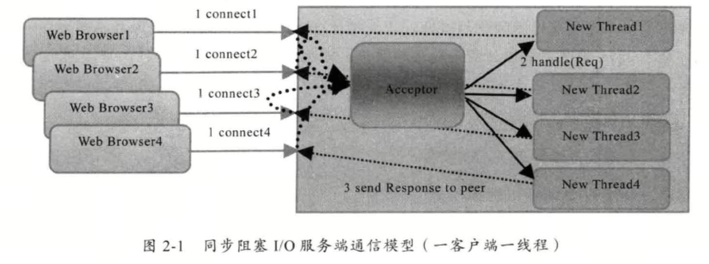
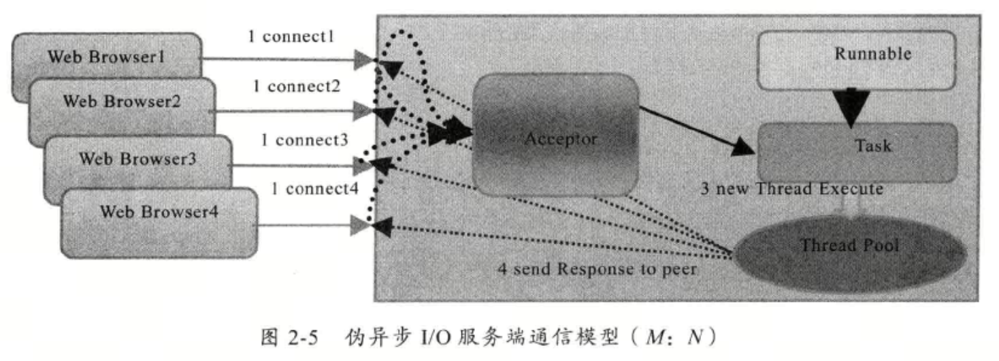
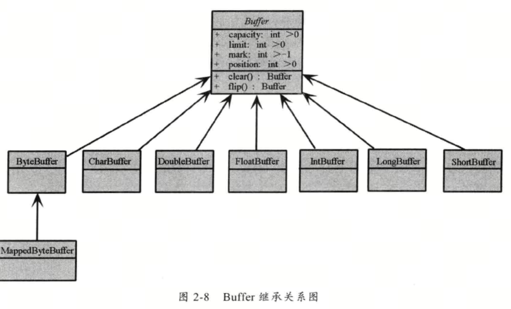
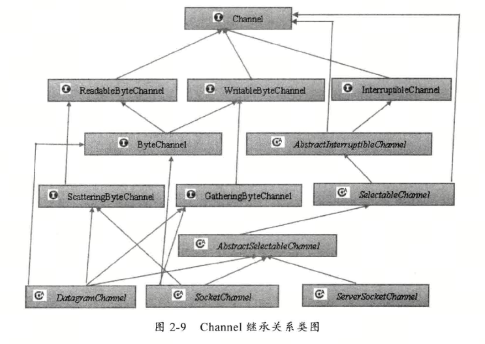
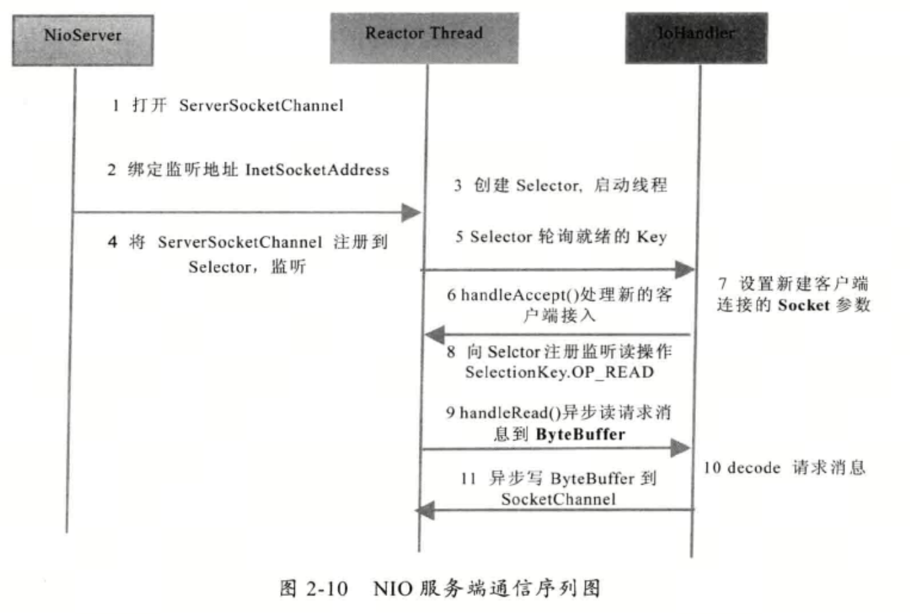

# 第2章 NIO 入门

## 2.1 传统的BIO 编程



### TimeServer

``` java

import java.net.ServerSocket;
import java.net.Socket;

public class TimeServer {

    public static void main(String[] args)  {
        int port = 8088;
        try (ServerSocket server=new ServerSocket(port);){
            System.out.println("The time server is start in port : " + port);
            while (true) {
                try{
                    Socket socket=server.accept();
                    new Thread(new TimeServerHandler(socket)).start();
                }catch (Exception e){
                    e.printStackTrace();
                }
            }
        } catch (Exception e) {
            e.printStackTrace();
        }
    }
}
```

### TimeServerHandler

``` java
import java.io.BufferedReader;
import java.io.IOException;
import java.io.InputStreamReader;
import java.io.PrintWriter;
import java.net.Socket;

public class TimeServerHandler implements Runnable {

    private Socket socket;

    public TimeServerHandler(Socket socket) {
        this.socket = socket;
    }

    @Override
    public void run() {
        try (BufferedReader in = new BufferedReader(new InputStreamReader(this.socket.getInputStream()));
             PrintWriter out = new PrintWriter(this.socket.getOutputStream(), true);) {
            String currentTime = null;
            String body = null;
            while (true) {
                body = in.readLine();
                if (body == null)
                    break;
                System.out.println("The time server receive order : " + body);
                currentTime = "QUERY TIME ORDER".equalsIgnoreCase(body) ? new java.util.Date(
                        System.currentTimeMillis()).toString() : "BAD ORDER";
                out.println(currentTime);
            }
        } catch (Exception e) {
            e.printStackTrace();
        }finally {
            if (this.socket != null) {
                try {
                    this.socket.close();
                } catch (IOException e1) {
                    e1.printStackTrace();
                }
                this.socket = null;
            }
        }
    }
}

```

### TimeClient

``` java
import java.io.BufferedReader;
import java.io.InputStreamReader;
import java.io.PrintWriter;
import java.net.Socket;

public class TimeClient {

    public static void main(String[] args) {
        int port = 8088;
        try (Socket socket = new Socket("127.0.0.1", port);
             BufferedReader in = new BufferedReader(new InputStreamReader(socket.getInputStream()));
             PrintWriter out = new PrintWriter(socket.getOutputStream(), true);) {
            out.println("QUERY TIME ORDER");
            System.out.println("Send order 2 server succeed.");
            String resp = in.readLine();
            System.out.println("Now is : " + resp);
        } catch (Exception e) {
            e.printStackTrace();
        }
    }
}
```

## 2.2 伪异步I/O 编程



``` java
package com.onekbase.demo.netty.pio;

import com.onekbase.demo.netty.bio.TimeServerHandler;
import java.net.ServerSocket;
import java.net.Socket;
import java.util.concurrent.ArrayBlockingQueue;
import java.util.concurrent.ExecutorService;
import java.util.concurrent.ThreadPoolExecutor;
import java.util.concurrent.TimeUnit;

public class TimeServer {

    public static void main(String[] args) {
        int port = 8090;
        try (ServerSocket server = new ServerSocket(port);){
            System.out.println("The time server is start in port : " + port);
            TimeServerHandlerExecutePool singleExecutor = new TimeServerHandlerExecutePool(
                    50, 10000);// 创建IO任务线程池
            while (true) {
                Socket socket = server.accept();
                singleExecutor.execute(new TimeServerHandler(socket));
            }
        } catch (Exception e){
           e.printStackTrace();
        }
    }
}

class TimeServerHandlerExecutePool {
    private ExecutorService executor;
    public TimeServerHandlerExecutePool(int maxPoolSize, int queueSize) {
        executor = new ThreadPoolExecutor(Runtime.getRuntime()
                .availableProcessors(), maxPoolSize, 120L, TimeUnit.SECONDS,
                new ArrayBlockingQueue<Runnable>(queueSize));
    }

    public void execute(Runnable task) {
        executor.execute(task);
    }
}
```

## 2.3 NIO 编程










### TimeServer

dn: 为了做bio client兼容，对读写数据添加了`\n`{=latex}

``` java
package com.onekbase.demo.netty.nio;

import java.io.IOException;
import java.net.InetSocketAddress;
import java.nio.ByteBuffer;
import java.nio.channels.SelectionKey;
import java.nio.channels.Selector;
import java.nio.channels.ServerSocketChannel;
import java.nio.channels.SocketChannel;
import java.util.Iterator;
import java.util.Set;

public class TimeServer {

    public static void main(String[] args) {
        int port = 8088;
        MultiplexerTimeServer timeServer = new MultiplexerTimeServer(port);
        new Thread(timeServer, "NIO-MultiplexerTimeServer-001").start();
    }
}

class MultiplexerTimeServer implements Runnable {

    private Selector selector;

    private volatile boolean stop;

    public MultiplexerTimeServer(int port) {
        try {
            selector = Selector.open();
            ServerSocketChannel servChannel = ServerSocketChannel.open();
            servChannel.configureBlocking(false);
            servChannel.socket().bind(new InetSocketAddress(port), 1024);
            servChannel.register(selector, SelectionKey.OP_ACCEPT);
            System.out.println("The time server is start in port : " + port);
        } catch (IOException e) {
            e.printStackTrace();
            System.exit(1);
        }
    }

    public void stop() {
        this.stop = true;
    }

    @Override
    public void run() {
        while (!stop) {
            try {
                selector.select(1000);
                Set<SelectionKey> selectedKeys = selector.selectedKeys();
                Iterator<SelectionKey> it = selectedKeys.iterator();
                SelectionKey key;
                while (it.hasNext()) {
                    key = it.next();
                    it.remove();
                    try {
                        handleInput(key);
                    } catch (Exception e) {
                        if (key != null) {
                            key.cancel();
                            if (key.channel() != null)
                                key.channel().close();
                        }
                    }
                }
            } catch (Throwable t) {
                t.printStackTrace();
            }
        }
        // 多路复用器关闭后，所有注册在上面的Channel和Pipe等资源都会被自动去注册并关闭，所以不需要重复释放资源
        if (selector != null) {
            try {
                selector.close();
            } catch (IOException e) {
                e.printStackTrace();
            }
        }
    }

    private void handleInput(SelectionKey key) throws IOException {

        if (!key.isValid()) {
            return;
        }
        // 处理新接入的请求消息
        if (key.isAcceptable()) {
            // Accept the new connection
            ServerSocketChannel ssc = (ServerSocketChannel) key.channel();
            SocketChannel sc = ssc.accept();
            sc.configureBlocking(false);
            // Add the new connection to the selector
            sc.register(selector, SelectionKey.OP_READ);
            return ;
        }
        if (key.isReadable()) {
            // Read the data
            SocketChannel sc = (SocketChannel) key.channel();
            ByteBuffer readBuffer = ByteBuffer.allocate(1024);
            int readBytes = sc.read(readBuffer);
            if (readBytes > 0) {
                readBuffer.flip();
                byte[] bytes = new byte[readBuffer.remaining()];
                readBuffer.get(bytes);
                String body = new String(bytes, "UTF-8");
                System.out.println("The time server receive order : "+ body);
                String currentTime = "QUERY TIME ORDER"
                        .equalsIgnoreCase(body.replace("\n","")) ? (new java.util.Date(
                        System.currentTimeMillis()).toString()+"\n")
                        : "BAD ORDER\n";
                if ("STOP".equalsIgnoreCase(body)) {
                    stop();
                }
                doWrite(sc, currentTime);
            } else if (readBytes < 0) {
                // 对端链路关闭
                key.cancel();
                sc.close();
            }
            // 读到0字节，忽略
        }
    }

    private void doWrite(SocketChannel channel, String response)
            throws IOException {
        if (response != null && response.trim().length() > 0) {
            byte[] bytes = response.getBytes();
            ByteBuffer writeBuffer = ByteBuffer.allocate(bytes.length);
            writeBuffer.put(bytes);
            writeBuffer.flip();
            channel.write(writeBuffer);
        }
    }
}


```

### TimeClient

书中client连接有问题，且client没有必要用selector，直接写个简单的

``` java
package com.onekbase.demo.netty.nio;

import java.io.IOException;
import java.net.InetSocketAddress;
import java.nio.ByteBuffer;
import java.nio.channels.SocketChannel;

public class TcpClientSocketChannel {
    public static void main(String[] args) {
        try {
            // Create a socket channel and connect to the server
            SocketChannel socketChannel = SocketChannel.open();
            socketChannel.connect(new InetSocketAddress("localhost", 8088));
            // Send a message to the server
            String message = "QUERY TIME ORDER";
            ByteBuffer buffer = ByteBuffer.wrap(message.getBytes());
            socketChannel.write(buffer);
            System.out.println("Send order 2 server succeed.");
            // Receive a response from the server
            ByteBuffer responseBuffer = ByteBuffer.allocate(1024);
            socketChannel.read(responseBuffer);
            responseBuffer.flip();
            String response = new String(responseBuffer.array(), 0, responseBuffer.limit());
            System.out.println("Now is: " + response);
            // Close the socket channel
            socketChannel.close();
        } catch (IOException e) {
            e.printStackTrace();
        }
    }
}

```

## 2.4 AIO 编程
