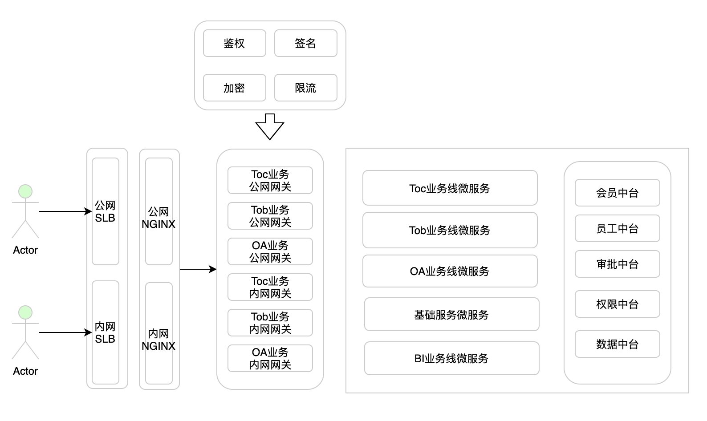
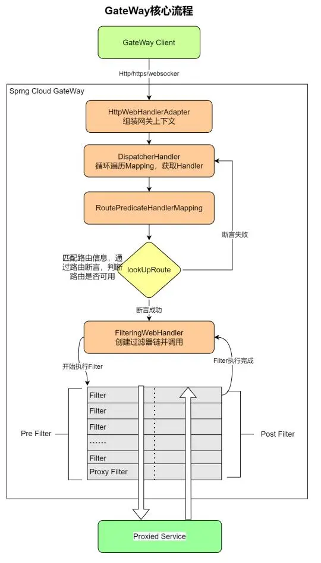

# gateway

## 网关的作用 

为什么需要网关？

1.  封装内部微服务功能，对外统一提供对外接口供外部访问
    -   内部系统:
        不被前端、APP、三方直接调用，可以同步修改上线，无兼容问题
    -   外部接口: 修改时需要前端、APP、三方配合同步修改，有兼容问题
2.  统一规划对外接口，封装内部微服务功能的变化
    -   内部接口地址改变
    -   内部接口迁移
3.  公共功能：鉴权、权限、验签、限流，提取内部微服务功能到网关统一管理

gateway和nginx的区别：

1.  管理分属不同，nginx一般运维管理，gateway一般开发管理
2.  路由功能类似，但nginx定制开发能力差，需要运维定制
3.  应用架构层面不能满足开发需求，鉴权、签名、限流等
4.  不能接入注册中心，统一代理微服务接口

网关的业务架构作用：



## gateway网关的原理

1.  断言一个请求走哪个路由
2.  用过滤器处理请求



## gateway网关搭建 

搭建一个gateway，不接入微服务，使用域名路由服务。

1.  创建一个springboot maven项目

``` xml
<parent>
      <groupId>org.springframework.boot</groupId>
      <artifactId>spring-boot-starter-parent</artifactId>
      <version>2.3.2.RELEASE</version>
</parent>
```

1.  引入springcloud依赖管理

``` xml
<dependencyManagement>
    <dependencies>
        <dependency>
            <groupId>org.springframework.cloud</groupId>
            <artifactId>spring-cloud-dependencies</artifactId>
            <version>Hoxton.SR9</version>
            <type>pom</type>
            <scope>import</scope>
        </dependency>
  </dependencies>
</dependencyManagement>
```

1.  引入gateway依赖

``` xml
<dependency>
    <groupId>org.springframework.cloud</groupId>
    <artifactId>spring-cloud-starter-gateway</artifactId>
</dependency>
```

1.  配置路由

```yaml
spring:
  cloud:
    gateway:
      routes:
        - id: facade-hello-http
          uri: http://localhost:8088
          predicates:
            - Path=/api/gateway/http/**
          filters:
            - StripPrefix=2
```
## 路由配置最佳实践

1.  禁止使用globalfilter实现业务功能，因为不能对指定路由做变更，需要改代码
2.  后端接口统一添加相对路径，我习惯用*api/gateway*
3.  按业务拆分路由，同一内部服务不同业务拆分为不同路由
    -   会员注册
    -   会员查询
    -   白名单：按业务拆分路由，不要混一起
4.  对外路由事先规划好，内部服务接口可以变，但对外地址不可以变
    -   对外路由不要依赖于内部服务接口
    -   按业务模块聚合对外路由

## actuator

Spring Boot Actuator 提供了多种特性来监控和管理应用程序

``` xml
<dependency>
    <groupId>org.springframework.boot</groupId>
    <artifactId>spring-boot-starter-actuator</artifactId>
</dependency>
```
```yaml
management:
  endpoints:
    web:
      exposure:
        include: '*' # 默认只开放 health 和 info 两个端点，通过 * 开放所有的端点。
  endpoint:
    health:
      enabled: true  # 是否开启， 默认true 开启
      show-details: always 
```
下表总结了Spring Cloud Gateway actuator endpoints。

注意，每个endpoint都是/actuator/gateway作为基本路径。

| id            | HTTP-Method | Description        |
|---------------|-------------|--------------------|
| globalfilters | GET         | 返回全局Filter列表 |
| routefilters  | GET         | 每个路由的filter   |
| refresh       | POST        | 刷新路由缓存       |
| routes        | GET         | 路由列表           |
| routes/{id}   | GET         | 指定路由的信息     |
| routes/{id}   | POST        | 创建路由           |
| routes/{id}   | DELETE      | 删除路由           |

## gateway引入nacos 

为了接入微服务环境，使用应用名调用微服务，引入nacos注册中心

1.  引入springcloud alibaba依赖管理
2.  引入nacos依赖

``` xml
<dependencyManagement>
    <dependencies>
        ......
        <dependency>
            <groupId>com.alibaba.cloud</groupId>
            <artifactId>spring-cloud-alibaba-dependencies</artifactId>
            <version>2.2.6.RELEASE</version>
            <type>pom</type>
            <scope>import</scope>
        </dependency>
    </dependencies>
</dependencyManagement>
<dependencies>
    ......
    <dependency>
        <groupId>com.alibaba.cloud</groupId>
        <artifactId>spring-cloud-starter-alibaba-nacos-discovery</artifactId>
    </dependency>
</dependencies>
```
```yaml
spring:
  profiles:
    active: dev
  application:
    name: edu-gateway
  cloud:
    gateway:
      routes:
        - id: facade-hello-http
          uri: http://localhost:8088
          predicates:
            - Path=/api/gateway/http/**
          filters:
            - StripPrefix=2
        - id: facade-hello
          uri: lb://edu-cloud-facade
          predicates:
            - Path=/api/gateway/lb/http/**
          filters:
            - StripPrefix=3
        - id: center-echo
          uri: lb://edu-cloud-center
          predicates:
            - Path=/api/gateway/center/**
          filters:
            - StripPrefix=3
            - PrefixPath=/edu/center
```
## gateway predicates

所有断言可以搜RoutePredicateFactory结尾的类

| predicate            | 功能                                             | 示例                                                                                           |
|----------------------|--------------------------------------------------|------------------------------------------------------------------------------------------------|
| After                | 在这个时间点之后 时间格式为ZonedDateTime.now()   | After=2022-05-23T19:52:33.736+08:00\[Asia/Shanghai\]                                           |
| Before               | 在这个时间点之前                                 | Before=2021-05-23T19:52:33.736+08:00\[Asia/Shanghai\]                                          |
| Between              | 两个时间点之内                                   | 2022-05-23T19:52:33.736+08:00\[Asia/Shanghai\], 2023-05-23T19:52:33.736+08:00\[Asia/Shanghai\] |
| Cookie               | 接收Cookie参数，且值需要与正则表达是匹配         | Cookie=chocolate, ch.p                                                                         |
| Header               | 请求头匹配                                       | Header=X-Request-Id, d+                                                                        |
| Host                 | 请求的host匹配规则                               | Host=.somehost.org,.anotherhost.org                                                    |
| Method               | 请求的方式匹配参数                               | Method=GET,POST                                                                                |
| Path                 | 一个路径集合，表示请求的路径需要匹配Path中的路径 | Path=/red/{segment},/blue/{segment}                                                            |
| Query                | 请求param和正则表达式                            | Query=green                                                                                    |
| RemoteAddr           |                                                  | RemoteAddr=192.168.1.1/24                                                                      |
| Weight               | 对于同一个组内的路由按照权重转发                 |                                                                                                |
| XForwardedRemoteAddr |                                                  | XForwardedRemoteAddr=192.168.1.1/24                                                            |
|                      |                                                  |                                                                                                |

### Weight Route

接收一组【组名，权重】，然后对于同一个组内的路由按照权重转
```
spring:
  cloud:
    gateway:
      routes:
      - id: weight_high
        uri: https://weighthigh.org
        predicates:
        - Weight=group1, 8
      - id: weight_low
        uri: https://weightlow.org
        predicates:
        - Weight=group1, 2
```
### 自定义路由断言工厂

自定义路由断言工厂

1.  必须是Spring的Bean
2.  类必须以RoutePredicateFactory结尾（约定大于配置）
3.  必须继承AbstractRoutePredicateFactory
4.  必须声明静态内部类 声明属性来接收 配置文件中对应的断言的信息
5.  需要结合shortcutFieldOrder进行绑定
6.  通过apply进行逻辑判断 true就是匹配成功 false匹配失败

## gateway灰度

通过路径控制流量
```yaml
- id: edu-cloud-center-path
  uri: lb://edu-cloud-center
  predicates:
    - Path=/api/gateway/v2/echo
  filters:
    - StripPrefix=3
    - PrefixPath=/edu/center/
- id: edu-cloud-facade-path
  uri: lb://edu-cloud-path
  predicates:
    - Path=/api/gateway/v1/echo
  filters:
    - StripPrefix=3
```
通过参数控制
```yaml
- id: edu-cloud-center-param
  uri: lb://edu-cloud-center
  predicates:
    - Path=/api/gateway/echo
    - Query=appversion,center
  filters:
    - StripPrefix=2
    - PrefixPath=/edu/center/
- id: edu-cloud-facade-param
  uri: lb://edu-cloud-facade
  predicates:
    - Path=/api/gateway/echo
    - Query=appversion,facade
  filters:
    - StripPrefix=2
```
通过header控制流量
```yaml
- id: edu-cloud-center-header
    uri: lb://edu-cloud-center
    predicates:
      - Path=/api/gateway/gray/echo
      - Header=appversion, center
    filters:
      - StripPrefix=3
      - PrefixPath=/edu/center/
  - id: edu-cloud-facade-header
    uri: lb://edu-cloud-facade
    predicates:
      - Path=/api/gateway/gray/echo
      - Header=appversion, front
    filters:
      - StripPrefix=3
```
## gateway filters

所有自带filter可以搜GatewayFilter后缀的类，去掉GatewayFilter即为过滤器名

| filter                        | 功能说明                          | 示例                                                                       |
|-------------------------------|-----------------------------------|----------------------------------------------------------------------------|
| AddRequestHeader              | 添加请求头                        | AddRequestHeader=X-Request-red, blue                                       |
| AddRequestParameter           | 添加参数                          | AddRequestParameter=red, blue                                              |
| AddResponseHeader             | 添加响应头                        | AddResponseHeader=X-Response-Red, Blue                                     |
| DedupeResponseHeader          | 剔除重复的响应头                  |                                                                            |
| CircuitBreaker                |                                   |                                                                            |
| MapRequestHeader              | 采用fromHeader和toHeader参数      | MapRequestHeader=Blue, X-Request-Red                                       |
| PrefixPath                    | 请求添加前缀                      | PrefixPath=/mypath                                                         |
| PreserveHostHeader            |                                   |                                                                            |
| RequestRateLimiter            | 限流                              |                                                                            |
| RedirectTo                    | 重定向                            | RedirectTo=302, <https://acme.org>                                         |
| RemoveRequestHeader           | 删除请求头                        | RemoveRequestHeader=X-Request-Foo                                          |
| RemoveResponseHeader          | 删除响应头                        | RemoveResponseHeader=X-Response-Foo                                        |
| RemoveRequestParameter        | 删除请求参数                      | RemoveRequestParameter=red                                                 |
| RewritePath                   | 重写请求路径                      | RewritePath=/red/?(?\<segment\>.\*), /\${segment}                          |
| RewriteLocationResponseHeader | 修改响应头Location的值            | RewriteLocationResponseHeader=AS~INREQUEST~, Location, ,                   |
| RewriteResponseHeader         | Java 正则表达式灵活地重写响应头值 | RewriteResponseHeader=X-Response-Red, , password=\[\^&\]+, password=\*\*\* |
| SaveSession                   | 强制执行 WebSession::save操作     |                                                                            |
| SecureHeaders                 |                                   |                                                                            |
| SetPath                       |                                   | SetPath=/{segment}                                                         |
| SetRequestHeader              | 重置请求头的值                    | SetRequestHeader=X-Request-Foo, Bar                                        |
| SetResponseHeader             |                                   | SetResponseHeader=X-Response-Red, Blue                                     |
| SetStatus                     |                                   | SetStatus=401                                                              |
| StripPrefix                   | 剥离路径中的部分数                | StripPrefix=2                                                              |
| Retry                         |                                   |                                                                            |
| RequestSize                   | 请求大小限制                      |                                                                            |
| SetRequestHostHeader          | 覆盖消息头Host                    |                                                                            |
| ModifyRequestBody             | 修改请求主体                      |                                                                            |
| Token Relay                   |                                   |                                                                            |
| Default Filters               | 添加过滤器并将其应用于所有路由    | spring.cloud.gateway.default-filters                                       |

### DedupeResponseHeader

DedupeResponseHeader
剔除重复的响应头，接受一个name参数和一个可选strategy参数。name可以包含以空格分隔的标题名称列表。

如果网关 CORS
逻辑和下游逻辑都添加了响应头Access-Control-Allow-Credentials和Access-Control-Allow-Origin响应头的重复值，这将删除它们。

该DedupeResponseHeader过滤器还接受一个可选的strategy参数。接受的值为RETAIN~FIRST~（默认）、RETAIN~LAST~、 和RETAIN~UNIQUE~。
```yaml
spring:
  cloud:
    gateway:
      routes:
      - id: dedupe_response_header_route
        uri: https://example.org
        filters:
        - DedupeResponseHeader=Access-Control-Allow-Credentials Access-Control-Allow-Origin
```
### CircuitBreaker

CircuitBreaker使用 Spring Cloud Circuit Breaker API 将网关路由包装在断路器中。Spring Cloud Circuit Breaker 支持多个可与 Spring Cloud Gateway 一起使用的库。Spring Cloud 支持开箱即用的 Resilience4J。

要启用 Spring Cloud Circuit Breaker 过滤器，您需要放置spring-cloud-starter-circuitbreaker-reactor-resilience4j在类路径上。

### FallbackHeaders

FallbackHeaders允许您在转发到fallbackUri外部应用程序中的请求的标头中添加 Spring Cloud Circuit Breaker 执行异常详细信息 。
```yaml
spring:
  cloud:
    gateway:
      routes:
      - id: ingredients
        uri: lb://ingredients
        predicates:
        - Path=//ingredients/**
        filters:
        - name: CircuitBreaker
          args:
            name: fetchIngredients
            fallbackUri: forward:/fallback
      - id: ingredients-fallback
        uri: http://localhost:9994
        predicates:
        - Path=/fallback
        filters:
        - name: FallbackHeaders
          args:
            executionExceptionTypeHeaderName: Test-Header
```
在此示例中，在运行断路器时发生执行异常后，请求将转发到fallback运行于 localhost:9994上的应用程序中的端点或处理程序。带有异常类型、消息和（如果可用）根本原因异常类型和消息的标头由FallbackHeaders过滤器添加到该请求中。

您可以通过设置以下参数的值（显示为默认值）来覆盖配置中标题的名称：

executionExceptionTypeHeaderName (“Execution-Exception-Type”)

executionExceptionMessageHeaderName (“Execution-Exception-Message”)

rootCauseExceptionTypeHeaderName (“Root-Cause-Exception-Type”)

rootCauseExceptionMessageHeaderName (“Root-Cause-Exception-Message”)

### PreserveHostHeader

PreserveHostHeade没有参数。此过滤器设置路由过滤器检查的请求属性，以确定是否应发送原始Host 消息头，而不是由 HTTP 客户端确定的Host 消息头。

### RewriteLocationResponseHeader

RewriteLocationResponseHeader修改响应头Location的值，通常摆脱于后端的具体细节。需要stripVersionMode，locationHeaderName，hostValue，和protocolsRegex参数。
```yaml
spring:
  cloud:
    gateway:
      routes:
      - id: rewritelocationresponseheader_route
        uri: http://example.org
        filters:
        - RewriteLocationResponseHeader=AS_IN_REQUEST, Location, ,
```
该stripVersionMode参数具有以下可能的值：NEVER~STRIP~、AS~INREQUEST~（默认）和ALWAYS~STRIP~。

NEVER~STRIP~: 版本不会被剥离，即使原始请求路径不包含版本。

AS~INREQUEST~ 仅当原始请求路径不包含版本时才会剥离版本。

ALWAYS~STRIP~ 版本总是被剥离，即使原始请求路径包含版本。

该hostValue参数（如果提供）用于替换host:port响应Location标头的部分。如果未提供，Host则使用请求标头的值。

protocolsRegex参数必须是一个有效的正则表达式String，抵靠该协议名称匹配。如果不匹配，则过滤器不执行任何操作。默认为http\|https\|ftp\|ftps。

### RewriteResponseHeader

RewriteResponseHeader 需要name，regexp和replacement参数。它使用 Java 正则表达式来灵活地重写响应头值。
```yaml
    spring:
      cloud:
        gateway:
          routes:
          - id: rewriteresponseheader_route
            uri: https://example.org
            filters:
            - RewriteResponseHeader=X-Response-Red, , password=[^&]+, password=***
```
对于 `/aaauser=ford&password=omg!what&flag=true`的 header 值，在发出下游请求后设置为`/aaauser=ford&password=***&flag=true`。

### SecureHeaders

SaveSession在向下游服务转发请求之前强制执行 WebSession::save操作。这在将Spring Session 之类的东西与惰性数据存储一起使用时特别有用，并且您需要确保在进行转发调用之前已保存会话状态。
```yml
spring:
  cloud:
    gateway:
      routes:
      - id: save_session
        uri: https://example.org
        predicates:
        - Path=/foo/**
        filters:
        - SaveSession
```
SecureHeaders会向响应添加多个头数据，括号中是默认值:

X-Xss-Protection:1 (mode=block)

Strict-Transport-Security (max-age=631138519)

X-Frame-Options (DENY)

X-Content-Type-Options (nosniff)

Referrer-Policy (no-referrer)

Content-Security-Policy (default-src ‘self’ https:; font-src ‘self’ https: data:; img-src ‘self’ https: data:; object-src ‘none’; script-src https:; style-src ‘self’ https: ‘unsafe-inline)’

X-Download-Options (noopen)

X-Permitted-Cross-Domain-Policies (none)

要更改默认值，请在spring.cloud.gateway.filter.secure-headers命名空间中设置适当的属性。以下属性可用：

xss-protection-header

strict-transport-security

x-frame-options

x-content-type-options

referrer-policy

content-security-policy

x-download-options

x-permitted-cross-domain-policies

要禁用默认值，请spring.cloud.gateway.filter.secure-headers.disable使用逗号分隔值设置属性。以下示例显示了如何执行此操作：
```
    spring.cloud.gateway.filter.secure-headers.disable=x-frame-options,strict-transport-security
```
### SetPath

SetPath 输入一个参数：template，匹配 Spring Framework URI 路径模板并修改，允许多个匹配
```yml
spring:
  cloud:
    gateway:
      routes:
      - id: setpath_route
        uri: http://www.hxmec.com
        predicates:
        - Path=/foo/{segment}
        filters:
        - SetPath=/{segment}
```
如上所示，请求 /foo/bar 会被设置为 /bar 到下游。

### SetStatus

SetStatus采用单个参数，status。它必须是有效的 Spring Http Status。它可能是404枚举的整数值或字符串表示形式：NOT~FOUND~。
```yml
spring:
  cloud:
    gateway:
      routes:
      - id: setstatusstring_route
        uri: https://example.org
        filters:
        - SetStatus=BAD_REQUEST
      - id: setstatusint_route
        uri: https://example.org
        filters:
        - SetStatus=401
```
无论哪种情况，响应的 HTTP 状态都设置为 401。

您可以将 SetStatus 配置为从响应的标头中的代理请求返回原始 HTTP 状态代码。如果配置了以下属性，则将标头添加到响应中：
```yml
spring:
  cloud:
    gateway:
      set-status:
        original-status-header-name: original-http-status
```
### Retry

该过滤器用于重试请求，支持如下参数的配置：

- retries: 重试的次数
- statuses: 应被重试的 HTTP Status Codes，参考 org.springframework.http.HttpStatus
- methods: 应被重试的 HTTP Methods，参考org.springframework.http.HttpMethod
- series: 应被重试的 Status Codes 系列，参考 org.springframework.http.HttpStatus.Series
- exceptions: 应被重试的异常列表
- backoff: 为重试配置指数级的 backoff。重试时间间隔的计算公式为 firstBackoff * (factor ^ n)，n 是重试的次数；如果设置了 maxBackoff，最大的 backoff 限制为 maxBackoff. 如果 basedOnPreviousValue 设置为 true, backoff 计算公式为 prevBackoff * factor.
 
如果 Retry filter 启用，默认配置如下：

- retries:3 times
- series:5XX series
- methods:GET method
- exceptions:IOException and TimeoutException
- backoff:disabled

Retry配置示例：

```yml
spring:
  cloud:
    gateway:
      routes:
      - id: retry_test
        uri: http://localhost:8080/flakey
        predicates:
        - Host=*.retry.com
        filters:
        - name: Retry
          args:
            retries: 3
            statuses: BAD_GATEWAY
            methods: GET,POST
            backoff:
              firstBackoff: 10ms
              maxBackoff: 50ms
              factor: 2
              basedOnPreviousValue: false
```

上面例子，当下游服务返回502状态码时，gateway会重试3次。

注意：当将重试过滤器与带有forward:前缀的 URL 一起使用时，应仔细编写目标端点，以便在发生错误的情况下，它不会做任何可能导致响应发送到客户端并提交的操作。 例如，如果目标端点是带注释的控制器，则目标控制器方法不应返回带有错误状态代码的 ResponseEntity。 相反，它应该引发 Exception 或发出错误信号（例如，通过Mono.error(ex)返回值），可以配置重试过滤器来进行重试处理。

警告：当将重试过滤器与任何带有 body 的 HTTP方法一起使用时，body 将被缓存，并且网关将受到内存的限制。 body 将缓存在 ServerWebExchangeUtils.CACHED_REQUEST_BODY_ATTR定义的请求属性中，对象的类型是org.springframework.core.io.buffer.DataBuffer。

可以使用单个status和来添加简化的“快捷方式”符号method。

下面两个例子是等价的：
```yml
    spring:
      cloud:
        gateway:
          routes:
          - id: retry_route
            uri: https://example.org
            filters:
            - name: Retry
              args:
                retries: 3
                statuses: INTERNAL_SERVER_ERROR
                methods: GET
                backoff:
                  firstBackoff: 10ms
                  maxBackoff: 50ms
                  factor: 2
                  basedOnPreviousValue: false

          - id: retryshortcut_route
            uri: https://example.org
            filters:
            - Retry=3,INTERNAL_SERVER_ERROR,GET,10ms,50ms,2,false
```
### RequestSize

RequestSize 当请求大小大于允许的限制时，RequestSize可以限制请求到达下游服务。过滤器接受一个maxSize参数。可以被定义为一个数字，后跟一个可选的DataUnit后缀，例如“KB”或“MB”。字节的默认值为“Bit”。它是以字节为单位定义的请求的允许大小限制。
```yml
    spring:
      cloud:
        gateway:
          routes:
          - id: request_size_route
            uri: http://localhost:8080/upload
            predicates:
            - Path=/upload
            filters:
            - name: RequestSize
              args:
                maxSize: 5000000
```

RequestSize设置响应状态作为413 ，errorMessage为Payload Too Large与另外的报头时，请求被由于尺寸拒绝。以下示例显示了这样的errorMessage：
```
    errorMessage` : `Request size is larger than permissible limit. Request size is 6.0 MB where permissible limit is 5.0 MB
```
如果未在路由定义中作为过滤器参数提供，则默认请求大小设置为 5 MB。

### SetRequestHostHeader

SetRequestHostHeader在某些情况下，可能需要覆盖消息头Host。在这种情况下，SetRequestHostHeade可以用指定的值替换现有的Host。过滤器接受一个host参数。
```yml
    spring:
      cloud:
        gateway:
          routes:
          - id: set_request_host_header_route
            uri: http://localhost:8080/headers
            predicates:
            - Path=/headers
            filters:
            - name: SetRequestHostHeader
              args:
                host: example.org
```
该SetRequestHostHeade替换Host的值为example.org。

### Token Relay

Token Relay是 OAuth2 消费者充当客户端并将传入令牌转发到传出资源请求的地方。消费者可以是纯客户端（如 SSO 应用程序）或资源服务器。

Spring Cloud Gateway 可以将 OAuth2 访问令牌下游转发到它正在代理的服务。要将此功能添加到网关，您需要添加 TokenRelayGatewayFilterFactory如下内容：
```java
    @Bean
    public RouteLocator customRouteLocator(RouteLocatorBuilder builder) {
        return builder.routes()
                .route("resource", r -> r.path("/resource")
                        .filters(f -> f.tokenRelay())
                        .uri("http://localhost:9000"))
                .build();
    }
```
或
```yml
    spring:
      cloud:
        gateway:
          routes:
          - id: resource
            uri: http://localhost:9000
            predicates:
            - Path=/resource
            filters:
            - TokenRelay=
```
并且它将（除了登录用户并获取令牌之外）将身份验证令牌下游传递给服务（在本例中 /resource）。

要为 Spring Cloud Gateway 启用此功能，请添加以下依赖项

``` 
org.springframework.boot:spring-boot-starter-oauth2-client

```
### Default Filters

要添加过滤器并将其应用于所有路由，您可以使用spring.cloud.gateway.default-filters.

此属性采用过滤器列表。以下清单定义了一组默认过滤器：

```yml
spring:
  cloud:
    gateway:
      default-filters:
      - AddResponseHeader=X-Response-Default-Red, Default-Blue
      - PrefixPath=/httpbin

```

## gateway自定义filter

GlobalFilter

名字不限，继承GlobalFilter，全局生效。

``` java
@Slf4j
@Service
@ConditionalOnProperty( name = {"filter.global-log.enabled"}, matchIfMissing = true)
public class LogGlobalFilter implements GlobalFilter, Ordered {
    @Override
    public Mono<Void> filter(ServerWebExchange exchange, GatewayFilterChain chain) {
        log.info("global filter uri:{}",exchange.getRequest().getPath());
        return chain.filter(exchange);
    }

    @Override
    public int getOrder() {
        return 0;
    }
}
```

GatewayFilter

继承AbstractGatewayFilterFactory，名字以GatewayFilterFactory结尾，不以GatewayFilterFactory结尾类名即为filter名。

``` java
@Slf4j
@Service
public class LogUriGatewayFilterFactory extends AbstractGatewayFilterFactory {
    @Override
    public GatewayFilter apply(Object config) {
        return (exchange, chain) -> {
            log.info("gateway filter uri:{}",exchange.getRequest().getPath());
            return chain.filter(exchange);
        };
    }
}
```

一般不要使用GlobalFilter，因为可配制性差，如有需要可以通过配置default-filters实现
```yml
    spring:
      cloud:
        gateway:
          default-filters:
            - LogUri
          routes:
            - id: edu-cloud-center
              uri: lb://edu-cloud-center
              predicates:
                - Path=/api/gateway/hello
              filters:
                - StripPrefix=2
                - PrefixPath=/edu/center/demo/
```
## gateway探活功

提供一个status接口，供负载做探活使用。

``` java
@Slf4j
@Service
public class CheckStatusGatewayFilterFactory extends AbstractGatewayFilterFactory {
    @Override
    public GatewayFilter apply(Object config) {
        return (exchange, chain) -> {
            log.info("gateway filter uri:{}",exchange.getRequest().getPath());
            exchange.getResponse().setStatusCode(HttpStatus.OK);
            // exchange.getResponse().getHeaders().add("Content-Type","application/json;charset=UTF-8");
            DataBufferFactory dataBufferFactory = exchange.getResponse().bufferFactory();
            DataBuffer wrap = dataBufferFactory.wrap("ok".getBytes(StandardCharsets.UTF_8));
            return exchange.getResponse().writeWith(Mono.just(wrap));
        };
    }
}
```

```yml
  - id: gateway-status
    uri: lb://abc
    predicates:
      - Path=/api/gateway/status
    filters:
      - CheckStatus
```
提取工具类

``` xml
<dependency>
    <groupId>com.alibaba</groupId>
    <artifactId>fastjson</artifactId>
    <version>1.2.68</version>
</dependency>
```

``` java
  @Data
  public class R<T> {

      private Integer code = HttpStatus.OK.value();
      private String msg = "success";
      private T data;

      public static R ok() {
          return new R();
      }
  }


public class GatewayHelper {

    public static Mono<Void> ok(ServerWebExchange exchange){
        exchange.getResponse().setStatusCode(HttpStatus.OK);
        exchange.getResponse().getHeaders().add("Content-Type","application/json;charset=UTF-8");
        DataBufferFactory dataBufferFactory = exchange.getResponse().bufferFactory();
        DataBuffer wrap = dataBufferFactory.wrap(JSON.toJSONString(R.ok()).getBytes(StandardCharsets.UTF_8));
        return exchange.getResponse().writeWith(Mono.just(wrap));
    }
}
```

## gateway登录鉴权功能 

1.  登录接口
2.  网关Filter验证是否登录
3.  网关Filter返回用户信息接口
4.  单点登录逻辑

中台服务实现登录接口

引入redis

``` xml
<dependency>
    <groupId>org.springframework.boot</groupId>
    <artifactId>spring-boot-starter-data-redis</artifactId>
</dependency>
<dependency>
    <groupId>org.apache.commons</groupId>
    <artifactId>commons-pool2</artifactId>
    <version>2.8.1</version>
</dependency>
```

``` java
@Configuration
public class RedisUtils implements ApplicationContextAware {

    private static StringRedisTemplate stringRedisTemplate;

    @Override
    public void setApplicationContext(ApplicationContext applicationContext) throws BeansException {
        stringRedisTemplate=applicationContext.getBean(StringRedisTemplate.class);
    }

    public static String get(String key) {
         return stringRedisTemplate.opsForValue().get(key);
    }

    public static void set(String key, String value) {
        stringRedisTemplate.opsForValue().set(key,value);
    }
}

```

``` java
  @Data
  public class LoginVO {

      private String username;
      private String pwd;

  }

  @Data
  public class R<T> {

      private Integer code = HttpStatus.OK.value();
      private String msg = "success";
      private T data;

      public static R<String> ok() {
          return ok("");
      }
      public static <T> R<T> ok(T data) {
          R<T> r=new R<T>();
          r.setData(data);
          return r;
      }
  }

  @RestController
  public class LoginController {
      @PostMapping("/login")
      public R<String> login(@RequestBody LoginVO lvo) {
          if(!"abc".equals(lvo.getUsername())){
              return R.ok("username or password error");
          }
          String sessionId= UUID.randomUUID().toString();
          RedisUtils.set(sessionId,"{uid:123,username:abc}");
          return R.ok(sessionId);
      }

  }
@RestController
public class LoginController {
    @PostMapping("/login")
    public R<String> login(@RequestBody LoginVO lvo) {
        if(!"abc".equals(lvo.getUsername())){
            return R.ok("username or password error");
        }
        // 单点登录情况下这里需要并发控制
        String loginKey="login:"+lvo.getUsername();
        String oldsid=RedisUtils.get(loginKey);
        if(StringUtils.isNotBlank(oldsid)){
            RedisUtils.del(oldsid);
            RedisUtils.del(loginKey);
        }
        String sessionId= UUID.randomUUID().toString();
        RedisUtils.set(sessionId,"{uid:123,username:abc}");
        RedisUtils.set(loginKey,sessionId);

        return R.ok(sessionId);
    }
}
```

网关Filter

``` java

  @Slf4j
  @Service
  public class AuthGatewayFilterFactory  extends AbstractGatewayFilterFactory {
      @Override
      public GatewayFilter apply(Object config) {
          return (exchange, chain) -> {
              String token=exchange.getRequest().getHeaders().getFirst("LOGINTOKEN");
              log.info("login filter token:{}",token);
              String juser=RedisUtils.get(token);
              log.info("login filter user:{}",juser);
              if(StringUtils.isBlank(juser)){
                  return GatewayHelper.noAuth(exchange);
              }
              return chain.filter(exchange);
          };
      }
  }


@Slf4j
@Service
public class UserInfoGatewayFilterFactory  extends AbstractGatewayFilterFactory {
    @Override
    public GatewayFilter apply(Object config) {
        return (exchange, chain) -> {
            String token=exchange.getRequest().getHeaders().getFirst("LOGINTOKEN");
            log.info("login filter token:{}",token);
            String juser=RedisUtils.get(token);
            log.info("login filter user:{}",juser);
            return GatewayHelper.ok(exchange, juser);
        };
    }
}

```
```
    @gwUrl=http://localhost:8083/api/gateway

    ### 
    POST  {{gwUrl}}/login
    Content-Type: application/json

    {
        "username":"abc",
        "pwd":123456
    }

    ###
    GET {{gwUrl}}/hello
    LOGINTOKEN: a11a4581-d221-40a7-b05b-f06f3b02d42e1

    ###
    GET {{gwUrl}}/userinfo
    LOGINTOKEN: 45991a4f-fde6-496e-b563-336a360639f4
```
## gateway限流

gateway有一个默认的限流filter，基于redis令牌桶实现。

RequestRateLimiterGatewayFilterFactory

``` java
@ConfigurationProperties("spring.cloud.gateway.filter.request-rate-limiter")
public class RequestRateLimiterGatewayFilterFactory extends
        AbstractGatewayFilterFactory<RequestRateLimiterGatewayFilterFactory.Config>

```

1.  gateway添加redis配置
2.  添加一个KeyResolver的实现。

``` java
@Component
public class RequestRateLimiterResolver {

    @Bean
    public KeyResolver ipKeyResolver() {
        return exchange -> Mono.just(
                exchange.getRequest()
                        .getHeaders()
                        .getFirst("X-Forwarded-For")
        );
    }

    @Primary
    @Bean
    public KeyResolver pathKeyResolver() {
        return exchange -> Mono.just(
                exchange.getRequest()
                        .getPath()
                        .toString()
        );
    }
}
```

1.  给路由添加限流配置

```yml
    - id: edu-cloud-center-echo
        uri: lb://edu-cloud-center
        predicates:
          - Path=/api/gateway/echo
        filters:
          - StripPrefix=2
          - PrefixPath=/edu/center/
          - name: RequestRateLimiter
            args:
              # 令牌桶每秒填充平均速率
              redis-rate-limiter.replenishRate: 50
              # 令牌桶的上限
              redis-rate-limiter.burstCapacity: 50
              # 使用SpEL表达式从Spring容器中获取Bean对象
              key-resolver: "#{@pathKeyResolver}"
```
注：pathKeyResolver是对每个uri做限流的，同一个route有多个接口地址，每个接口有相同的流量限制

## 功能权限管理

是否可以访问哪个接口？

给系统编号，每个系统分配访问接口地址

系统编号在路径上体现，或在Header头中传输

## 阿里网关替换

如何修改请请体参考：ModifyRequestBodyGatewayFilterFactory

## gateway压测

参数修改

``` java
@Configuration
public class ReactNettyConfiguration {

    @Bean
    public ReactorResourceFactory reactorClientResourceFactory() {
//        System.setProperty("reactor.netty.ioSelectCount","10");
        // 这里工作线程数为2-4倍都可以。看具体情况
        int ioWorkerCount = Math.max(Runtime.getRuntime().availableProcessors()*3, 4);
        System.setProperty("reactor.netty.ioWorkerCount",String.valueOf(ioWorkerCount));
        return new ReactorResourceFactory();
    }
}

```

gateway->center 接口 hello sleep 200ms ioSelectCount
默认为-1不打开，验证打开性能会差一点 结论: 单独压center

| jemter线程数 | ioWorkerCount | 90% | 95% | 99% | 吞吐量 | 错误率 | 线程数 | cpu  | 备注 |
|--------------|---------------|-----|-----|-----|--------|--------|--------|------|------|
| 500          | 8             | 216 | 221 | 238 | 2280   | 0      | 58     | 60%+ |      |
| 1000         | 8             | 327 | 360 | 450 | 3670   | 0      | 58     | 90%+ |      |
| 200          | 8             | 212 | 215 | 218 | 900+   | 0      | 58     | 40%+ |      |
| 1000         | 24            | 310 | 364 | 475 | 3800+  | 0      | 74     | 90%+ |      |
| 500          | 24            | 219 | 228 | 261 | 2290   | 0      | 74     | 60%+ |      |
|              |               |     |     |     |        |        |        |      |      |

## gateway签名验证

什么时候需要签名？

1.  验证访问者的身份
2.  验证内容没有被篡改

身份验证方法：

1.  oauth2: 最安全的方案，可以授权第三方资源权限
2.  用户密码: 用户直接访问系统方式
3.  签名:
    1.  非用户类调用方验证: APP、后端服务
    2.  非登录访问: 前端非登录访问，防止直接接口调用
    3.  简单身份验证: 不想开发很复杂的验证功能的时候

验证内容没有被篡改需要取出请求体运算，对性能有严重影响，非必要情况不建议使用。

``` java

package com.edu.gateway.filter;


import com.edu.gateway.base.GateWayResultCode;
import com.edu.gateway.base.GatewayHelper;
import com.edu.gateway.base.R;
import com.edu.gateway.utils.EncryptUtil;
import lombok.extern.slf4j.Slf4j;
import org.apache.commons.lang.StringUtils;
import org.springframework.beans.factory.annotation.Autowired;
import org.springframework.cloud.gateway.filter.GatewayFilter;
import org.springframework.cloud.gateway.filter.GatewayFilterChain;
import org.springframework.cloud.gateway.filter.factory.AbstractGatewayFilterFactory;
import org.springframework.core.env.Environment;
import org.springframework.stereotype.Component;
import org.springframework.web.server.ServerWebExchange;
import reactor.core.publisher.Mono;

import java.util.Date;

/**
 * X-Ca-Key   签名的key  每个版本key都不一样
 * X-Ca-Timestamp   调用方生成的时间戳 3分钟时间差。超过会报错
 * X-Ca-Nonce   随机数，最好雪花算法生成，一个请求一个
 * X-Ca-Content-Signature  md5 加密请求体
 * X-Ca-Signature    通过对 (content_type, key, timestamp,ca-id , token, url )   进行 加密后的数据
 * 加密方式  EncryptUtil.encodeByHmacSHA256(origData,secure);
 */
@Slf4j
@Component
public class SafetyAuthGatewayFilterFactory extends AbstractGatewayFilterFactory<Object> {

    public static String X_CA_KEY="X-Ca-Key";
    public static String X_CA_TIMESTAMP="X-Ca-Timestamp";
    // 传 1
    public static String X_CA_VERSION="X-Ca-Version";
    public static String X_CA_SIGNATURE="X-Ca-Signature";
    // 未启用 sha1 sha256 md5
    public static String X_CA_SIGNATURE_METHOD="X-Ca-Signature-Method";
    // 随机数，最好雪花算法生成，一个请求一个
    public static final String X_CA_NOCE=  "X-Ca-Nonce";
    // 内容摘要 现在不做内容签名验证，有值就行
    public static final String X_CA_CONTENT_SIGNATURE="X-Ca-Content-Signature" ;

    @Autowired
    private Environment environment;

    @Override
    public GatewayFilter apply(Object config) {
        return (exchange, chain) -> {
            log.info("gateway filter uri:{}",exchange.getRequest().getPath());
            return filter(exchange,chain);
        };
    }

    public Mono<Void> filter(ServerWebExchange exchange, GatewayFilterChain chain) {
        try {
            String path = exchange.getRequest().getPath().value();
            log.info("SafetyAuthGatewayFilter url:{} ,path: {}",exchange.getRequest().getURI(),path);

            //timestamp 合规
            String timestamp=exchange.getRequest().getHeaders().getFirst(X_CA_TIMESTAMP);
            if(StringUtils.isBlank(timestamp)||!checkTimestamp(timestamp)){
                log.info("SafetyAuthGatewayFilter checktime fail:{}",timestamp);
                return GatewayHelper.fail(exchange, GateWayResultCode.SAFETY_TIMESTAMP);
            }
            String version = exchange.getRequest().getHeaders().getFirst(X_CA_VERSION);
            if(StringUtils.isBlank(version)){
                log.info("SafetyAuthGatewayFilter ca_version fail:{}",version);
                return GatewayHelper.fail(exchange, GateWayResultCode.SAFETY_VERSION);
            }
            R<String> ssr = getSign(exchange);
            if(! ssr.isSuccess()){
                return GatewayHelper.fail(exchange, GateWayResultCode.SAFETY_CAKEY);
            }
            String sign = ssr.getData();
            log.info("SafetyAuthGatewayFilter sign string:{}",sign);
            String key=exchange.getRequest().getHeaders().getFirst(X_CA_KEY);
            String paramsign=exchange.getRequest().getHeaders().getFirst(X_CA_SIGNATURE);
            // 计算 sign签名
            R<String> sr= getSignBykey(key, sign);
            if(!sr.isSuccess()){
                return GatewayHelper.fail(exchange, GateWayResultCode.SAFETY_BUILD_FAIL);
            }
            String signBykey = sr.getData();
            if(!paramsign.equals(signBykey)){
                log.info("SafetyAuthGatewayFilter 计算的sign:{} , 前端传递的sign :{}",signBykey,paramsign);
                return GatewayHelper.fail(exchange, GateWayResultCode.SAFETY_CAKEY_SIGN);
            }
            return chain.filter(exchange);
        } catch (Exception e) {
            log.error("SafetyAuthGatewayFilter 鉴权未知异常",e);
            return GatewayHelper.fail(exchange, GateWayResultCode.SAFETY_ERROR);
        }
    }

    /**
     * @param timestamp
     * @return 时间验证结果
     */
    private boolean checkTimestamp(String timestamp) {
        Date date = new Date();
        long time = date.getTime();
        //10分钟毫秒
        long add =600000;
        long after=time+add;
        long begin=time-add;
        Long catime = Long.valueOf(timestamp);
        log.info("checkTimestamp time:{}  after:{}  begin:{} timestamp:{} catime:{}",time,after,begin,timestamp,catime);
        if(catime >begin && catime<after){
            return true;
        }
        return false;
    }

    /**
     * 根据 key 获取加密后的数据
     * @param appKey
     * @param signStr
     * @return
     * @throws Exception
     */
    public  R  getSignBykey(String appKey,String signStr) throws Exception {
        // 密钥
        String sec = environment.getProperty("safety."+appKey+".secretkey");
        // 加密方式
        String type = environment.getProperty("safety."+appKey+".enctype");
        //验证 密钥和 加密方式是否合法
        if(StringUtils.isBlank(sec) && StringUtils.isBlank(type)){
            log.error("获取签名密钥失败 appKey:{}",appKey);
            return R.fail("获取签名密钥失败"+appKey);
        }
        if(EncryptUtil.SHA256.equals(type)){
            String sign= EncryptUtil.encodeByHmacSHA256(signStr, sec);
            return R.ok(sign);
        }
        return R.fail("签名验证错误 没有对应的加密方法 key:"+appKey+"  type:"+type);
    }

    /**
     * @param exchange
     * @return 用于签名的字符串
     */
    private R getSign(ServerWebExchange exchange){
        String key=exchange.getRequest().getHeaders().getFirst(X_CA_KEY);
        if(StringUtils.isBlank(key)){
            R.fail("X_CA_KEY 为空");
        }
        String nonce=exchange.getRequest().getHeaders().getFirst(X_CA_NOCE);
        if(StringUtils.isBlank(nonce)){
            R.fail("X_CA_NOCE 为空");
        }
        String timestamp=exchange.getRequest().getHeaders().getFirst(X_CA_TIMESTAMP);
        if(StringUtils.isBlank(timestamp)){
            R.fail("X_CA_TIMESTAMP 为空");
        }
        String contentSign=exchange.getRequest().getHeaders().getFirst(X_CA_CONTENT_SIGNATURE);
        if(StringUtils.isBlank(contentSign)){
            R.fail("X_CA_CONTENT_SIGNATURE 为空");
        }
        String url = exchange.getRequest().getPath().value();

        log.info("SafetyAuthGatewayFilter key:{} ,nonce:{} ,timestamp:{},conteSign:{},url:{}",key,nonce,timestamp,contentSign,url);
        String s = buildStringToSign(key, timestamp, nonce, contentSign, url);
        return R.ok(s);
    }

    public static String buildStringToSign(String key,String timestamp,String nonce,String contentSign,String url) {
        String sign = String.format("%s:%s\n%s:%s\n%s:%s\n%s:%s\n%s",
                "X-Ca-Key",
                key,
                "X-Ca-Timestamp",
                timestamp,
                "X-Ca-Nonce",
                nonce,
                "X-Ca-Content-Signature",
                contentSign,
                url
        );
        return sign;
    }

}

```

``` java

package com.edu.gateway.utils;

import lombok.extern.slf4j.Slf4j;

import javax.crypto.Mac;
import javax.crypto.spec.SecretKeySpec;
import java.nio.charset.Charset;
import java.security.MessageDigest;
import java.security.NoSuchAlgorithmException;
import java.util.Base64;

/**
 * 加密工具类
 */
@Slf4j
public class EncryptUtil {

    public static final String SHA256="HmacSHA256";

    private static final char[] HEX_CHARS =
            {'0', '1', '2', '3', '4', '5', '6', '7', '8', '9', 'a', 'b', 'c', 'd', 'e', 'f'};

    public static String encodeByHmacSHA1(String stringToSign,String secret){
        String sign=null;
        try {
            Mac hmacSha1 = Mac.getInstance("HmacSHA1");
            byte[] keyBytes = secret.getBytes(Charset.forName("UTF-8"));
            hmacSha1.init(new SecretKeySpec(secret.getBytes("UTF-8"), 0, keyBytes.length, "HmacSHA1"));
            byte[] md5Result = hmacSha1.doFinal(stringToSign.getBytes("UTF-8"));
            sign = Base64.getEncoder().encodeToString(md5Result);
        } catch (Exception e) {
            log.error("encodeByHmacSHA1 stringToSign:{},appSecret:{}",stringToSign,secret);
           log.error("encodeByHmacSHA1 error:",e);
        }
        return sign;
    }
    public static String encodeByHmacSHA256(String stringToSign,String secret){
        String sign=null;
        try {
            Mac hmacSha256 = Mac.getInstance("HmacSHA256");
            byte[] keyBytes = secret.getBytes(Charset.forName("UTF-8"));
            hmacSha256.init(new SecretKeySpec(secret.getBytes("UTF-8"), 0, keyBytes.length, "HmacSHA256"));
            byte[] md5Result = hmacSha256.doFinal(stringToSign.getBytes("UTF-8"));
            sign = Base64.getEncoder().encodeToString(md5Result);

        } catch (Exception e) {
            log.error("encodeByHmacSHA256 stringToSign:{},secret:{}",stringToSign,secret);
            log.error("encodeByHmacSHA256 error",e);
        }
        return sign;
    }
    public static String encodeByMD5(String plainText) {
        byte[] secretBytes = null;
        try {
            secretBytes = MessageDigest.getInstance("md5").digest(
                    plainText.getBytes());
        } catch (NoSuchAlgorithmException e) {
            log.error("encodeByMD5 error",e);
            return null;
        }
        if(null==secretBytes){
            return null;
        }
        return new String(encodeHex(secretBytes));
    }
    private static char[] encodeHex(byte[] bytes) {
        char chars[] = new char[32];
        for (int i = 0; i < chars.length; i = i + 2) {
            byte b = bytes[i / 2];
            chars[i] = HEX_CHARS[(b >>> 0x4) & 0xf];
            chars[i + 1] = HEX_CHARS[b & 0xf];
        }
        return chars;
    }

}

```

``` java


  package com.edu.gateway.base;


  import com.alibaba.fastjson.JSON;
  import org.springframework.core.io.buffer.DataBuffer;
  import org.springframework.core.io.buffer.DataBufferFactory;
  import org.springframework.http.HttpStatus;
  import org.springframework.web.server.ServerWebExchange;
  import reactor.core.publisher.Mono;

  import java.nio.charset.StandardCharsets;

  public class GatewayHelper {

      public static Mono<Void> ok(ServerWebExchange exchange){
          return resp(exchange,HttpStatus.OK,R.ok());
      }

      public static Mono<Void> ok(ServerWebExchange exchange, String data){
          return resp(exchange,HttpStatus.OK,R.ok(data));
      }

      public static Mono<Void> fail(ServerWebExchange exchange, String data){
          return resp(exchange,HttpStatus.INTERNAL_SERVER_ERROR,R.fail(data));
      }

      public static Mono<Void> fail(ServerWebExchange exchange, GateWayResultCode code){
          return resp(exchange,HttpStatus.INTERNAL_SERVER_ERROR,R.fail(code.getMsg()).setCode(code.getCode()));
      }

      public static Mono<Void> noAuth(ServerWebExchange exchange){
          return resp(exchange,HttpStatus.UNAUTHORIZED,R.ok("no auth"));
      }

      public static Mono<Void> resp(ServerWebExchange exchange,HttpStatus status,R r){
          exchange.getResponse().setStatusCode(status);
          exchange.getResponse().getHeaders().add("Content-Type","application/json;charset=UTF-8");
          DataBufferFactory dataBufferFactory = exchange.getResponse().bufferFactory();
          DataBuffer wrap = dataBufferFactory.wrap(JSON.toJSONString(r).getBytes(StandardCharsets.UTF_8));
          return exchange.getResponse().writeWith(Mono.just(wrap));
      }
  }

package com.edu.gateway.base;


public enum GateWayResultCode {
    SAFETY_ERROR("鉴权未知异常","400000"),
    SAFETY_TIMESTAMP("鉴权失败，时间戳不合法","400001"),
    SAFETY_VERSION("鉴权版本为空","400002"),
    SAFETY_CAKEY("鉴权参数不合法","400002"),
    SAFETY_BUILD_FAIL("验签生成失败","400003"),
    SAFETY_CAKEY_SIGN("鉴权失败，签名不匹配","400009")
            ;
    private String msg;
    private String code;

    GateWayResultCode(String msg, String code) {
        this.msg = msg;
        this.code = code;
    }

    public String getMsg() {
        return msg;
    }

    public String getCode() {
        return code;
    }

}

```
