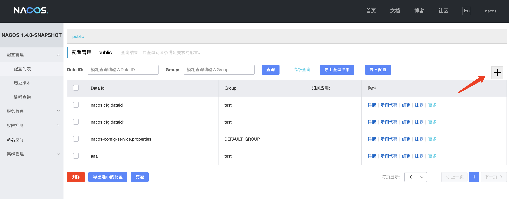
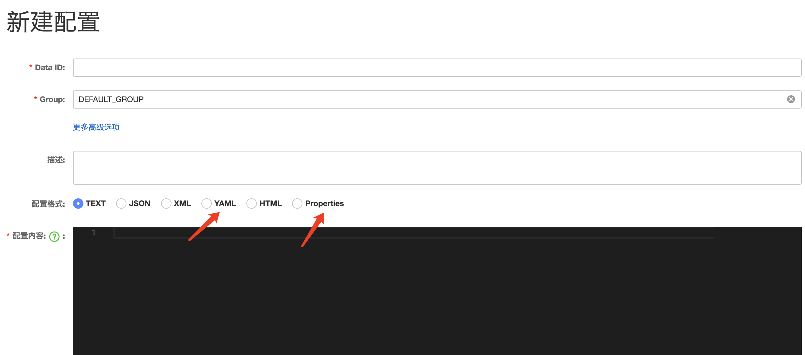
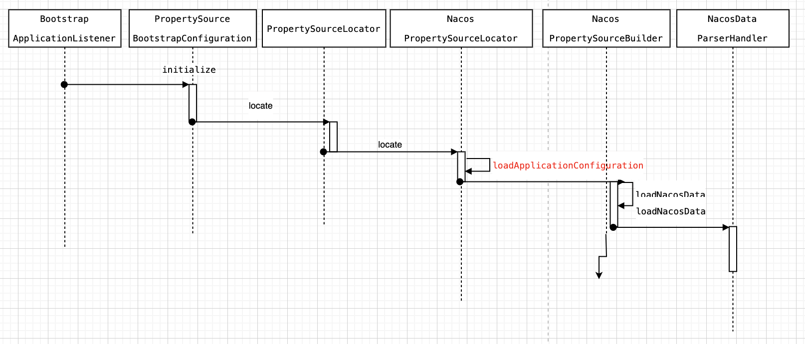

# nacos

[Nacos官网](https://nacos.io/zh-cn/index.html)

## Nacos安装

下载源码方式安装

```
git clone https://github.com/alibaba/nacos.git
cd nacos/
mvn -Prelease-nacos -Dmaven.test.skip=true clean install -U  
ls -al distribution/target/

// change the $version to your actual path
cd distribution/target/nacos-server-$version/nacos/bin
```

启动

```
sh startup.sh -m standalone
```

控制台

http://127.0.0.1:8848/nacos/index.html

docker

```
docker pull nacos/nacos-server:1.4.2
docker pull nacos/nacos-server:v2.1.0

docker run --name nacos-quick142 -e MODE=standalone -p 8848:8848 -d nacos/nacos-server:1.4.2
docker run --name nacos-quick210 -e MODE=standalone -p 8848:8848 -d nacos/nacos-server:v2.1.0
```

```
    docker  run \
    --name nacos -d \
    -p 8848:8848 \
    --privileged=true \
    --restart=always \
    -e JVM_XMS=256m \
    -e JVM_XMX=256m \
    -e MODE=standalone \
    -e PREFER_HOST_MODE=hostname \
    -v /Users/zihuidou/devtools/docker/nacos/logs:/home/nacos/logs \
    -v /Users/zihuidou/devtools/docker/nacos/init.d/custom.properties:/home/nacos/init.d/custom.properties \
    nacos/nacos-server
```

## Nacos配制管理

在 Nacos Spring Cloud 中，`dataId` 的完整格式如下：

```
${prefix}-${spring.profiles.active}.${file-extension}
```

- `prefix` 默认为 `spring.application.name` 的值，也可以通过配置项 `spring.cloud.nacos.config.prefix`来配置。
- `spring.profiles.active` 即为当前环境对应的 profile。 注意：当 `spring.profiles.active` 为空时，对应的连接符 `-` 也将不存在，dataId 的拼接格式变成 `${prefix}.${file-extension}`
- `file-exetension` 为配置内容的数据格式，可以通过配置项 `spring.cloud.nacos.config.file-extension` 来配置。目前只支持 `properties` 和 `yaml` 类型。





## 项目引入

新建springboot项目

### 引入nacos依赖

只使用配制功能不用引入`spring-cloud-starter-alibaba-nacos-discovery`，也不用`@EnableDiscoveryClient`

```xml
<dependency>
	<groupId>com.alibaba.cloud</groupId>
	<artifactId>spring-cloud-starter-alibaba-nacos-config</artifactId>
	<version>2.2.1.RELEASE</version>
</dependency>
```
### 项目配制管理

nacos config的配制必须放在bootstrap.properties或bootstrap.yml中，否则自动配制不能加载到配制的信息。

配制支持namespace，group，file-extension。

```yml
spring:
  application:
    name: hdl-cloud-front
  cloud:
    nacos:
      server-addr: 127.0.0.1:8848
      discovery:
        enabled: true
        service: ${spring.application.name}
        namespace: bbe65e4e-6f39-4862-9eb4-2fb561e302da
        group: TEST_GROUP
      config:
        enabled: true
        encode: UTF-8
        namespace: bbe65e4e-6f39-4862-9eb4-2fb561e302da
        group: TEST_GROUP
        file-extension: yaml
```

### 示例

配制文件aplication.properties：

```properties
server.port=8071
spring.application.name=nacos-config-service
spring.cloud.nacos.server-addr=127.0.0.1:8848
spring.cloud.nacos.config.file-extension=properties


swagger.enable=true
swagger.projectname=testconfig
```

注意启动日志：

```
Ignore the empty nacos configuration and get it based on dataId[nacos-config-service] & group[DEFAULT_GROUP]
Ignore the empty nacos configuration and get it based on dataId[nacos-config-service.properties] & group[DEFAULT_GROUP]

Located property source: [BootstrapPropertySource {name='bootstrapProperties-nacos-config-service.properties,DEFAULT_GROUP'}, BootstrapPropertySource {name='bootstrapProperties-nacos-config-service,DEFAULT_GROUP'}]
No active profile set, falling back to default profiles: default
```

```
[fixed-localhost_8848] [subscribe] nacos-config-service.properties+DEFAULT_GROUP
[fixed-localhost_8848] [add-listener] ok, tenant=, dataId=nacos-config-service.properties, group=DEFAULT_GROUP, cnt=1
[fixed-localhost_8848] [subscribe] nacos-config-service+DEFAULT_GROUP
[fixed-localhost_8848] [add-listener] ok, tenant=, dataId=nacos-config-service, group=DEFAULT_GROUP, cnt=1
```

`@RefreshScope`针对`@Value`可以同步配制修改，而不用重启服务。

`@ConfigurationProperties`的配制支持自动更新。

```java
@Component
@ConfigurationProperties(prefix = "swagger")
public class SwaggerConfigProperties {
    private boolean enable;
    private boolean urlAuthEnable;
    private String projectname;

    public boolean isEnable() {
        return enable;
    }

    public void setEnable(boolean enable) {
        this.enable = enable;
    }

    public boolean isUrlAuthEnable() {
        return urlAuthEnable;
    }

    public void setUrlAuthEnable(boolean urlAuthEnable) {
        this.urlAuthEnable = urlAuthEnable;
    }

    public String getProjectname() {
        return projectname;
    }

    public void setProjectname(String projectname) {
        this.projectname = projectname;
    }
}
```

```JAVA
@RestController
public class HelloConfigController {

    @Autowired
    SwaggerConfigProperties p;

    @GetMapping("config")
    public Object getConfig(){
        return JSON.toJSONString(p);
    }

}
```

```java
@RestController
public class HelloValueController {

    @Value("${swagger.projectname}")
    String projectname;
    @Value("${swagger.enable}")
    boolean enable;

    @GetMapping("name")
    public Object getName(){
        return projectname+":"+enable;
    }
}
```

### 加载流程

