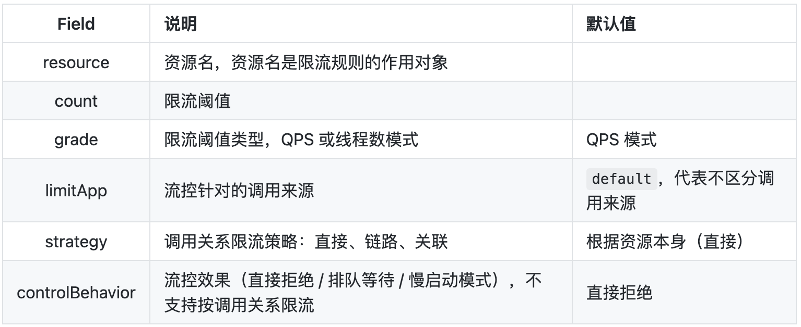

# sentinel 

-   [spring-cloud-alibaba](https://github.com/alibaba/spring-cloud-alibaba/wiki)
-   [Spring Cloud Alibaba Sentinel](https://github.com/alibaba/spring-cloud-alibaba/wiki/Sentinel)
-   [Sentinel官网](https://sentinelguard.io/zh-cn/index.html)
-   [Sentinel wiki](https://github.com/alibaba/Sentinel/wiki)

## core

``` xml
<dependency>
  <groupId>com.alibaba.csp</groupId>
  <artifactId>sentinel-core</artifactId>
  <version>1.8.1</version>
</dependency>
```

``` java
public class Test1 {
    public static void main(String[] args) throws InterruptedException {
        initFlowRules();
        while (true) {
            try (Entry entry = SphU.entry("HelloWorld")) {
                Thread.sleep(100);
                System.out.println("hello world");
            } catch (BlockException ex) {
                System.out.println("blocked!");
            }
        }
    }
    private static void initFlowRules(){
        List<FlowRule> rules = new ArrayList<>();
        FlowRule rule = new FlowRule();
        rule.setResource("HelloWorld");
        rule.setGrade(RuleConstant.FLOW_GRADE_QPS);
        rule.setCount(5);
        rules.add(rule);
        FlowRuleManager.loadRules(rules);
    }
}
```

## SentinelResource

``` xml
<dependency>
  <groupId>org.springframework</groupId>
  <artifactId>spring-context</artifactId>
  <version>5.2.8.RELEASE</version>
</dependency>
<dependency>
  <groupId>com.alibaba.csp</groupId>
  <artifactId>sentinel-core</artifactId>
  <version>1.8.1</version>
</dependency>
<dependency>
  <groupId>com.alibaba.csp</groupId>
  <artifactId>sentinel-annotation-aspectj</artifactId>
  <version>1.8.1</version>
</dependency>
```

``` java

@Configuration
@EnableAspectJAutoProxy
@ComponentScan("com.onekbase.demo.sentinel")
public class TestMain {
    public static void main(String[] args) throws InterruptedException {
        ApplicationContext context = new AnnotationConfigApplicationContext(TestMain.class);
        TestService ts= context.getBean(TestService.class);
        initFlowRules();
        while (true) {
            Thread.sleep(100);
            System.out.println(ts.hello(123));
        }
    }

    private static void initFlowRules(){
        List<FlowRule> rules = new ArrayList<>();
        FlowRule rule = new FlowRule();
        rule.setResource("hello");
        rule.setGrade(RuleConstant.FLOW_GRADE_QPS);
        // Set limit QPS to 20.
        rule.setCount(2);
        rules.add(rule);
        FlowRuleManager.loadRules(rules);
    }
}

@Configuration
public class AopConfiguration {
    @Bean
    public SentinelResourceAspect sentinelResourceAspect() {
        return new SentinelResourceAspect();
    }
}


@Service
public class TestService {

    @SentinelResource(value = "hello", fallback = "helloFallback")
    public String hello(long s) {
        if (s < 0) {
            throw new IllegalArgumentException("invalid arg");
        }
        return String.format("Hello at %d", s);
    }

    public String helloFallback(long s, Throwable ex) {
        ex.printStackTrace();
        return "Oops, error occurred at " + s;
    }
}

```

## FlowRule



可以通过调用 FlowRuleManager.loadRules() 方法来用硬编码的方式定义流量控制规则，比如：

``` java
private static void initFlowQpsRule() {
    List<FlowRule> rules = new ArrayList<>();
    FlowRule rule1 = new FlowRule();
    rule1.setResource(resource);
    // Set max qps to 20
    rule1.setCount(20);
    rule1.setGrade(RuleConstant.FLOW_GRADE_QPS);
    rule1.setLimitApp("default");
    rules.add(rule1);
    FlowRuleManager.loadRules(rules);
}
```

## 日志查看

位置：\~/logs/csp/

- sentinel-record.log** : 系统日志，包括规则加载更新等
- <appName>-metrics.log** : 明细
- sentinel-block.log: 拦截记录

metrics.log

其中 p 代表通过的请求, block 代表被阻止的请求, s 代表成功执行完成的请求个数, e 代表用户自定义的异常, rt 代表平均响应时长。
```
    |--timestamp-|------date time----|--resource-|p |block|s |e|rt
    1529998904000|2018-06-26 15:41:44|hello world|20|0    |20|0|0
    1529998905000|2018-06-26 15:41:45|hello world|20|5579 |20|0|728
    1529998906000|2018-06-26 15:41:46|hello world|20|15698|20|0|0
    1529998907000|2018-06-26 15:41:47|hello world|20|19262|20|0|0
    1529998908000|2018-06-26 15:41:48|hello world|20|19502|20|0|0
    1529998909000|2018-06-26 15:41:49|hello world|20|18386|20|0|0
```
sentinel-record.log

-   以\[FlowRuleManager\] Flow rules loaded: {} 开头
-   DynamicSentinelProperty
-   FlowRuleManager
-   AuthorityRuleManager
-   SystemRuleManager
-   DegradeRuleManager
-   SpiLoader

```
    2023-11-02 22:34:48.050 INFO [FlowRuleManager] Flow rules loaded: {}
    2023-11-02 22:34:48.054 INFO App name resolved from default: com.onekbase.demo.sentinel.Test1
    2023-11-02 22:34:48.054 INFO [SentinelConfig] Application type resolved: 0
    2023-11-02 22:34:48.069 INFO [MetricWriter] Creating new MetricWriter, singleFileSize=52428800, totalFileCount=6
    2023-11-02 22:34:48.073 INFO [DynamicSentinelProperty] Config will be updated to: [FlowRule{resource=HelloWorld, limitApp=default, grade=1, count=5.0, strategy=0, refResource=null, controlBehavior=0, warmUpPeriodSec=10, maxQueueingTimeMs=500, clusterMode=false, clusterConfig=null, controller=null}]
    2023-11-02 22:34:48.077 INFO [FlowRuleManager] Flow rules received: {HelloWorld=[FlowRule{resource=HelloWorld, limitApp=default, grade=1, count=5.0, strategy=0, refResource=null, controlBehavior=0, warmUpPeriodSec=10, maxQueueingTimeMs=500, clusterMode=false, clusterConfig=null, controller=com.alibaba.csp.sentinel.slots.block.flow.controller.DefaultController@b81eda8}]}
    2023-11-02 22:34:48.090 INFO [SpiLoader] Found SPI implementation for SPI com.alibaba.csp.sentinel.init.InitFunc, provider=com.alibaba.csp.sentinel.metric.extension.MetricCallbackInit, aliasName=com.alibaba.csp.sentinel.metric.extension.MetricCallbackInit, isSingleton=true, isDefault=false, order=0
    2023-11-02 22:34:48.092 INFO [InitExecutor] Found init func: com.alibaba.csp.sentinel.metric.extension.MetricCallbackInit
    2023-11-02 22:34:48.095 INFO [InitExecutor] Executing com.alibaba.csp.sentinel.metric.extension.MetricCallbackInit with order 2147483647
    2023-11-02 22:34:48.098 INFO Add child <sentinel_default_context> to node <machine-root>
    2023-11-02 22:34:48.113 INFO [SpiLoader] Found SPI implementation for SPI com.alibaba.csp.sentinel.slotchain.SlotChainBuilder, provider=com.alibaba.csp.sentinel.slots.DefaultSlotChainBuilder, aliasName=com.alibaba.csp.sentinel.slots.DefaultSlotChainBuilder, isSingleton=true, isDefault=true, order=0
    2023-11-02 22:34:48.114 INFO [SlotChainProvider] Global slot chain builder resolved: com.alibaba.csp.sentinel.slots.DefaultSlotChainBuilder
    2023-11-02 22:34:48.116 INFO [SpiLoader] Found SPI implementation for SPI com.alibaba.csp.sentinel.slotchain.ProcessorSlot, provider=com.alibaba.csp.sentinel.slots.nodeselector.NodeSelectorSlot, aliasName=com.alibaba.csp.sentinel.slots.nodeselector.NodeSelectorSlot, isSingleton=false, isDefault=false, order=-10000
    2023-11-02 22:34:48.116 INFO [SpiLoader] Found SPI implementation for SPI com.alibaba.csp.sentinel.slotchain.ProcessorSlot, provider=com.alibaba.csp.sentinel.slots.clusterbuilder.ClusterBuilderSlot, aliasName=com.alibaba.csp.sentinel.slots.clusterbuilder.ClusterBuilderSlot, isSingleton=false, isDefault=false, order=-9000
    2023-11-02 22:34:48.117 INFO [SpiLoader] Found SPI implementation for SPI com.alibaba.csp.sentinel.slotchain.ProcessorSlot, provider=com.alibaba.csp.sentinel.slots.logger.LogSlot, aliasName=com.alibaba.csp.sentinel.slots.logger.LogSlot, isSingleton=true, isDefault=false, order=-8000
    2023-11-02 22:34:48.120 INFO [SpiLoader] Found SPI implementation for SPI com.alibaba.csp.sentinel.slotchain.ProcessorSlot, provider=com.alibaba.csp.sentinel.slots.statistic.StatisticSlot, aliasName=com.alibaba.csp.sentinel.slots.statistic.StatisticSlot, isSingleton=true, isDefault=false, order=-7000
    2023-11-02 22:34:48.120 INFO [SpiLoader] Found SPI implementation for SPI com.alibaba.csp.sentinel.slotchain.ProcessorSlot, provider=com.alibaba.csp.sentinel.slots.block.authority.AuthoritySlot, aliasName=com.alibaba.csp.sentinel.slots.block.authority.AuthoritySlot, isSingleton=true, isDefault=false, order=-6000
    2023-11-02 22:34:48.121 INFO [SpiLoader] Found SPI implementation for SPI com.alibaba.csp.sentinel.slotchain.ProcessorSlot, provider=com.alibaba.csp.sentinel.slots.system.SystemSlot, aliasName=com.alibaba.csp.sentinel.slots.system.SystemSlot, isSingleton=true, isDefault=false, order=-5000
    2023-11-02 22:34:48.122 INFO [SpiLoader] Found SPI implementation for SPI com.alibaba.csp.sentinel.slotchain.ProcessorSlot, provider=com.alibaba.csp.sentinel.slots.block.flow.FlowSlot, aliasName=com.alibaba.csp.sentinel.slots.block.flow.FlowSlot, isSingleton=true, isDefault=false, order=-2000
    2023-11-02 22:34:48.123 INFO [SpiLoader] Found SPI implementation for SPI com.alibaba.csp.sentinel.slotchain.ProcessorSlot, provider=com.alibaba.csp.sentinel.slots.block.degrade.DegradeSlot, aliasName=com.alibaba.csp.sentinel.slots.block.degrade.DegradeSlot, isSingleton=true, isDefault=false, order=-1000
    2023-11-02 22:34:48.127 INFO Add child <HelloWorld> to node <sentinel_default_context>
    2023-11-02 22:34:48.129 INFO [AuthorityRuleManager] Load authority rules: {}
    2023-11-02 22:34:48.138 INFO [SystemRuleManager] Current system check status: false, highestSystemLoad: 1.797693e+308, highestCpuUsage: 1.797693e+308, maxRt: 9223372036854775807, maxThread: 9223372036854775807, maxQps: 1.797693e+308
    2023-11-02 22:34:48.141 INFO [DegradeRuleManager] Degrade rules loaded: {}
    2023-11-02 22:34:48.143 WARNING No SPI configuration file, filename=META-INF/services/com.alibaba.csp.sentinel.metric.extension.MetricExtension, classloader=sun.misc.Launcher$AppClassLoader@18b4aac2
    2023-11-02 22:34:48.143 INFO [MetricExtensionProvider] No existing MetricExtension found
    2023-11-02 22:34:49.077 INFO [MetricWriter] New metric file created: /Users/zihuidou/logs/csp/com-onekbase-demo-sentinel-Test1-metrics.log.2023-11-02
    2023-11-02 22:34:49.077 INFO [MetricWriter] New metric index file created: /Users/zihuidou/logs/csp/com-onekbase-demo-sentinel-Test1-metrics.log.2023-11-02.idx
```
## 启动配置

[启动配置项](https://sentinelguard.io/zh-cn/docs/startup-configuration.html)

默认 Sentinel 会尝试从 classpath:sentinel.properties 文件读取配置，读取编码默认为 UTF-8。

``` properties
project.name=appname
csp.sentinel.log.use.pid=true
csp.sentinel.log.output.type=console
csp.sentinel.dashboard.server=localhost:9090
csp.sentinel.api.port=8719
```

spring环境日志有效，纯java怎么加载需要确认

## springcloud接入

``` xml
<dependency>
    <groupId>com.alibaba.cloud</groupId>
    <artifactId>spring-cloud-starter-alibaba-sentinel</artifactId>
</dependency>
```

``` java
@SpringBootApplication
public class Application {

    public static void main(String[] args) {
        SpringApplication.run(ServiceApplication.class, args);
    }
}

@Service
public class TestService {

    @SentinelResource(value = "sayHello")
    public String sayHello(String name) {
        return "Hello, " + name;
    }
}

@RestController
public class TestController {

    @Autowired
    private TestService service;

    @GetMapping(value = "/hello/{name}")
    public String apiHello(@PathVariable String name) {
        return service.sayHello(name);
    }
}
```

### Feign 支持

Sentinel 适配了 Feign 组件。如果想使用，除了引入 spring-cloud-starter-alibaba-sentinel 的依赖外还需要 2 个步骤：

配置文件打开 Sentinel 对 Feign 的支持：feign.sentinel.enabled=true

加入 spring-cloud-starter-openfeign 依赖使 Sentinel starter 中的自动化配置类生效

### springcloud 接入控制台
```yml
    spring:
      cloud:
        sentinel:
          transport:
            port: 8719 # 默认值，被占用自动加1
            dashboard: localhost:8080
```
这里的 spring.cloud.sentinel.transport.port 端口配置会在应用对应的机器上启动一个 Http Server，该 Server 会与 Sentinel 控制台做交互。比如 Sentinel 控制台添加了一个限流规则，会把规则数据 push 给这个 Http Server 接收，Http Server 再将规则注册到 Sentinel 中。

## HTTP API

引入了 transport 模块后，可以通过以下的 HTTP API 来获取所有已加载的规则：

    http://localhost:8719/getRules?type=<XXXX>

其中，type=flow 以 JSON 格式返回现有的限流规则，degrade 返回现有生效的降级规则列表，system 则返回系统保护规则。

获取所有热点规则：

    http://localhost:8719/getParamRules

## Sentinel 控制台

下载jar包启动
```
java -Dserver.port=9090 -Dcsp.sentinel.dashboard.server=localhost:9090 -Dproject.name=sentinel-dashboard -jar sentinel-dashboard.jar
```
从 Sentinel 1.6.0 起，Sentinel 控制台引入基本的登录功能，默认用户名和密码都是 sentinel。可以参考 鉴权模块文档 配置用户名和密码。

### 客户端接入控制台

``` xml
<dependency>
    <groupId>com.alibaba.csp</groupId>
    <artifactId>sentinel-transport-simple-http</artifactId>
    <version>x.y.z</version>
</dependency>
```

启动时加入 JVM 参数`-Dcsp.sentinel.dashboard.server=consoleIp:port`指定控制台地址和端口。若启动多个应用，则需要通过`-Dcsp.sentinel.api.port=xxxx`指定客户端监控 API 的端口（默认是 8719）。

除了修改 JVM 参数，也可以通过配置文件取得同样的效果

## 源码分析

### FlowRule流控规则

-   FlowSlot 流控规则入口
    -   checkFlow
        -   FlowRuleChecker
            -   checkFlow
            -   canPassCheck
                -   passClusterCheck 集群规则check
                    -   applyTokenResult 处理clusterService返回结果
                        -   fallbackToLocalOrPass 返回失败处理方法
                -   passLocalCheck 本地规则check

FlowRuleChecker.checkFlow对所有rule做通过检查，有不通过的抛出FlowException

``` java
for (FlowRule rule : rules) {
    if (!canPassCheck(rule, context, node, count, prioritized)) {
        throw new FlowException(rule.getLimitApp(), rule);
    }
}
```

fallbackToLocalOrPass

``` java
if (rule.getClusterConfig().isFallbackToLocalWhenFail()) {
    return passLocalCheck(rule, context, node, acquireCount, prioritized);
} else {
    // The rule won't be activated, just pass.
    return true;
}
```
