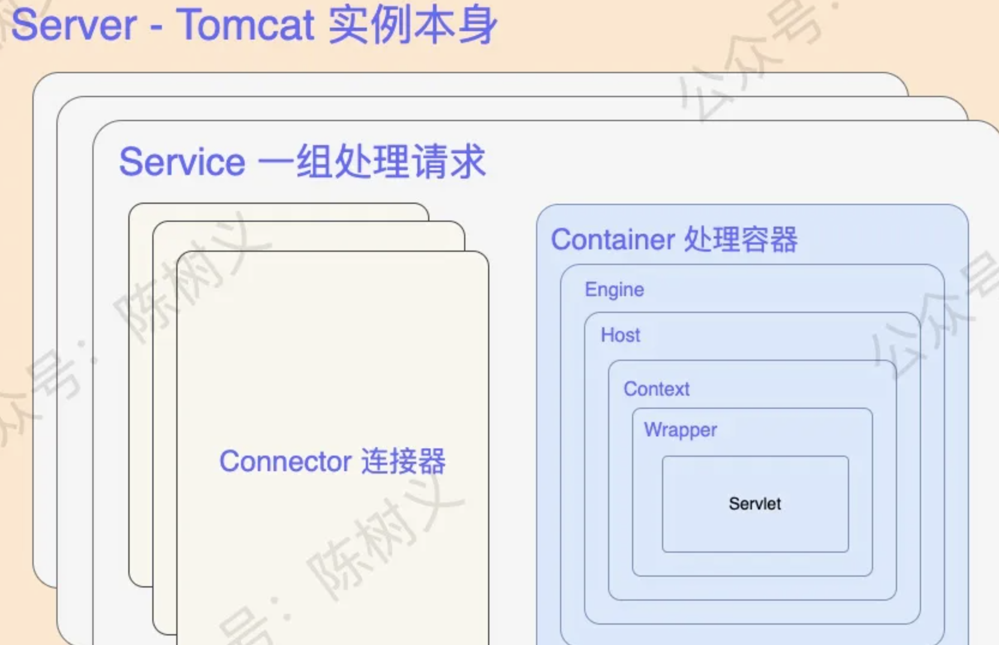

# tomcat 

## 组件架构

要对 Tomcat 进行性能调优，我们需要先了解其组件架构。Tomcat 的组件架构如下图所示：

Tomcat 组件结构示意图

从上图可以看到，Tomcat 将其业务抽象成了 Server、Service、Connector、Container 等等组件，每个组件都有不同的作用。

- Server 组件。 Server 组件是 Tomcat 最外层的组件，该组件是 Tomcat 实例本身的抽象，代表着 Tomcat 自身。一个 Server 组件可以有一 个或多个 Service 组件。
- Service 组件。 Service 组件是 Tomcat 中一组提供服务、处理请求的组件，一个 Service 组件可以有多个 Connector 连接器和一个 Container，有多个 Connector 表示其可以同时使用多种协议接收用户请求。
- Connector 组件。 Connector 负责处理客户端的连接，它提供各种服务协议支持，包括：BIO、NIO、AIO 等等。其存在的价值在于，为 Container 容器屏蔽了多协议的复杂性，统一了 Container 容器的处理标准。
- Container 组件。 Container 组件是负责具体业务逻辑处理的容器，当 Connector 组件与客户端建立连接后，便会将请求转发给 Container 组件的 Engine 组件处理。

到这里，Tomcat 的核心组件基本上讲完了。实际上 Container 组件里还细分了很多组件，其实对业务的抽象，感兴趣的可以继续看看。

- Engine 组件。 Engine 组件表示可运行的 Servlet 实例，包含了 Servlet 容器的核心功能，其可以有一个或多个虚拟主机（Host）。其主要功 能是将请求委托给合适的虚拟主机处理，即根据 URL 路径的配置匹配到合适的虚拟主机处理。
- Host 组件。 Host 组件负责运行多个应用，其负责安装这些应用，其主要作用是解析 web.xml 文件，并将其匹配到对应的 Context 组件。
- Context 组件。 Context 组件代表具体的 Web 应用程序本身，其最重要的功能就是管理里面的 Servlet 实例。一个 Context 可以有一个或者 多个 Servlet 实例。
- Wrapper 组件。 一个 Wrapper 组件代表一个 Servlet，它负责管理一个 Servlet，包括 Servlet 的装载、初始化、执行以及资源回收。 Wrapper 是最底层的容器。

可以看到，Host 是虚拟主机的抽象，Context 是应用程序的抽象，Wrapper 是 Servlet 的抽象，而 Engine 则是处理层的抽象。

## 核心参数

在了解核心参数之前，我们我们需要大致了解一下 Tomcat 对于请求的处理流程。Tomcat 对请求的处理流程如下所示：

-   首先，客户端向 Tomcat 服务器发起请求，Connector 组件监听到请求，于是与客户端建立起连接。
-   接着，Connector 将请求封装后转发给 Engine 组件处理。
-   最后，Engine 组件处理完之后将结果返回给 Connector，Connector 组件再将结果返回给客户端。

上述过程可以用如下示意图来表示：

Tomcat 核心参数示意图

在上面的示意图中有三个非常关键的核心参数，这几个关键的参数也是性能调优的关键，它们分别是：

1.  acceptCount：当 Container 线程池达到最大数量且没有空闲线程，同时 Connector 队列达到最大数量时，操作系统最多能接受的连接数。
2.  maxConnections：当 Container 线程池达到最大数量且没有空闲线程时，Connector 的队列能接收的最大线程数。
3.  maxThreads： Container 线程池的处理线程的最大数量。

从上面三个参数的含义我们可以知道如下几点结论：

1.  客户端并不是直接与 Tomcat 的 Connector 组件建立联系的，而是先与操作系统建立，然后再移交给 Connector 的。这点很重要，不然你就无法理解 acceptCount 这个参数。
2.  不仅仅 Connector 组件中有队列，操作系统中也有队列来临时存储与客户端的连接，这也是很关键的点。
3.  我们所说的线程池，指的是 Container 这个容器里的线程池。

明白这三个核心参数的含义是非常重要的，不然没有办法进行后续的性能调优工作。

### maxThreads

我们知道 maxThreads 指的是请求处理线程的最大数量，在 Tomcat7 和 Tomcat8 中都是默认 200 个。

对于这个参数的设置，需要根据任务的执行内容去调整，一般来说计算公式为：最大线程数 = ((IO时间 + CPU时间)/CPU时间) * CPU 核数。这个公式的思路其实很简单，就是最大化利用 CPU 的资源。一个任务的耗时分为 IO 耗时和 CPU 耗时，基本上 IO 耗时是最多的，这时候 CPU 是没事干的。

因此如果可以让 CPU 在任务等待 IO 的时候处理其他任务，那么 CPU 利用率不就上来了么。一般来说，由于 IO 耗时远大于 CPU 耗时，因此根据公式计算出来的 maxThreads 数都会远大于 CPU 核数，这是很正常的。

要注意的是，这个数值也不是越高越好。因为一旦线程数太多了，CPU 需要进行上下文切换，这就消耗了一部分 CPU 资源。因此最好的办法是用上述公式去计算一个基准值，随后再进行压力测试，去调整到一个合理的值。一般来说，如果调高了 maxThreads 的值，但是吞吐量没有提升或者下降的话，那么表明可能到达了了瓶颈了。

### maxConnections

maxConnections 指的是当线程池的线程达到最大值，并且都在忙的时候，Connector 中的队列最多能容纳多少个连接。一般来说，我们都要设置一个合理的数值，不能让其无限制堆积。因为 Tomcat 的处理能力肯定是有限的，到达一定程度肯定就处理不过来了，因此你堆积太多了也没啥用，反而会造成内存堆积，最终导致内存溢出 OOM 的发生。

一般来说，一个经验值是可以设置成为 maxThreads 同样的大小。 我想这样也是比较合理的，因为在队列中的连接最多只需要等待线程处理一个任务的时间即可，不会等待太久，响应时间也不会太长。如果你想缩短响应时间，那么可以将 maxConnections 调低于 maxThreads 一些，这样可以降低一些响应时间。但要注意的是，如果降得太低的话，可能就会严重降低性能，降低吞吐量。

### acceptCount

acceptCount 指的是当 Container 线程池达到最大数量且没有空闲线程，同时 Connector 队列达到最大数量时，操作系统最多能接受的连接数。 当队列中的个数达到最大值后，进来的请求一律被拒绝，默认值是 100。这可以理解成是操作系统的一种自我保护机制吧，堆积太多无法处理，那就直接拒绝掉，保护自身资源。

这个参数的调优资料比较少，但根据其含义，这个值不建议比 maxConnections 大。 因为在这个队列中的连接，是需要等待的。如果数值太大，就说明会有很多连接没有被处理。连接越多，那么其等待的时间就越长，其响应时间就越慢。如果你想响应时间短一些，或许应该调低一下这个值。

有同学会疑惑，为啥有了 maxConnections 了还要有 acceptCount 呢？这不是重复了么？其实在 BIO 的时代，这两个数值基本都是相同的。我猜是因为后面出现了 NIO、AIO 等技术，操作系统可以接受更多的客户端连接了。于是就可以先让操作系统先建立连接缓存着，随后 Connnector 直接从操作系统处获取连接即可，这样就不需要等待操作系统进行耗时的 TCP 连接了，从而提高了效率。

除了上面这三个参数之外，还有几个非核心参数，但我觉得还是有些作用的。

-   connectionTimeout 参数， 表示建立连接后的等待超时时间，如果超过这个时间，那么就会直接返回超时。
-   minSpareThreads 参数， 表示最小存活线程数，也就是如果没有请求了，那么最低要保持几个线程存活。这个参数与是否有突发流程相关联，在有突发流量的情况下，如果这个数值太低，那么就会导致瞬时的响应时间比较长。

### 总结

今天我们分享了 Tomcat 的核心组件，接着讲解了 Tomcat 处理请求过程时的 3 个核心参数及其调优经验。

对于 maxThreads 参数而言，如果按照公式计算的话，我们需要获取 IO 时间和 CPU 时间，但实际上这两个值并不是很好获取。所以一般情况下，我们可以通过压测的方式来获得一个比较合适的 maxThreads。

对于 maxConnections 参数而言，可以设置一个与 maxThreads 相同的值，再根据具体情况进行调整。如果想降低响应时间，那么可以稍微调低一些，否则可以调高一些。对于 acceptCount 参数而言，其调优逻辑与 maxConnections 类似，可以设置与 maxConnections 相似，再根据对相应时间的要求，做一个微调。
