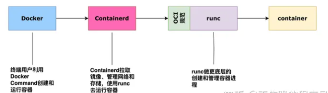

# 容器的核心概念

- [Docker与K8S的关系](https://zhuanlan.zhihu.com/p/651017500)

Docker和K8S本质上都是创建容器的工具，Docker作用与单机，K8S作用与集群。

几个核心概念：OCI、CR、Runc、Containerd、CRI。

## 容器运行规范OCI

容器运行规范OCI（Open Container Initiative）即开放的容器运行时规范，定义了镜像和容器运行时的规范。

容器镜像规范：该规范的目标是创建可互操作的工具，用于构建、传输和准备运行的容器镜像。

容器运行时规范：该规范用于定义容器的配置、执行环境和生命周期。

## 容器运行时CR

容器运行时（Container Runtime）负责以下工作：拉取镜像、提取镜像到文件系统、为容器准备挂载点、从容器镜像中设置元数据以确保容器按预期运行、提醒内核为该容器分配某种隔离、提醒内核为该容器分配资源限制、调用系统指令启动容器等。

容器运行时的有如下方案：Containerd、CRI-O 、Kata、Virtlet等等。

## RunC

RunC （Run Container）是从 Docker 的 libcontainer 中迁移而来的，实现了容器启停、资源隔离等功能。Docker将RunC捐赠给 OCI 作为OCI 容器运行时标准的参考实现。

RunC是一个基于OCI标准实现的一个轻量级容器运行工具，用来创建和运行容器。纯从系统角度，Runc才是底层的容器运行时 。

## Containerd

Containerd是用来维持通过RunC创建的容器的运行状态。即RunC用来创建和运行容器，containerd作为常驻进程用来管理容器。containerd（container daemon）是一个daemon进程用来管理和运行容器，可以用来拉取/推送镜像和管理容器的存储和网络。其中可以调用runc来创建和运行容器。

很早之前的 Docker Engine 中就有了 Containerd，只不过现在是将 Containerd 从 Docker Engine 里分离出来，作为一个独立的开源项目，目标是提供一个更加开放、稳定的容器运行基础设施。分离出来的Containerd 将具有更多的功能，涵盖整个容器运行时管理的所有需求，提供更强大的支持。

Containerd 是一个工业级标准的容器运行时，它强调简单性、健壮性和可移植性，Containerd 可以负责干下面这些事情：

- 管理容器的生命周期（从创建容器到销毁容器）
- 拉取/推送容器镜像
- 存储管理（管理镜像及容器数据的存储）
- 调用 runc 运行容器（与 runc 等容器运行时交互）
- 管理容器网络接口及网络

K8S自v1.24 起，已经删除了Dockershim ，使用Containerd作为容器运行时。选择 Containerd原因是，它的调用链更短，组件更少，更稳定，占用节点资源更少。

## CRI

容器运行时是 Kubernetes（K8S） 最重要的组件之一，负责管理镜像和容器的生命周期。Kubelet 通过 Container Runtime Interface (CRI) 与容器运行时交互，以管理镜像和容器。

CRI即容器运行时接口，主要用来定义K8S与容器运行时的API调用，kubelet通过CRI来调用容器运行时，只要实现了CRI接口的容器运行时就可以对接到K8S的kubelet组件。