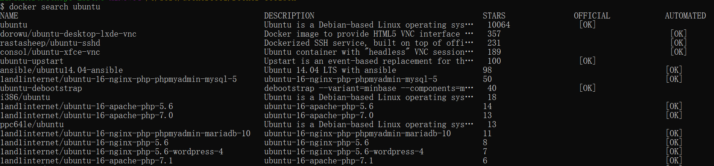
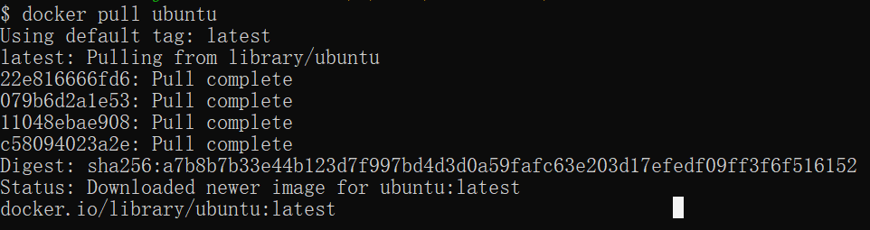

# Docker 仓库管理

仓库（Repository）是集中存放镜像的地方。以下介绍一下 [Docker Hub](https://hub.docker.com/)。当然不止 docker hub，只是远程的服务商不一样，操作都是一样的。

## Docker Hub

目前 Docker 官方维护了一个公共仓库 [Docker Hub](https://hub.docker.com/)。

大部分需求都可以通过在 Docker Hub 中直接下载镜像来实现。

### 注册

在 [https://hub.docker.com](https://hub.docker.com/) 免费注册一个 Docker 账号。

### 登录和退出

登录需要输入用户名和密码，登录成功后，我们就可以从 docker hub 上拉取自己账号下的全部镜像。

```plain
$ docker login
```

[](https://www.runoob.com/wp-content/uploads/2019/10/5974B2AE-945F-4DD0-A7C8-9D9B01BDAF62.jpg)

**退出**

退出 docker hub 可以使用以下命令：

```plain
$ docker logout
```

拉取镜像

你可以通过 docker search 命令来查找官方仓库中的镜像，并利用 docker pull 命令来将它下载到本地。

以 ubuntu 为关键词进行搜索：

```plain
$ docker search ubuntu
```

[](https://www.runoob.com/wp-content/uploads/2019/10/docker-search22.png)

使用 docker pull 将官方 ubuntu 镜像下载到本地：

```plain
$ docker pull ubuntu 
```

[](https://www.runoob.com/wp-content/uploads/2019/10/docker-pull22.png)

### 推送镜像

用户登录后，可以通过 docker push 命令将自己的镜像推送到 Docker Hub。

以下命令中的 username 请替换为你的 Docker 账号用户名。

```plain
$ docker tag ubuntu:18.04 username/ubuntu:18.04
$ docker image ls

REPOSITORY      TAG        IMAGE ID            CREATED           ...  
ubuntu          18.04      275d79972a86        6 days ago        ...  
username/ubuntu 18.04      275d79972a86        6 days ago        ...  
$ docker push username/ubuntu:18.04
$ docker search username/ubuntu

NAME             DESCRIPTION       STARS         OFFICIAL    AUTOMATED
username/ubuntu
```