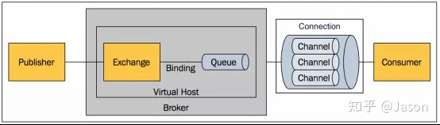
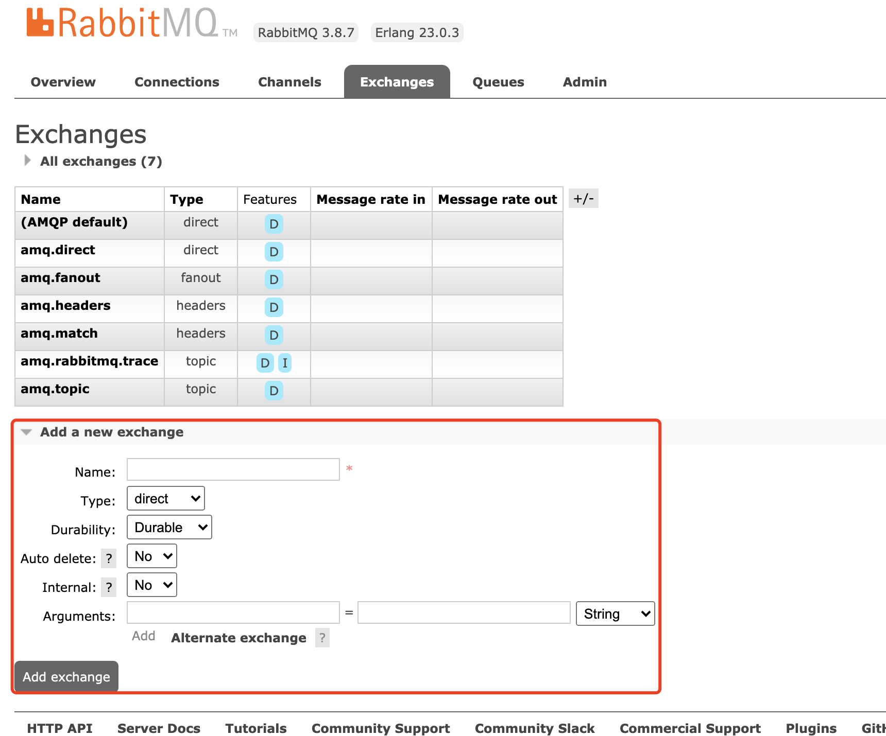
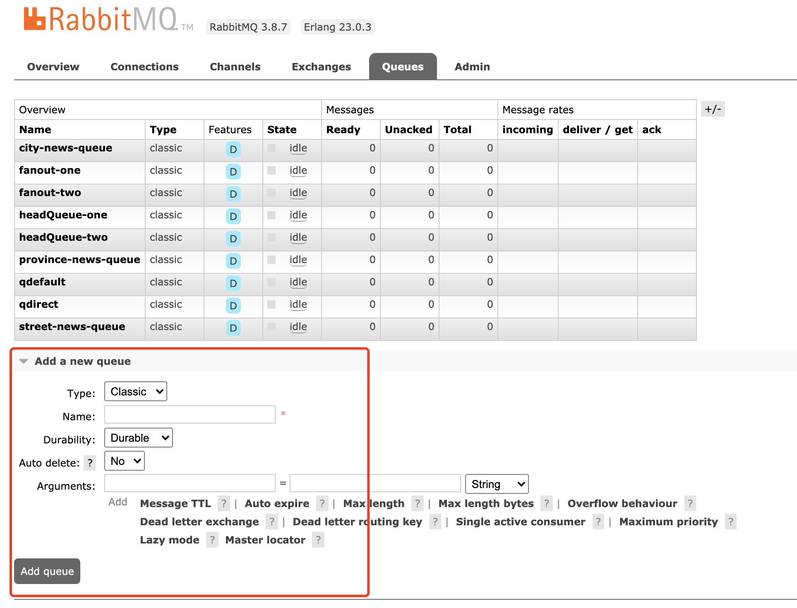
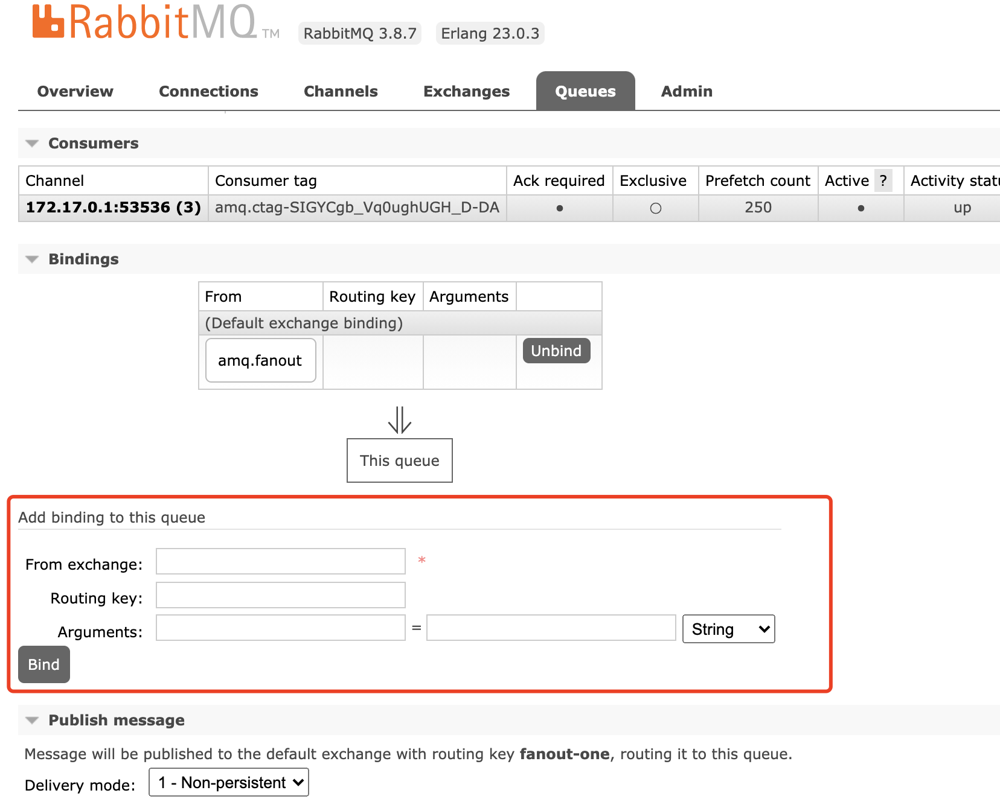

# rabbitmq

<https://www.rabbitmq.com/>

可使用模拟器做配制模拟：http://tryrabbitmq.com/

## docker方式安装

<http://localhost:15672/> admin:admin

    docker pull rabbitmq:3.8.7-management

    docker run -d \
    --hostname docker-rabbit --name rabbit3.8.7m \
    -p 15672:15672 -p 5672:5672 \
    -e RABBITMQ_DEFAULT_USER=admin \
    -e RABBITMQ_DEFAULT_PASS=admin \
    rabbitmq:3.8.7-management

说明：

    -d 后台运行容器；
    --name 指定容器名；
    -p 指定服务运行的端口（5672：应用访问端口；15672：控制台Web端口号）；
    -v 映射目录或文件；
    --hostname  主机名（RabbitMQ的一个重要注意事项是它根据所谓的 “节点名称” 存储数据，默认为主机名）；
    -e 指定环境变量；（RABBITMQ_DEFAULT_VHOST：默认虚拟机名；RABBITMQ_DEFAULT_USER：默认的用户名；RABBITMQ_DEFAULT_PASS：默认用户名的密码）

使用命令：docker ps 查看正在运行容器

## start



1.  新建一个exchange，分为direct、fanout、topic三类
2.  新建queue，绑定exchange
3.  connection和channel在连接消费者时可以看到

publisher的一个消息只能发给一个exchange，一个queue可以绑定多个exchange。

创建exchange和queue

先登录控制台：http://localhost:15672/

新建exchange



新建queue



点击对应的queues进入编辑界面可以绑定exchange



## springboot

新建springboot项目。

添加依赖：

``` xml
<dependency>
      <groupId>org.springframework.boot</groupId>
      <artifactId>spring-boot-starter-amqp</artifactId>
      <version>2.3.3.RELEASE</version>
</dependency>
```

添加配制：

``` yaml
server:
  port: 18082
spring:
  rabbitmq:
    username: admin
    password: admin
    addresses: 127.0.0.1:5672
    cache:
      connection:
        #       缓存连接模式,默认一个连接,多个channel
        mode: channel
#        多个连接,多个channel
#        mode: connection

```

生产者：RabbitTemplate可以直接发送消息

消费者：注解可以在类上，也可以在方法上

1.  注解：@RabbitListener
2.  注解：@RabbitListeners
3.  注解：@RabbitHandler生产者：RabbitTemplate可以直接发送消息

消费者：注解可以在类上，也可以在方法上

1.  注解：@RabbitListener
2.  注解：@RabbitListeners
3.  注解：@RabbitHandler

### 生产者示例

``` java
@RestController
public class ProducerController {

    @Autowired
    private RabbitTemplate rabbitTemplate;


    // 直接连交换机:申明一个queue和Exchange(如果他们不存在),并binding
    @RequestMapping("/directex")
    public String direct() throws InterruptedException {
        //(交换机,routingKey,消息内容)
        for(int i=0;i<1000;i++) {
            String msg="message direct:"+i+" "+Thread.currentThread().getName();
            rabbitTemplate.convertAndSend("amq.direct", "mine.direct", msg);
            System.out.println("send  "+msg);
            Thread.sleep(100);
        }
        return "ProducerController";
    }

    // 默认交换机:一个queue若不指定binding的交换机,就被绑定到默认交换机上,routingKey为queue的名称
    @RequestMapping("/defaultex")
    public String defaultex() throws InterruptedException {
        //(交换机,routingKey,消息内容)
        for(int i=0;i<1000;i++) {
            String msg="message default:"+i+" "+Thread.currentThread().getName();
            rabbitTemplate.convertAndSend("qdefault", " message direct:"+i+" "+Thread.currentThread().getName());
            System.out.println("send "+msg);
            Thread.sleep(100);
        }
        return "ProducerController";
    }
    @RequestMapping("/fanoutex")
    public String fanout() throws InterruptedException {
        //(交换机,routingKey,消息内容)
        for(int i=0;i<1000;i++) {
            String msg="message default:"+i+" "+Thread.currentThread().getName();
            rabbitTemplate.convertAndSend("amq.fanout","qdefault", " message fanout:"+i+" "+Thread.currentThread().getName());
            System.out.println("send "+msg);
            Thread.sleep(100);
        }
        return "ProducerController";
    }

    @RequestMapping("/topicex")
    public String topic() throws InterruptedException {
        //(交换机,routingKey,消息内容)
        for(int i=0;i<1000;i++) {
            String msg="message default:"+i+"中了大奖 "+Thread.currentThread().getName();
            rabbitTemplate.convertAndSend("amq.topic","province.city.street.shop",msg);
            System.out.println("send "+msg);
            Thread.sleep(100);
        }
        return "ProducerController";
    }

    @RequestMapping("/headerex")
    public String header() throws InterruptedException {
        //(交换机,routingKey,消息内容)
        for(int i=0;i<1000;i++) {
            String msg="message default:"+i+"中了大奖 "+Thread.currentThread().getName();
            rabbitTemplate.convertAndSend("amq.headers", "", msg, message -> {
                MessageProperties properties = message.getMessageProperties();
                properties.setHeader("key-one", "1");
                return message;
            });
            System.out.println("send "+msg);
            Thread.sleep(100);
        }
        return "ProducerController";
    }

}

```

### 各种queue示例

``` java
@Component
@RabbitListener(queuesToDeclare = @Queue("qdefault"))
public class MyDefaultListener {

    @RabbitHandler
    public void onMessage(String msg) throws InterruptedException {
        Thread.sleep(200);
        System.out.println("read:"+msg);
    }
}

@Component
@RabbitListener(bindings = @QueueBinding(
        value = @Queue("qdirect"),
        exchange = @Exchange(value = "amq.direct", type = ExchangeTypes.DIRECT),
        key = "mine.direct"
))
public class MyDirectListener {

    /**
     * listenerAdapter
     *
     * @param msg 消息内容,当只有一个参数的时候可以不加@Payload注解
     */
    @RabbitHandler
    public void onMessage(@Payload String msg) throws InterruptedException {
        Thread.sleep(200);
        System.out.println("read:"+msg);
    }
}

@Component
@RabbitListeners({
        @RabbitListener(
                bindings = @QueueBinding(
                        value = @Queue("fanout-one"),
                        exchange = @Exchange(value = "amq.fanout", type = ExchangeTypes.FANOUT),
                        key = "key.one")),

        @RabbitListener(
                bindings = @QueueBinding(
                        value = @Queue("fanout-two"),
                        exchange = @Exchange(value = "amq.fanout", type = ExchangeTypes.FANOUT),
                        key = "key.two")),
})
public class MyFanoutListener {

    @RabbitHandler
    public void onMessage(@Payload String msg, @Headers Map<String, Object> headers) {
        System.out.println("来自" + headers.get(AmqpHeaders.CONSUMER_QUEUE) + "的消息:" + msg);
    }

}

@Component
public class MyHeadListener {

    /**
     * 任意匹配
     *
     * @param msg
     */
    @RabbitListener(bindings = @QueueBinding(
            value = @Queue("headQueue-one"),
            exchange = @Exchange(value = "amq.headers", type = ExchangeTypes.HEADERS),
            arguments = {
                    @Argument(name = "key-one", value = "1"),
                    @Argument(name = "key-two", value = "2"),
                    @Argument(name = "x-match", value = "any")
            }))
    public void anyMatchOnMessage(String msg) {
        System.out.println("来自 headQueue-one " + msg);
    }


    /**
     * 全匹配
     *
     * @param msg
     */
    @RabbitListener(bindings = @QueueBinding(
            value = @Queue("headQueue-two"),
            exchange = @Exchange(value = "amq.headers", type = ExchangeTypes.HEADERS),
            arguments = {
                    @Argument(name = "key-one", value = "1"),
                    @Argument(name = "x-match", value = "all")
            }))
    public void allMatchOnMessage(String msg) {
        System.out.println("来自 headQueue-two " + msg);
    }

}

@Component
public class MyTopicListener {

    @RabbitListener(bindings = @QueueBinding(
            value = @Queue("province-news-queue"),
            exchange = @Exchange(value = "amq.topic", type = ExchangeTypes.TOPIC),
            key = "province.#"))
    @RabbitHandler
    public void provinceNews(String msg) {
        System.out.println("来自省TV的消息:" + msg);
    }

    @RabbitListener(bindings = @QueueBinding(
            value = @Queue("city-news-queue"),
            exchange = @Exchange(value = "amq.topic", type = ExchangeTypes.TOPIC),
            key = "province.city.#"))
    @RabbitHandler
    public void cityNews(String msg) {
        System.out.println("来自市TV的消息:" + msg);
    }

    @RabbitListener(bindings = @QueueBinding(
            value = @Queue("street-news-queue"),
            exchange = @Exchange(value = "amq.topic", type = ExchangeTypes.TOPIC),
            key = "province.city.street.*"))
    @RabbitHandler
    public void streetNews(String msg) {
        System.out.println("来自街区TV的消息:" + msg);
    }

}


```
