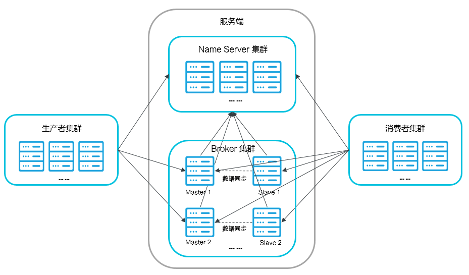
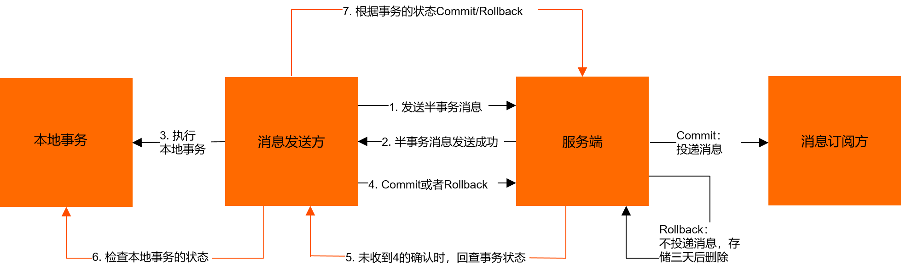

# Rocketmq阿里云产品介绍

消息队列RocketMQ版是阿里云基于Apache RocketMQ构建的低延迟、高并发、高可用、高可靠的分布式消息中间件。消息队列RocketMQ版既可为分布式应用系统提供异步解耦和削峰填谷的能力，同时也具备互联网应用所需的海量消息堆积、高吞吐、可靠重试等特性。

## 核心概念

-   Topic：消息主题，一级消息类型，生产者向其发送消息。
-   生产者：也称为消息发布者，负责生产并发送消息至Topic。
-   消费者：也称为消息订阅者，负责从Topic接收并消费消息。
-   消息：生产者向Topic发送并最终传送给消费者的数据和（可选）属性的组合。
-   消息属性：生产者可以为消息定义的属性，包含Message Key和Tag。
-   Group：一类生产者或消费者，这类生产者或消费者通常生产或消费同一类消息，且消息发布或订阅的逻辑一致。

## 消息收发模型

消息队列RocketMQ版支持发布和订阅模型，消息生产者应用创建Topic并将消息发送到Topic。消费者应用创建对Topic的订阅以便从其接收消息。通信可以是一对多（扇出）、多对一（扇入）和多对多。

具体通信如下图所示。


-   生产者集群：用来表示发送消息应用，一个生产者集群下包含多个生产者实例，可以是多台机器，也可以是一台机器的多个进程，或者一个进程的多个生产者对象。

    一个生产者集群可以发送多个Topic消息。发送分布式事务消息时，如果生产者中途意外宕机，消息队列RocketMQ版服务端会主动回调生产者集群的任意一台机器来确认事务状态。

-   消费者集群：用来表示消费消息应用，一个消费者集群下包含多个消费者实例，可以是多台机器，也可以是多个进程，或者是一个进程的多个消费者对象。

    一个消费者集群下的多个消费者以均摊方式消费消息。如果设置的是广播方式，那么这个消费者集群下的每个实例都消费全量数据。

## 应用场景

-   削峰填谷

    诸如秒杀、抢红包、企业开门红等大型活动时皆会带来较高的流量脉冲，或因没做相应的保护而导致系统超负荷甚至崩溃，或因限制太过导致请求大量失败而影响用户体验，消息队列RocketMQ版可提供削峰填谷的服务来解决该问题。

-   异步解耦

    交易系统作为淘宝和天猫主站最核心的系统，每笔交易订单数据的产生会引起几百个下游业务系统的关注，包括物流、购物车、积分、流计算分析等等，整体业务系统庞大而且复杂，消息队列RocketMQ版可实现异步通信和应用解耦，确保主站业务的连续性。

-   顺序收发

    细数日常中需要保证顺序的应用场景非常多，例如证券交易过程时间优先原则，交易系统中的订单创建、支付、退款等流程，航班中的旅客登机消息处理等等。与先进先出FIFO（First
    In First
    Out）原理类似，消息队列RocketMQ版提供的顺序消息即保证消息FIFO。

-   分布式事务一致性

    交易系统、支付红包等场景需要确保数据的最终一致性，大量引入消息队列RocketMQ版的分布式事务，既可以实现系统之间的解耦，又可以保证最终的数据一致性。

-   大数据分析

    数据在“流动”中产生价值，传统数据分析大多是基于批量计算模型，而无法做到实时的数据分析，利用阿里云消息队列RocketMQ版与流式计算引擎相结合，可以很方便的实现业务数据的实时分析。

-   分布式缓存同步

    天猫双11大促，各个分会场琳琅满目的商品需要实时感知价格变化，大量并发访问数据库导致会场页面响应时间长，集中式缓存因带宽瓶颈，限制了商品变更的访问流量，通过消息队列RocketMQ版构建分布式缓存，实时通知商品数据的变化。

## 系统部署架构

系统部署架构如下图所示。



图中所涉及到的概念如下所述：

-   Name Server：是一个几乎无状态节点，可集群部署，在消息队列RocketMQ版中提供命名服务，更新和发现Broker服务。
-   Broker：消息中转角色，负责存储消息，转发消息。分为Master Broker和Slave Broker，一个Master Broker可以对应多个Slave Broker，但是一个Slave Broker只能对应一个Master Broker。Broker启动后需要完成一次将自己注册至Name Server的操作；随后每隔30s定期向Name Server上报Topic路由信息。
-   生产者：与Name Server集群中的其中一个节点（随机）建立长连接（Keep-alive），定期从Name Server读取Topic路由信息，并向提供Topic服务的Master Broker建立长连接，且定时向Master Broker发送心跳。
-   消费者：与Name Server集群中的其中一个节点（随机）建立长连接，定期从Name Server拉取Topic路由信息，并向提供Topic服务的Master Broker、Slave Broker建立长连接，且定时向Master Broker、Slave Broker发送心跳。Consumer既可以从Master Broker订阅消息，也可以从Slave Broker订阅消息，订阅规则由Broker配置决定。

# 消息类型

普通消息 消息队列RocketMQ版中无特性的消息，区别于有特性的定时和延时消息、顺序消息和事务消息。

定时和延时消息 允许消息生产者对指定消息进行定时（延时）投递，最长支持40天。

顺序消息 允许消息消费者按照消息发送的顺序对消息进行消费，顺序消息包括全局顺序消息和分区顺序消息。

事务消息 实现类似XA或Open XA的分布事务功能，以达到事务最终一致性状态。

# 定时和延时消息

## 概念介绍

-   定时消息：Producer将消息发送到消息队列RocketMQ版服务端，但并不期望立马投递这条消息，而是推迟到在当前时间点之后的某一个时间投递到Consumer进行消费，该消息即定时消息。
-   延时消息：Producer将消息发送到消息队列RocketMQ版服务端，但并不期望立马投递这条消息，而是延迟一定时间后才投递到Consumer进行消费，该消息即延时消息。

定时消息与延时消息在代码配置上存在一些差异，但是最终达到的效果相同：消息在发送到消息队列RocketMQ版服务端后并不会立马投递，而是根据消息中的属性延迟固定时间后才投递给消费者。

## 概念介绍

-   定时消息：Producer将消息发送到消息队列RocketMQ版服务端，但并不期望立马投递这条消息，而是推迟到在当前时间点之后的某一个时间投递到Consumer进行消费，该消息即定时消息。
-   延时消息：Producer将消息发送到消息队列RocketMQ版服务端，但并不期望立马投递这条消息，而是延迟一定时间后才投递到Consumer进行消费，该消息即延时消息。

定时消息与延时消息在代码配置上存在一些差异，但是最终达到的效果相同：消息在发送到消息队列RocketMQ版服务端后并不会立马投递，而是根据消息中的属性延迟固定时间后才投递给消费者。

# 顺序消息2.0

顺序消息常用于金融证券、电商业务等对消息指令顺序有严格要求的场景。相对于顺序消息1.0版本，2.0版本具有更高的并发性、可用性和抗热点能力。本文介绍消息队列RocketMQ版顺序消息2.0的基本概念、实现原理、功能优势以及使用过程中的注意事项。

## 什么是顺序消息

顺序消息是消息队列RocketMQ版提供的一种对消息发送和消费顺序有严格要求的消息。对于一个指定的Topic，消息严格按照先进先出（FIFO）的原则进行消息发布和消费，即先发布的消息先消费，后发布的消息后消费。

## 分区顺序消息

对于指定的一个Topic，所有消息根据\*Sharding Key\*进行区块分区，同一个分区内的消息按照严格的先进先出（FIFO）原则进行发布和消费。同一分区内的消息保证顺序，不同分区之间的消息顺序不做要求。

-   基本概念

    -   \*Sharding Key\*：顺序消息中用来区分Topic中不同分区的关键字段，消息队列RocketMQ版会将设置了相同\*Sharding Key\*的消息路由到同一个分区下，同一个分区内的消息将按照消息发布顺序进行消费。将和普通消息的Key是完全不同的概念。
    -   分区：即Topic Partition，每个Topic包含一个或多个分区，Topic中的消息会分布在这些不同的分区中。本文中的逻辑分区指的就是Topic的分区，
    -   物理分区：区别于逻辑分区，消息实际存储的单元，每个物理分区都会分配到某一台机器指定节点上。

-   适用场景

    适用于性能要求高，以\*Sharding Key\*作为分区字段，在同一个区块中严格地按照先进先出（FIFO）原则进行消息发布和消费的场景。

-   示例

    -   用户注册需要发送发验证码，以用户ID作为\*Sharding Key\*，那么同一个用户发送的消息都会按照发布的先后顺序来消费。
    -   电商的订单创建，以订单ID作为Sharding Key，那么同一个订单相关的创建订单消息、订单支付消息、订单退款消息、订单物流消息都会按照发布的先后顺序来消费。

阿里巴巴集团内部电商系统均使用分区顺序消息，既保证业务的顺序，同时又能保证业务的高性能。

## 全局顺序消息

对于指定的一个Topic，所有消息按照严格的先入先出（FIFO）的顺序来发布和消费。

-   适用场景

    适用于性能要求不高，所有的消息严格按照FIFO原则来发布和消费的场景。

-   示例

    在证券处理中，以人民币兑换美元为Topic，在价格相同的情况下，先出价者优先处理，则可以按照FIFO的方式发布和消费全局顺序消息。

**说明**

全局顺序消息实际上是一种特殊的分区顺序消息，即Topic中只有一个分区，因此全局顺序和分区顺序的实现原理相同。因为分区顺序消息有多个分区，所以分区顺序消息比全局顺序消息的并发度和性能更高。

## 顺序消息2.0功能优势

顺序消息2.0提出了一种创新的分布式消息有序协议，一个逻辑分区可以对应多个物理分区。和顺序消息1.0相比，顺序消息2.0具有以下优势：

-   无热点

    一个逻辑分区可以对应多个物理分区，消除了因为物理分区性能瓶颈导致的逻辑分区热点问题。即使是全局顺序消息，也不会出现单个逻辑分区的热点问题。

-   高并发无限扩展

    在保持顺序的前提下，每个逻辑分区对应的物理分区可以无限水平扩展，极大提高消息处理的并发性，并且业务侧无感知，也不需额外的业务改造成本。

-   故障秒级恢复

    单个物理分区故障，其他物理分区可继续处理消息，达到秒级切换，业务基本无感知。

# 事务消息

消息队列RocketMQ版提供的分布式事务消息适用于所有对数据最终一致性有强需求的场景。本文介绍消息队列RocketMQ版事务消息的概念、优势、典型场景、交互流程以及使用过程中的注意事项。

## 概念介绍

-   事务消息：消息队列RocketMQ版提供类似XA或Open XA的分布式事务功能，通过消息队列RocketMQ版事务消息能达到分布式事务的最终一致。
-   半事务消息：暂不能投递的消息，发送方已经成功地将消息发送到了消息队列RocketMQ版服务端，但是服务端未收到生产者对该消息的二次确认，此时该消息被标记成“暂不能投递”状态，处于该种状态下的消息即半事务消息。
-   消息回查：由于网络闪断、生产者应用重启等原因，导致某条事务消息的二次确认丢失，消息队列RocketMQ版服务端通过扫描发现某条消息长期处于“半事务消息”时，需要主动向消息生产者询问该消息的最终状态（Commit或是Rollback），该询问过程即消息回查。

## 分布式事务消息的优势

消息队列RocketMQ版分布式事务消息不仅可以实现应用之间的解耦，又能保证数据的最终一致性。同时，传统的大事务可以被拆分为小事务，不仅能提升效率，还不会因为某一个关联应用的不可用导致整体回滚，从而最大限度保证核心系统的可用性。在极端情况下，如果关联的某一个应用始终无法处理成功，也只需对当前应用进行补偿或数据订正处理，而无需对整体业务进行回滚。

## 交互流程

事务消息交互流程如下图所示。

事务消息发送步骤如下：

1.  发送方将半事务消息发送至消息队列RocketMQ版服务端。
2.  消息队列RocketMQ版服务端将消息持久化成功之后，向发送方返回Ack确认消息已经发送成功，此时消息为半事务消息。
3.  发送方开始执行本地事务逻辑。
4.  发送方根据本地事务执行结果向服务端提交二次确认（Commit或是Rollback），服务端收到Commit状态则将半事务消息标记为可投递，订阅方最终将收到该消息；服务端收到Rollback状态则删除半事务消息，订阅方将不会接受该消息。

事务消息回查步骤如下：

1.  在断网或者是应用重启的特殊情况下，上述步骤4提交的二次确认最终未到达服务端，经过固定时间后服务端将对消息发送方即生产者集群中任意一生产者实例发起消息回查。
2.  发送方收到消息回查后，需要检查对应消息的本地事务执行的最终结果。
3.  发送方根据检查得到的本地事务的最终状态再次提交二次确认，服务端仍按照步骤4对半事务消息进行操作。

## 注意事项

1.  事务消息的Group ID不能与其他类型消息的Group ID共用。与其他类型的消息不同，事务消息有回查机制，回查时消息队列RocketMQ版服务端会根据Group ID去查询客户端。

2.  通过=ONSFactory.createTransactionProducer=创建事务消息的Producer时必须指定=LocalTransactionChecker=的实现类，处理异常情况下事务消息的回查。

3.  事务消息发送完成本地事务后，可在

    ``` 
    execute
    ```

    方法中返回以下三种状态：

    -   =TransactionStatus.CommitTransaction=：提交事务，允许订阅方消费该消息。
    -   =TransactionStatus.RollbackTransaction=：回滚事务，消息将被丢弃不允许消费。
    -   =TransactionStatus.Unknow=：暂时无法判断状态，等待固定时间以后消息队列RocketMQ版服务端向发送方进行消息回查。

4.  可通过以下方式给每条消息设定第一次消息回查的最快时间：

    ``` java
    Message message = new Message();
    // 在消息属性中添加第一次消息回查的最快时间，单位秒。例如，以下设置实际第一次回查时间为120秒~125秒之间。
    message.putUserProperties(PropertyKeyConst.CheckImmunityTimeInSeconds,"120");
    // 以上方式只确定事务消息的第一次回查的最快时间，实际回查时间向后浮动0秒~5秒。如第一次回查后事务仍未提交，后续每隔5秒回查一次。
    ```

# 消息重试

消息队列RocketMQ版支持消息重试功能，即Consumer消费某条消息失败后，消息队列RocketMQ版会根据消息重试机制重新投递消息。TCP协议和HTTP协议的重试机制有所差异，本文介绍消息队列RocketMQ版分别在HTTP协议和TCP协议下的消息重试机制和配置方式。

## 消息重试机制概述

消息队列RocketMQ版消息收发过程中，若Consumer消费某条消息失败，则消息队列RocketMQ版会在重试间隔时间后，将消息重新投递给Consumer消费，若达到最大重试次数后消息还没有成功被消费，则消息将被投递至[死信队列](https://help.aliyun.com/document_detail/87277.htm#concept-2047154)。

-   重试间隔：消息消费失败后再次被消息队列RocketMQ版投递给Consumer消费的间隔时间。
-   最大重试次数：消息消费失败后，可被消息队列RocketMQ版重复投递的最大次数。

## TCP协议消息重试

### 顺序消息

对于顺序消息，当Consumer消费消息失败后，消息队列RocketMQ版会自动不断地进行消息重试，最大重试次数以\*MaxReconsumeTimes\*参数取值为准，若参数未设置，则默认最大次数为\*Integer.MAX\*。每次重试间隔时间以\*suspendTimeMillis\*参数值为准，默认为1秒。

-   若设置了\*MaxReconsumeTimes\*参数：消息重试次数超过了参数值后将不再重试，直接被投递至死信队列。
-   若未设置\*MaxReconsumeTimes\*参数：最大重试次数为\*Integer.MAX\*，消息将会无限次重试，直到消费成功。

### 无序消息

**注意**

无序消息的重试只针对集群消费模式生效；广播消费模式不提供失败重试特性，即消费失败后，失败消息不再重试，继续消费新的消息。

对于无序消息，当Consumer消费消息失败时，消息队列RocketMQ版会不断进行消息重试，最大重试次数以\*MaxReconsumeTimes\*参数取值为准，默认值为16次，即允许每条消息最多重试16次，如果消息重试16次后仍然失败，消息将被投递至死信队列。消息重试间隔时间如下表所示，若重试次数设置为大于16次，则超过16次的间隔时间均为2小时。

| 第几次重试 | 与上次重试的间隔时间 | 第几次重试 | 与上次重试的间隔时间 |
|------------|----------------------|------------|----------------------|
| 1          | 10秒                 | 9          | 7分钟                |
| 2          | 30秒                 | 10         | 8分钟                |
| 3          | 1分钟                | 11         | 9分钟                |
| 4          | 2分钟                | 12         | 10分钟               |
| 5          | 3分钟                | 13         | 20分钟               |
| 6          | 4分钟                | 14         | 30分钟               |
| 7          | 5分钟                | 15         | 1小时                |
| 8          | 6分钟                | 16         | 2小时                |

如果严格按照上述重试时间间隔计算且重试次数默认为16次，某条消息在一直消费失败的前提下，将会在接下来的4小时46分钟之内进行16次重试。超过这个时间范围消息将不再重试投递，而被投递至死信队列。

## HTTP协议消息重试

### 顺序消息

对于顺序消息，当Consumer消费消息失败后，消息队列RocketMQ版会不断进行消息重试，每次重试间隔时间为1分钟，最多重试288次。如果消息重试288次后仍然失败，消息将被投递至死信队列。

### 无序消息

对于无序消息，当Consumer消费消息失败后，消息队列RocketMQ版会不断进行消息重试，每次重试间隔时间为5分钟，最多重试288次。如果消息重试288次后仍然失败，消息将被投递至死信队列。

## 配置方式（TCP协议）

-   消息投递失败后需要重试

    集群消费模式下，消息消费失败后期望消息重试，需要在消息监听器接口的实现中明确进行配置（三种方式任选一种）：

    -   方式1：返回Action.ReconsumeLater（推荐）
    -   方式2：返回Null
    -   方式3：抛出异常

    示例代码

    ``` java
    public class MessageListenerImpl implements MessageListener {

        @Override
        public Action consume(Message message, ConsumeContext context) {
            //消息处理逻辑抛出异常，消息将重试。
            doConsumeMessage(message);
            //方式1：返回Action.ReconsumeLater，消息将重试。
            return Action.ReconsumeLater;
            //方式2：返回null，消息将重试。
            return null;
            //方式3：直接抛出异常，消息将重试。
            throw new RuntimeException("Consumer Message exception");
        }
    }
    ```

-   消费投递失败后无需重试

    集群消费模式下，消息失败后期望消息不重试，需要捕获消费逻辑中可能抛出的异常，最终返回Action.CommitMessage，此后这条消息将不会再重试。

    示例代码

    ``` java
    public class MessageListenerImpl implements MessageListener {

        @Override
        public Action consume(Message message, ConsumeContext context) {
            try {
                doConsumeMessage(message);
            } catch (Throwable e) {
                //捕获消费逻辑中的所有异常，并返回Action.CommitMessage;
                return Action.CommitMessage;
            }
            //消息处理正常，直接返回Action.CommitMessage;
            return Action.CommitMessage;
        }
    }
    ```

**自定义消息最大重试次数和重试间隔**

消息队列RocketMQ版允许Consumer实例启动的时候设置最大重试次数和重试间隔，无序消息重试间隔时间不支持自定义

配置方式如下：

``` java
Properties properties = new Properties();
//配置对应Group ID的最大消息重试次数为20次，最大重试次数为字符串类型。
properties.put(PropertyKeyConst.MaxReconsumeTimes,"20");
//配置对应Group ID的消息重试间隔时间为3000毫秒，重试间隔时间为字符串类型。
properties.put(PropertyKeyConst.suspendTimeMillis,"3000");
Consumer consumer = ONSFactory.createConsumer(properties);
```

-   获取消息重试次数

    Consumer收到消息后，可按照以下方式获取消息的重试次数，消息重试间隔时间一般不需要获取。

    ``` java
    public class MessageListenerImpl implements MessageListener {

        @Override
        public Action consume(Message message, ConsumeContext context) {
            //获取消息的重试次数。
            System.out.println(message.getReconsumeTimes());
            return Action.CommitMessage;
        }
    }
    ```

# 消息过滤

消费者订阅了某个Topic后，消息队列RocketMQ版会将该Topic中的所有消息投递给消费端进行消费。若消费者只需要关注部分消息，可通过设置过滤条件在消息队列RocketMQ版服务端完成消息过滤，只消费需要关注的消息。本文介绍消息过滤的功能描述、应用场景、使用限制、配置方式及示例代码。

## 功能描述

消息过滤功能指消息生产者向Topic中发送消息时，设置消息属性对消息进行分类，消费者订阅Topic时，根据消息属性设置过滤条件对消息进行过滤，只有符合过滤条件的消息才会被投递到消费端进行消费。

消费者订阅Topic时若未设置过滤条件，无论消息发送时是否有设置过滤属性，Topic中的所有消息都将被投递到消费端进行消费。

## Tag过滤

Tag，即消息标签，用于对某个Topic下的消息进行分类。消息队列RocketMQ版的生产者在发送消息时，指定消息的Tag，消费者需根据已经指定的Tag来进行订阅。

### 场景示例

以下图电商交易场景为例，从客户下单到收到商品这一过程会生产一系列消息，以以下消息为例：

-   订单消息
-   支付消息
-   物流消息

这些消息会发送到\*Trade~Topic~\*Topic中，被各个不同的系统所订阅，以以下系统为例：

-   支付系统：只需订阅支付消息。
-   物流系统：只需订阅物流消息。
-   交易成功率分析系统：需订阅订单和支付消息。
-   实时计算系统：需要订阅所有和交易相关的消息。

### 配置方式

消息队列RocketMQ版支持通过SDK配置Tag过滤功能，分别在消息发送和订阅代码中设置消息Tag和订阅消息Tag。SDK详细信息，请参见[SDK参考概述](https://help.aliyun.com/document_detail/124693.htm#concept-2335078)。消息发送端和消费端的代码配置方法如下：

-   发送消息

    发送消息时，每条消息必须指明Tag。

    ``` java
    Message msg = new Message("MQ_TOPIC","TagA","Hello MQ".getBytes());                
    ```

-   订阅所有Tag

    消费者如需订阅某Topic下所有类型的消息，Tag用星号（\*）表示。

    ``` java
    consumer.subscribe("MQ_TOPIC", "*", new MessageListener() {
        public Action consume(Message message, ConsumeContext context) {
            System.out.println(message.getMsgID());
            return Action.CommitMessage;
        }
    });                
    ```

-   订阅单个Tag

    消费者如需订阅某Topic下某一种类型的消息，请明确标明Tag。

    ``` java
    consumer.subscribe("MQ_TOPIC", "TagA", new MessageListener() {
        public Action consume(Message message, ConsumeContext context) {
            System.out.println(message.getMsgID());
            return Action.CommitMessage;
        }
    });                
    ```

-   订阅多个Tag

    消费者如需订阅某Topic下多种类型的消息，请在多个Tag之间用两个竖线（\|\|）分隔。

    ``` java
    consumer.subscribe("MQ_TOPIC", "TagA||TagB", new MessageListener() {
        public Action consume(Message message, ConsumeContext context) {
            System.out.println(message.getMsgID());
            return Action.CommitMessage;
        }
    });                
    ```

-   错误示例

    同一个消费者多次订阅某个Topic下的Tag，以最后一次订阅的Tag为准。

    ``` java
    //如下错误代码中，Consumer只能订阅到MQ_TOPIC下TagB的消息，而不能订阅TagA的消息。
    consumer.subscribe("MQ_TOPIC", "TagA", new MessageListener() {
        public Action consume(Message message, ConsumeContext context) {
            System.out.println(message.getMsgID());
            return Action.CommitMessage;
        }
    });
    consumer.subscribe("MQ_TOPIC", "TagB", new MessageListener() {
        public Action consume(Message message, ConsumeContext context) {
            System.out.println(message.getMsgID());
            return Action.CommitMessage;
        }
    });                
    ```

# 集群消费和广播消费

本文介绍消息队列RocketMQ版的集群消费和广播消费的基本概念、适用场景以及注意事项。

消息队列RocketMQ版是基于发布或订阅模型的消息系统。消费者，即消息的订阅方订阅关注的Topic，以获取并消费消息。由于消费者应用一般是分布式系统，以集群方式部署，因此消息队列RocketMQ版约定以下概念：

-   集群：使用相同Group ID的消费者属于同一个集群。同一个集群下的消费者消费逻辑必须完全一致（包括Tag的使用）。
-   集群消费：当使用集群消费模式时，消息队列RocketMQ版认为任意一条消息只需要被集群内的任意一个消费者处理即可。
-   广播消费：当使用广播消费模式时，消息队列RocketMQ版会将每条消息推送给集群内所有注册过的消费者，保证消息至少被每个消费者消费一次。

## 集群消费模式

-   适用场景

    适用于消费端集群化部署，每条消息只需要被处理一次的场景。此外，由于消费进度在服务端维护，可靠性更高。具体消费示例如下图所示。

-   注意事项

    -   集群消费模式下，每一条消息都只会被分发到一台机器上处理。如果需要被集群下的每一台机器都处理，请使用广播模式。
    -   集群消费模式下，不保证每一次失败重投的消息路由到同一台机器上。

## 广播消费模式

-   适用场景

    适用于消费端集群化部署，每条消息需要被集群下的每个消费者处理的场景。具体消费示例如下图所示。

-   注意事项

    -   广播消费模式下不支持顺序消息。
    -   广播消费模式下不支持重置消费位点。
    -   每条消息都需要被相同订阅逻辑的多台机器处理。
    -   消费进度在客户端维护，出现重复消费的概率稍大于集群模式。
    -   广播模式下，消息队列RocketMQ版保证每条消息至少被每台客户端消费一次，但是并不会重投消费失败的消息，因此业务方需要关注消费失败的情况。
    -   广播模式下，客户端每一次重启都会从最新消息消费。客户端在被停止期间发送至服务端的消息将会被自动跳过，请谨慎选择。
    -   广播模式下，每条消息都会被大量的客户端重复处理，因此推荐尽可能使用集群模式。
    -   广播模式下服务端不维护消费进度，所以消息队列RocketMQ版控制台不支持消息堆积查询、消息堆积报警和订阅关系查询功能。
