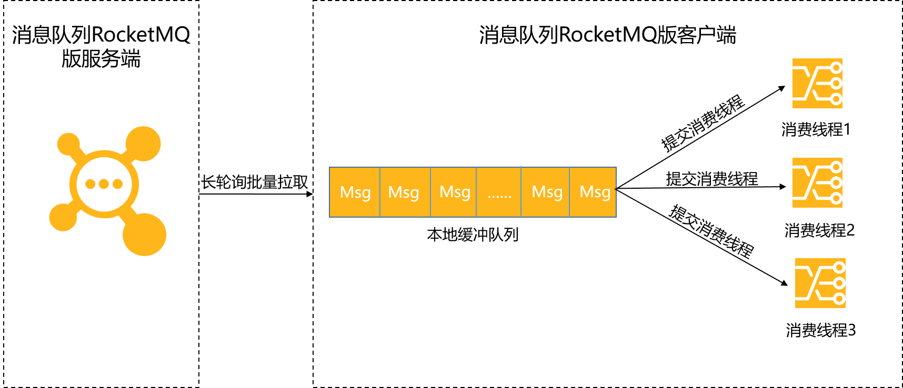

# Rocketmq最佳实践

## Topic与Tag最佳实践

在消息队列RocketMQ版中，Topic与Tag都是业务上用来归类的标识，区分在于Topic是一级分类，而Tag可以理解为是二级分类。您可通过本文了解如何搭配使用Topic和Tag来实现消息过滤。

### 背景信息

Topic和Tag的定义如下：

-   Topic

    消息主题，通过Topic对不同的业务消息进行分类。

-   Tag

    消息标签，用来进一步区分某个Topic下的消息分类，消息从生产者发出即带上的属性。

Topic和Tag的关系如下图所示。


### 适用场景

您可能会有这样的疑问：到底什么时候该用Topic，什么时候该用Tag？

建议您从以下几个方面进行判断：

-   消息类型是否一致：如普通消息、事务消息、定时（延时）消息、顺序消息，不同的消息类型使用不同的Topic，无法通过Tag进行区分。
-   业务是否相关联：没有直接关联的消息，如淘宝交易消息，京东物流消息使用不同的Topic进行区分；而同样是天猫交易消息，电器类订单、女装类订单、化妆品类订单的消息可以用Tag进行区分。
-   消息优先级是否一致：如同样是物流消息，盒马必须小时内送达，天猫超市24小时内送达，淘宝物流则相对会慢一些，不同优先级的消息用不同的Topic进行区分。
-   消息量级是否相当：有些业务消息虽然量小但是实时性要求高，如果跟某些万亿量级的消息使用同一个Topic，则有可能会因为过长的等待时间而“饿死”，此时需要将不同量级的消息进行拆分，使用不同的Topic。

总的来说，针对消息分类，您可以选择创建多个Topic，或者在同一个Topic下创建多个Tag。但通常情况下，不同的Topic之间的消息没有必然的联系，而Tag则用来区分同一个Topic下相互关联的消息，例如全集和子集的关系、流程先后的关系。

### 场景示例

以天猫交易平台为例，订单消息和支付消息属于不同业务类型的消息，分别创建\*Topic~Order~\*和\*Topic~Pay~\*，其中订单消息根据商品品类以不同的Tag再进行细分，列如电器类、男装类、女装类、化妆品类等被各个不同的系统所接收。

通过合理的使用Topic和Tag，可以让业务结构清晰，更可以提高效率。

## 消费幂等

为了防止消息重复消费导致业务处理异常，消息队列RocketMQ版的消费者在接收到消息后，有必要根据业务上的唯一Key对消息做幂等处理。本文介绍消息幂等的概念、适用场景以及处理方法。

### 什么是消息幂等

当出现消费者对某条消息重复消费的情况时，重复消费的结果与消费一次的结果是相同的，并且多次消费并未对业务系统产生任何负面影响，那么这整个过程就可实现消息幂等。

例如，在支付场景下，消费者消费扣款消息，对一笔订单执行扣款操作，扣款金额为100元。如果因网络不稳定等原因导致扣款消息重复投递，消费者重复消费了该扣款消息，但最终的业务结果是只扣款一次，扣费100元，且用户的扣款记录中对应的订单只有一条扣款流水，不会多次扣除费用。那么这次扣款操作是符合要求的，整个消费过程实现了消费幂等。

### 适用场景

在互联网应用中，尤其在网络不稳定的情况下，消息队列RocketMQ版的消息有可能会出现重复。如果消息重复会影响您的业务处理，请对消息做幂等处理。

消息重复的场景如下：

-   发送时消息重复

    当一条消息已被成功发送到服务端并完成持久化，此时出现了网络闪断或者客户端宕机，导致服务端对客户端应答失败。
    如果此时生产者意识到消息发送失败并尝试再次发送消息，消费者后续会收到两条内容相同并且Message
    ID也相同的消息。

-   投递时消息重复

    消息消费的场景下，消息已投递到消费者并完成业务处理，当客户端给服务端反馈应答的时候网络闪断。为了保证消息至少被消费一次，消息队列RocketMQ版的服务端将在网络恢复后再次尝试投递之前已被处理过的消息，消费者后续会收到两条内容相同并且Message ID也相同的消息。

-   负载均衡时消息重复（包括但不限于网络抖动、Broker重启以及消费者应用重启）

    当消息队列RocketMQ版的Broker或客户端重启、扩容或缩容时，会触发Rebalance，此时消费者可能会收到重复消息。

### 处理方法

因为不同的Message ID对应的消息内容可能相同，有可能出现冲突（重复）的情况，所以真正安全的幂等处理，不建议以Message ID作为处理依据。最好的方式是以业务唯一标识作为幂等处理的关键依据，而业务的唯一标识可以通过消息Key设置。

以支付场景为例，可以将消息的Key设置为订单号，作为幂等处理的依据。具体代码示例如下：

``` example
Message message = new Message();
message.setKey("ORDERID_100");
SendResult sendResult = producer.send(message);           
```

消费者收到消息时可以根据消息的Key，即订单号来实现消息幂等：

``` example
consumer.subscribe("ons_test", "*", new MessageListener() {
    public Action consume(Message message, ConsumeContext context) {
        String key = message.getKey()
        // 根据业务唯一标识的Key做幂等处理。
    }
});           
```

## 订阅关系一致

订阅关系一致指的是同一个消费者Group ID下所有Consumer实例所订阅的Topic、Tag必须完全一致。如果订阅关系不一致，消息消费的逻辑就会混乱，甚至导致消息丢失。本文提供订阅关系一致的正确示例代码以及订阅关系不一致的可能原因，帮助您顺畅地订阅消息。

### 背景信息

消息队列RocketMQ版里的一个消费者Group ID代表一个Consumer实例群组。对于大多数分布式应用来说，一个消费者Group ID下通常会挂载多个Consumer实例。

由于消息队列RocketMQ版的订阅关系主要由Topic+Tag共同组成，因此，保持订阅关系一致意味着同一个消费者Group ID下所有的Consumer实例需在以下方面均保持一致：

-   订阅的Topic必须一致，例如：Consumer1订阅TopicA和TopicB，Consumer2也必须订阅TopicA和TopicB，不能只订阅TopicA、只订阅TopicB或订阅TopicA和TopicC。
-   订阅的同一个Topic中的Tag必须一致，包括Tag的数量和Tag的顺序，例如：Consumer1订阅TopicB且Tag为\*Tag1\|\|Tag2\*，Consumer2订阅TopicB的Tag也必须是\*Tag1\|\|Tag2\*，不能只订阅\*Tag1\*、只订阅\*Tag2\*或者订阅\*Tag2\|\|Tag1\*。

正确的订阅关系如下，多个Group ID分别订阅了不同的Topic，但是同一个Group ID下的多个Consumer实例C1、C2、C3订阅的Topic和Tag都一致。

**注意**

消息队列RocketMQ版支持使用TCP协议和HTTP协议的SDK客户端收发消息，除了保证同一Group ID下的Consumer实例订阅关系一致，还必须保证订阅消息的Group ID的协议版本和SDK的协议版本一致，例如，使用TCP协议的SDK收发消息，订阅消息时也必须使用创建的TCP协议的Group ID，否则会导致消息消费失败。

### 正确订阅关系一：订阅一个Topic且订阅一个Tag

如下图所示，同一Group ID下的三个Consumer实例C1、C2和C3分别都订阅了TopicA，且订阅TopicA的Tag也都是\*Tag1\*，符合订阅关系一致原则。

\*正确示例代码一\*

C1、C2、C3的订阅关系一致，即C1、C2、C3订阅消息的代码必须完全一致，代码示例如下：

``` java
Properties properties = new Properties();
properties.put(PropertyKeyConst.GROUP_ID, "GID_test_1");
Consumer consumer = ONSFactory.createConsumer(properties);
consumer.subscribe("TopicA", "Tag1", new MessageListener() {
    public Action consume(Message message, ConsumeContext context) {
        System.out.println(message.getMsgID());
        return Action.CommitMessage;
    }
});                    
```

### 正确订阅关系二：订阅一个Topic且订阅多个Tag

如下图所示，同一Group ID下的三个Consumer实例C1、C2和C3分别都订阅了TopicB，订阅TopicB的Tag也都是\*Tag1\*和\*Tag2\*，表示订阅TopicB中所有Tag为\*Tag1\*或\*Tag2\*的消息，且顺序一致都是\*Tag1\|\|Tag2\*，符合订阅关系一致性原则。

\*正确示例代码二\*

C1、C2、C3的订阅关系一致，即C1、C2、C3订阅消息的代码必须完全一致，代码示例如下：

``` java
Properties properties = new Properties();
properties.put(PropertyKeyConst.GROUP_ID, "GID_test_2");
Consumer consumer = ONSFactory.createConsumer(properties);
consumer.subscribe("TopicB", "Tag1||Tag2", new MessageListener() {
    public Action consume(Message message, ConsumeContext context) {
        System.out.println(message.getMsgID());
        return Action.CommitMessage;
    }
});                    
```

### 正确订阅关系三：订阅多个Topic且订阅多个Tag

如下图所示，同一Group ID下的三个Consumer实例C1、C2和C3分别都订阅了TopicA和TopicB，且订阅的TopicA都未指定Tag，即订阅TopicA中的所有消息，订阅的TopicB的Tag都是\*Tag1\*和\*Tag2\*，表示订阅TopicB中所有Tag为\*Tag1\*或\*Tag2\*的消息，且顺序一致都是\*Tag\|\|Tag2\*，符合订阅关系一致原则。

\*正确示例代码三\*

C1、C2、C3的订阅关系一致，即C1、C2、C3订阅消息的代码必须完全一致，代码示例如下：

``` java
Properties properties = new Properties();
properties.put(PropertyKeyConst.GROUP_ID, "GID_test_3");
Consumer consumer = ONSFactory.createConsumer(properties);
consumer.subscribe("TopicA", "*", new MessageListener() {
    public Action consume(Message message, ConsumeContext context) {
        System.out.println(message.getMsgID());
        return Action.CommitMessage;
    }
});     
consumer.subscribe("TopicB", "Tag1||Tag2", new MessageListener() {
    public Action consume(Message message, ConsumeContext context) {
        System.out.println(message.getMsgID());
        return Action.CommitMessage;
    }
});                   
```

### 查看订阅关系一致性

您可在消息消息队列RocketMQ版控制台\*Group 详情\*页面查看指定Group的订阅关系是否一致。具体操作，请参见[查看消费者状态](https://help.aliyun.com/document_detail/94312.htm#concept-2047152)。若查询结果不一致，请参见[常见订阅关系不一致问题](https://help.aliyun.com/document_detail/43523.html#section-cu2-w4u-kpn)排查Consumer实例的消费代码。

### 常见订阅关系不一致问题

使用消息队列RocketMQ版收发消息时，Consumer收到的消息不符合预期并且在消息队列RocketMQ版控制台查看到订阅关系不一致，则Consumer实例可能存在以下问题：

-   错误示例一：同一Group ID下的Consumer实例订阅的Topic不同。

    如下图所示，同一Group
    ID下的三个Consumer实例C1、C2和C3分别订阅了TopicA、TopicB和TopicC，订阅的Topic不一致，不符合订阅关系一致性原则。

    错误示例代码一

    -   Consumer实例1-1：

        ``` java
        Properties properties = new Properties();
        properties.put(PropertyKeyConst.GROUP_ID, "GID_test_1");
        Consumer consumer = ONSFactory.createConsumer(properties);
        consumer.subscribe("TopicA", "*", new MessageListener() {
            public Action consume(Message message, ConsumeContext context) {
                System.out.println(message.getMsgID());
                return Action.CommitMessage;
            }
        });                    
        ```

    -   Consumer实例1-2：

        ``` java
        Properties properties = new Properties();
        properties.put(PropertyKeyConst.GROUP_ID, "GID_test_1");
        Consumer consumer = ONSFactory.createConsumer(properties);
        consumer.subscribe("TopicC", "*", new MessageListener() {
            public Action consume(Message message, ConsumeContext context) {
                System.out.println(message.getMsgID());
                return Action.CommitMessage;
            }
        });                    
        ```

    -   Consumer实例1-3：

        ``` java
        Properties properties = new Properties();
        properties.put(PropertyKeyConst.GROUP_ID, "GID_test_1");
        Consumer consumer = ONSFactory.createConsumer(properties);
        consumer.subscribe("TopicB", "*", new MessageListener() {
            public Action consume(Message message, ConsumeContext context) {
                System.out.println(message.getMsgID());
                return Action.CommitMessage;
            }
        });                    
        ```

-   错误示例二：同一Group ID下的Consumer实例订阅的Topic相同，但订阅Topic的Tag不同。

    如下图所示，同一Group ID下的三个Consumer实例C1、C2和C3分别都订阅了TopicA，但是C1订阅TopicA的Tag为\*Tag1\*，C2和C3订阅的TopicA的Tag为\*Tag2\*，订阅同一Topic的Tag不一致，不符合订阅关系一致性原则。

    **错误示例代码二**

    -   Consumer实例2-1：

        ``` java
        Properties properties = new Properties();
        properties.put(PropertyKeyConst.GROUP_ID, "GID_test_2");
        Consumer consumer = ONSFactory.createConsumer(properties);
        consumer.subscribe("TopicA", "Tag1", new MessageListener() {
            public Action consume(Message message, ConsumeContext context) {
                System.out.println(message.getMsgID());
                return Action.CommitMessage;
            }
        });                    
        ```

    -   Consumer实例2-2：

        ``` example
        Properties properties = new Properties();
        properties.put(PropertyKeyConst.GROUP_ID, "GID_test_2");
        Consumer consumer = ONSFactory.createConsumer(properties);
        consumer.subscribe("TopicA", "Tag2", new MessageListener() {
            public Action consume(Message message, ConsumeContext context) {
                System.out.println(message.getMsgID());
                return Action.CommitMessage;
            }
        });                   
        ```

    -   Consumer实例2-3：

        ``` example
        Properties properties = new Properties();
        properties.put(PropertyKeyConst.GROUP_ID, "GID_test_2");
        Consumer consumer = ONSFactory.createConsumer(properties);
        consumer.subscribe("TopicA", "Tag2", new MessageListener() {
            public Action consume(Message message, ConsumeContext context) {
                System.out.println(message.getMsgID());
                return Action.CommitMessage;
            }
        });                   
        ```

-   错误示例三：同一Group ID下的Consumer实例订阅的Topic及Topic的Tag都相同，但订阅的Tag顺序不同。

    如下图所示，同一Group ID下的三个Consumer实例C1、C2和C3分别都订阅了TopicA和TopicB，并且订阅的TopicA都没有指定Tag，订阅TopicB的Tag都是\*Tag1\*和\*Tag2\*，但是C1订阅TopicB的Tag为\*Tag1\|\|Tag2\*，C2和C3订阅的Tag为\*Tag2\|\|Tag1\*，顺序不一致，不符合订阅关系一致性原则。

    **错误示例代码三**

    -   Consumer实例3-1：

        ``` java
        Properties properties = new Properties();
        properties.put(PropertyKeyConst.GROUP_ID, "GID_test_3");
        Consumer consumer = ONSFactory.createConsumer(properties);
        consumer.subscribe("TopicA", "*", new MessageListener() {
            public Action consume(Message message, ConsumeContext context) {
                System.out.println(message.getMsgID());
                return Action.CommitMessage;
            }
        });   
        consumer.subscribe("TopicB", "Tag1||Tag2", new MessageListener() {
            public Action consume(Message message, ConsumeContext context) {
                System.out.println(message.getMsgID());
                return Action.CommitMessage;
            }
        });                         
        ```

    -   Consumer实例3-2：

        ``` java
        Properties properties = new Properties();
        properties.put(PropertyKeyConst.GROUP_ID, "GID_test_3");
        Consumer consumer = ONSFactory.createConsumer(properties);
        consumer.subscribe("TopicA", "*", new MessageListener() {
           public Action consume(Message message, ConsumeContext context) {
               System.out.println(message.getMsgID());
               return Action.CommitMessage;
           }
        }); 
        consumer.subscribe("TopicB", "Tag2||Tag1", new MessageListener() {
            public Action consume(Message message, ConsumeContext context) {
                System.out.println(message.getMsgID());
                return Action.CommitMessage;
            }
        });                   
        ```

    -   Consumer实例3-3：

        ``` java
        Properties properties = new Properties();
        properties.put(PropertyKeyConst.GROUP_ID, "GID_test_3");
        Consumer consumer = ONSFactory.createConsumer(properties);
        consumer.subscribe("TopicA", "*", new MessageListener() {
           public Action consume(Message message, ConsumeContext context) {
               System.out.println(message.getMsgID());
               return Action.CommitMessage;
           }
        }); 
        consumer.subscribe("TopicB", "Tag2||Tag1", new MessageListener() {
            public Action consume(Message message, ConsumeContext context) {
                System.out.println(message.getMsgID());
                return Action.CommitMessage;
            }
        });                   
        ```

## 消息堆积和延迟问题

本文主要介绍消息队列RocketMQ版TCP协议的Java客户端使用过程中，经常会出现的消息堆积和消息延迟的问题。通过了解消息队列RocketMQ版客户端的消费原理和消息堆积的主要原因，帮助您可以在业务部署前更好的规划资源和配置，或在运维过程中及时调整业务逻辑，避免因消息堆积和延迟影响业务运行。

### 背景信息

消息处理流程中，如果客户端的消费速度跟不上服务端的发送速度，未处理的消息会越来越多，这部分消息就被称为堆积消息。消息出现堆积进而会造成消息消费延迟。以下场景需要重点关注消息堆积和延迟的问题：

-   业务系统上下游能力不匹配造成的持续堆积，且无法自行恢复。
-   业务系统对消息的消费实时性要求较高，即使是短暂的堆积造成的消息延迟也无法接受。

### 客户端消费原理

消息队列RocketMQ版TCP协议客户端的消费流程如下图所示。



SDK客户端使用Push模式消费消息时，分为以下两个阶段：

-   阶段一：获取消息，SDK客户端通过长轮询批量拉取的方式从 消息队列RocketMQ版 服务端获取消息，将拉取到的消息缓存到本地缓冲队列中。

    SDK获取消息的方式为批量拉取，常见内网环境下都会有很高的吞吐量，例如：1个单线程单分区的低规格机器（4C8GB）可以达到几万TPS，如果是多个分区可以达到几十万TPS。所以这一阶段一般不会成为消息堆积的瓶颈。

-   阶段二：提交消费线程，SDK客户端将本地缓存的消息提交到消费线程中，使用业务消费逻辑进行处理。

    此时客户端的消费能力就完全依赖于业务逻辑的复杂度（消费耗时）和消费逻辑并发度了。如果业务处理逻辑复杂，处理单条消息耗时都较长，则整体的消息吞吐量肯定不会高，此时就会导致客户端本地缓冲队列达到上限，停止从服务端拉取消息。

通过以上客户端消费原理可以看出，消息堆积的主要瓶颈在于本地客户端的消费能力，即[消费耗时](https://help.aliyun.com/document_detail/193875.html#section-qqy-2gu-l2k)和[消费并发度](https://help.aliyun.com/document_detail/193875.html#section-86m-h0h-ng2)。想要避免和解决消息堆积问题，必须合理的控制消费耗时和消息并发度，其中消费耗时的优先级高于消费并发度，必须先保证消费耗时的合理性，再考虑消费并发度问题。

### 消费耗时

影响消费耗时的消费逻辑主要分为CPU内存计算和外部I/O操作，通常情况下代码中如果没有复杂的递归和循环的话，内部计算耗时相对外部I/O操作来说几乎可以忽略。外部I/O操作通常包括如下业务逻辑：

-   读写外部数据库，例如MySQL数据库读写。
-   读写外部缓存等系统，例如Redis读写。
-   下游系统调用，例如Dubbo调用或者下游HTTP接口调用。

这类外部调用的逻辑和系统容量您需要提前梳理，掌握每个调用操作预期的耗时，这样才能判断消费逻辑中I/O操作的耗时是否合理。通常消费堆积都是由于这些下游系统出现了服务异常、容量限制导致的消费耗时增加。

例如：某业务消费逻辑中需要写一条数据到数据库，单次消费耗时为1 ms，平时消息量小未出现异常。业务侧进行大促活动时，写数据库TPS爆发式增长，并很快达到数据库容量限制，导致消费单条消息的耗时增加到100
ms，业务侧可以明显感受到消费速度大幅下跌。此时仅通过调整消息队列RocketMQ版SDK的消费并发度并不能解决问题，需要对数据库容量进行升配才能从根本上提高客户端消费能力。

### 消费并发度

消息队列RocketMQ版消费消息的并发度计算方法如下表所示。

| 消息类型       | 消费并发度                            |
|----------------|---------------------------------------|
| 普通消息       | 单节点线程数\*节点数量                |
| 定时和延时消息 |                                       |
| 事务消息       |                                       |
| 顺序消息       | Min单（节点线程数\*节点数量，分区数） |

客户端消费并发度由单节点线程数和节点数量共同决定，一般情况下需要优先调整单节点的线程数，若单机硬件资源达到上限，则必须通过扩容节点来提高消费并发度。

单节点的并发度需要谨慎设置，不能盲目直接调大线程数，设置过大的线程数反而会带来大量的线程切换的开销。理想环境下单节点的最优线程数计算模型如下：

单机vCPU核数为C。 线程切换耗时忽略不计，I/O操作不消耗CPU。 线程有足够消息等待处理，且内存充足。 逻辑中CPU计算耗时为T1，外部I/O操作为T2。

则单个线程能达到的TPS为1/（T1+T2），如果CPU使用率达到理想状态100%，那么单机达到最大能力时需要设置C\*（T1+T2）/T1个线程。

### 如何避免消息堆积和延迟

为了避免在业务使用时出现非预期的消息堆积和延迟问题，您需要在前期设计阶段对整个业务逻辑进行完善的排查和梳理。整理出正常业务运行场景下的性能基线，才能在故障场景下迅速定位到阻塞点。其中最重要的就是梳理消息的消费耗时和消息消费的并发度。

-   梳理消息的消费耗时

    通过压测获取消息的消费耗时，并对耗时较高的操作的代码逻辑进行分析。梳理消息的消费耗时需要关注以下信息：

    -   消息消费逻辑的计算复杂度是否过高，代码是否存在无限循环和递归等缺陷。
    -   消息消费逻辑中的I/O操作（如：外部调用、读写存储等）是否是必须的，能否用本地缓存等方案规避。
    -   消费逻辑中的复杂耗时的操作是否可以做异步化处理，如果可以是否会造成逻辑错乱（消费完成但异步操作未完成）。

-   设置消息的消费并发度

    1.  逐步调大线程的单个节点的线程数，并观测节点的系统指标，得到单个节点最优的消费线程数和消息吞吐量。
    2.  得到单个节点的最优线程数和消息吞吐量后，根据上下游链路的流量峰值计算出需要设置的节点数，节点数=流量峰值/单线程消息吞吐量。

### 如何解决消息堆积和延迟问题

想要快速避免消息堆积和延迟给业务带来的影响，您可以通过消息队列RocketMQ版提供的监控报警功能，设置告警规则提前预警消息堆积问题，或通过业务埋点，触发报警事件，及时监控到消息堆积问题并进行处理。

## Group管理

### 背景信息

Group表示一类Producer或Consumer，这类Producer或Consumer通常生产或消费同一类消息，且消息发布或订阅的逻辑一致。使用消息队列RocketMQ版进行消息收发，您需要创建Group ID用于标识同一类生产者实例或者同一类消费者实例。

### 使用说明

-   Group ID不能跨实例使用，例如实例A中创建的Group ID不能在实例B中使用。
-   Group ID不能跨协议使用，消息队列RocketMQ版支持使用HTTP协议和TCP协议的SDK收发消息。如果您创建Group ID时选择的协议为\*TCP 协议\*，则该Group ID标识的客户端只能用于TCP协议的SDK收发消息，不能用于HTTP协议的SDK收发消息。
-   消费者必须有对应的Group ID，生产者不做强制要求。

### Group ID命名规范

-   Group ID推荐以“CID”或”GID”开头，长度限制为2\~64个字符，只能包含英文、数字、短划线（-）以及下划线（\_）。
-   如果Group所在实例有命名空间，则Group ID需要保证实例内唯一，不能和本实例下已有的Group ID或Topic名称重复；跨实例之间可以重名，例如实例A的Group ID可以和实例B的Group ID重复，也可以和实例B的Topic名称重复。
-   如果Group所在实例无命名空间，则Group ID需要保证跨实例和跨地域全局唯一，全局范围内不能和已有的Group ID或Topic名称重复。

## Topic管理

### 背景信息

Topic是消息队列RocketMQ版里对消息的一级归类。消息队列RocketMQ版支持发布和订阅模型，通过Topic完成消息的发布和订阅。消息生产者将消息发送到Topic中，而消息消费者则通过订阅该Topic来消费消息。

### 使用说明

Topic不能跨实例使用，例如在实例A中创建的Topic A不能在实例B中使用。

### 计费说明

消息队列RocketMQ版会对已创建的每一个Topic收取Topic资源占用费，即使Topic未使用也会产生费用，建议您及时删除不需要使用的Topic。

### Topic命名规范

-   Topic名称长度限制为3\~64个字符，只能包含英文、数字、短划线（-）以及下划线（\_）。
-   如果Topic所在的实例有命名空间，则Topic的名称需要保证实例内唯一，不能和本实例下已有的Topic名称或Group ID重复；跨实例之间可以重名，例如实例A的Topic名称可以和实例B的Topic名称重复，也可以和实例B的Group ID重复。
-   如果Topic所在的实例无命名空间，则Topic的名称需要保证跨实例和跨地域全局唯一，全局范围内不能和已有的Topic名称或Group ID重复。
