# rocketmq-console控制台

访问地址：http://localhost:8080/#/

新创建broker情况

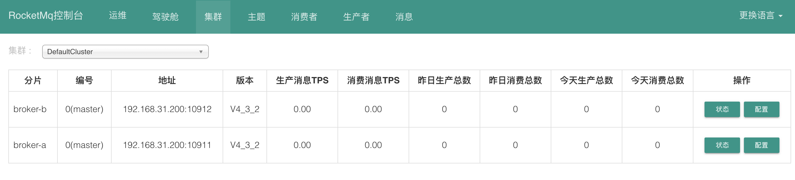

## topic

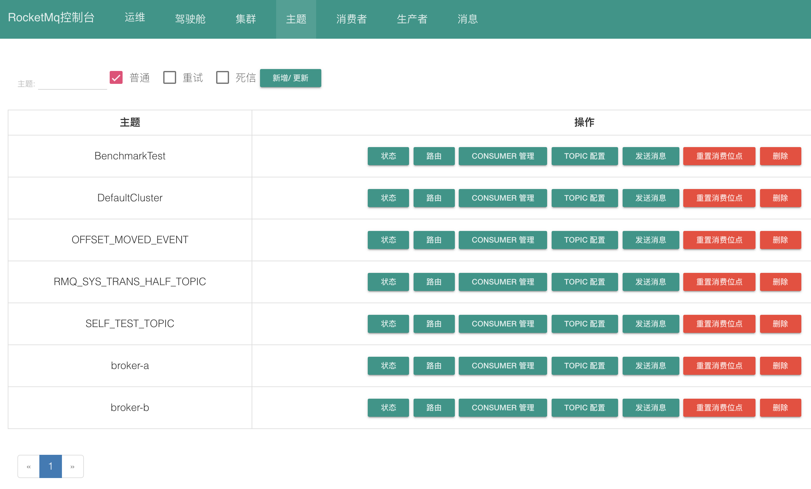

### 创建topic

队列数量为每个broker上的数量。

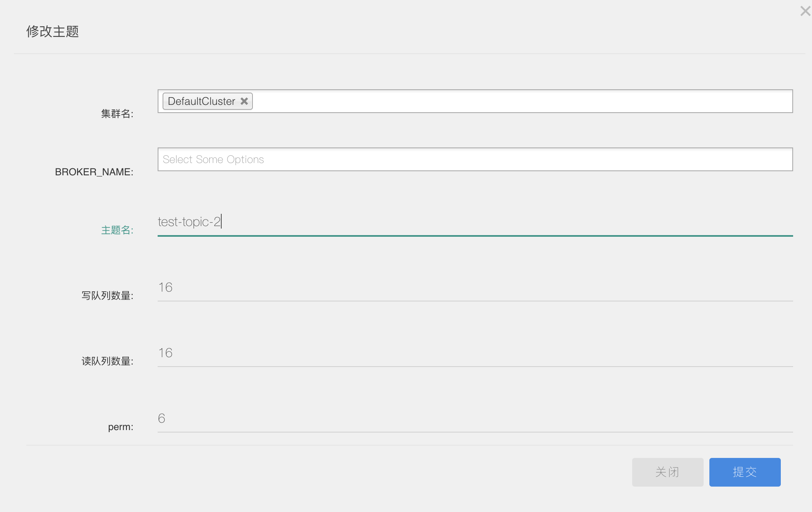

### topic状态

可以查看所有队列信息。

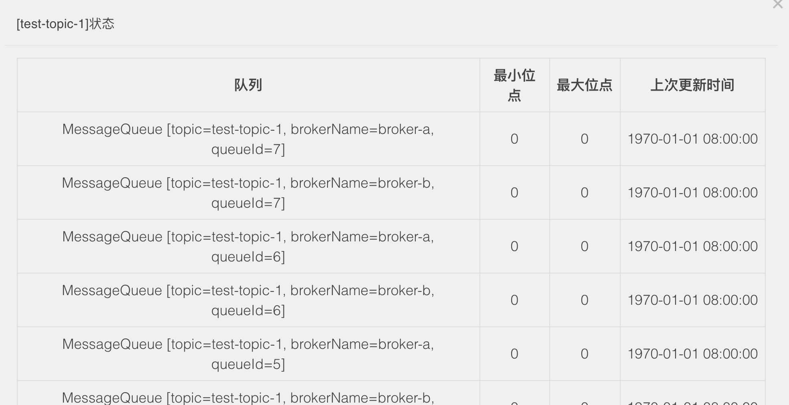

### topic路由

可以查看每个topic对应的broker和queue信息。

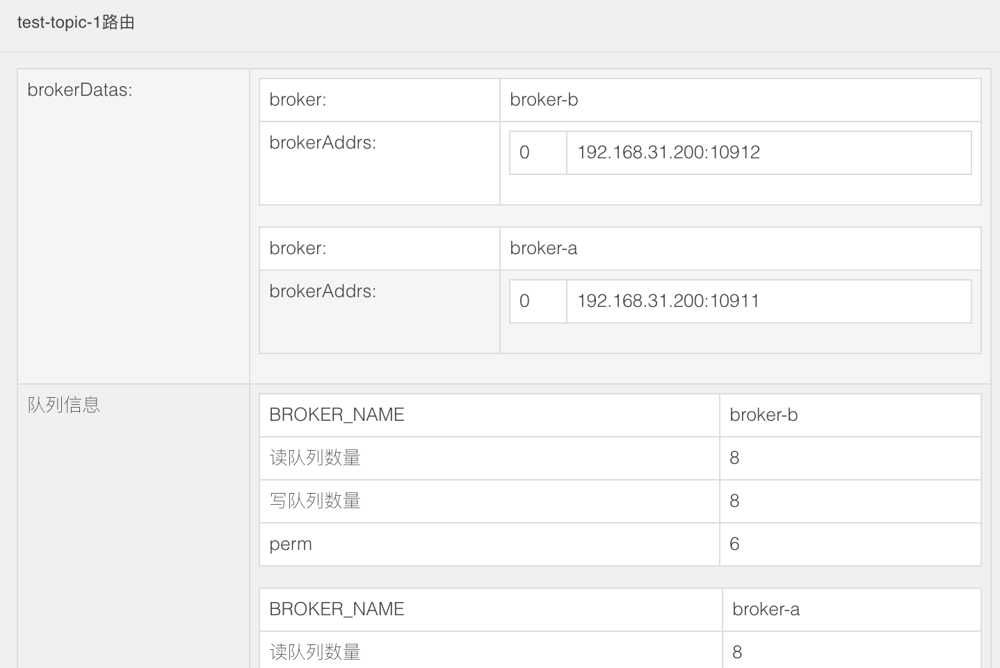

### topic修改

可以修改所有相关broker上的队列配制。

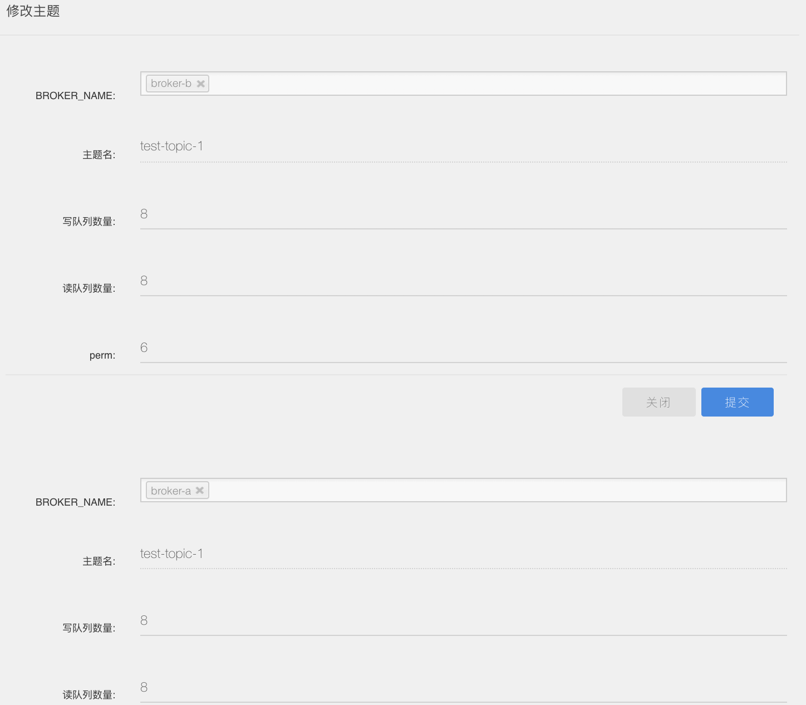

### topic发送消息

可以向topic手工发送消息。

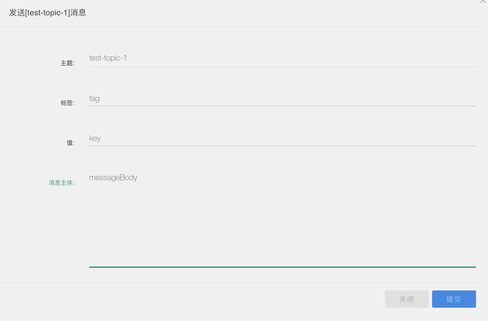

### topic消费者管理

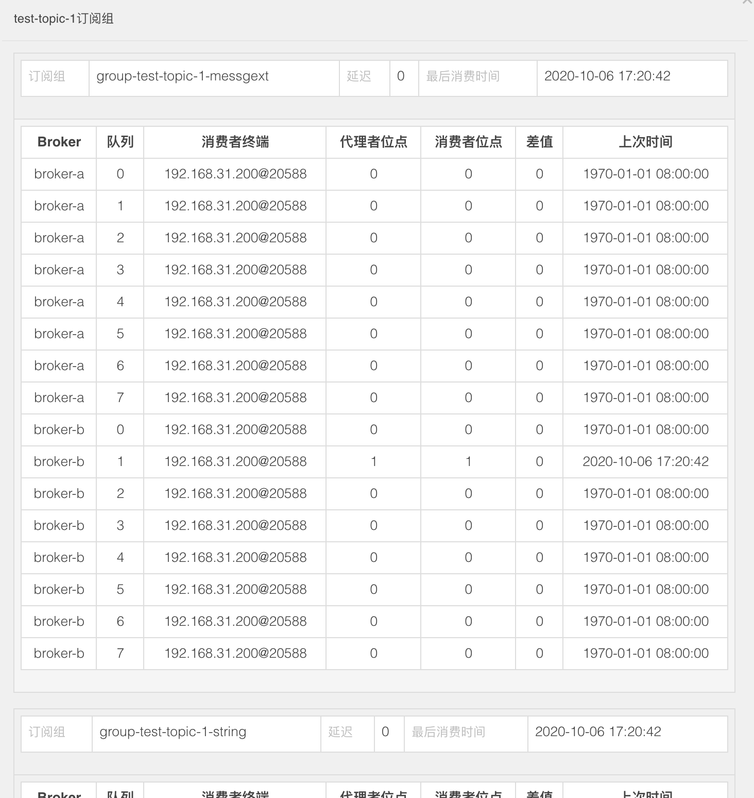

## 消费者

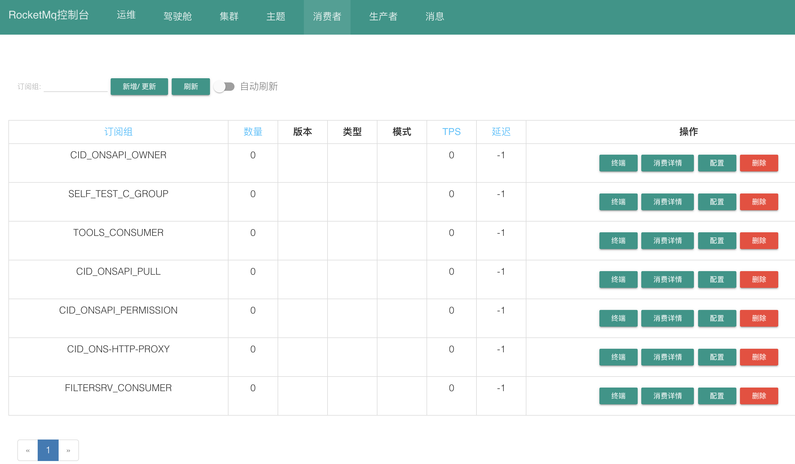

### 添加消费组

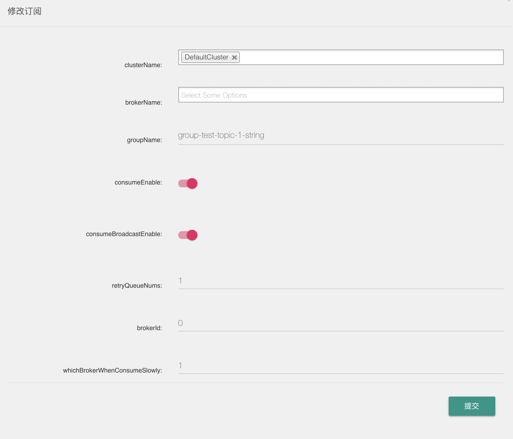

### 消费组终端

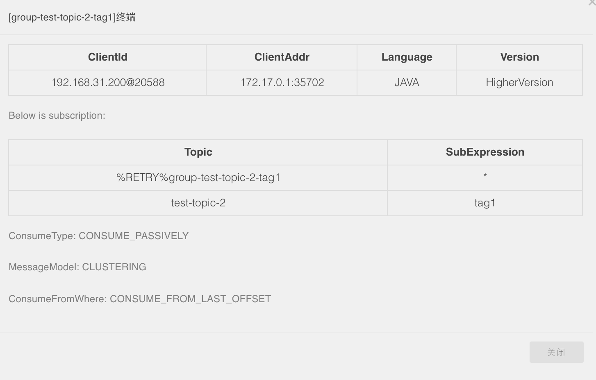

### 消费详情

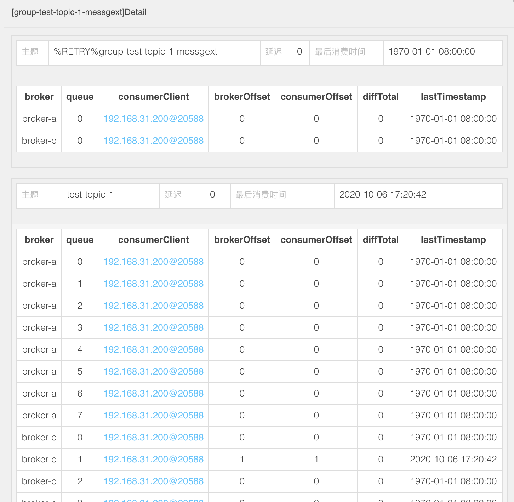

### 消费组配制

可以关闭一个broker的消费连接

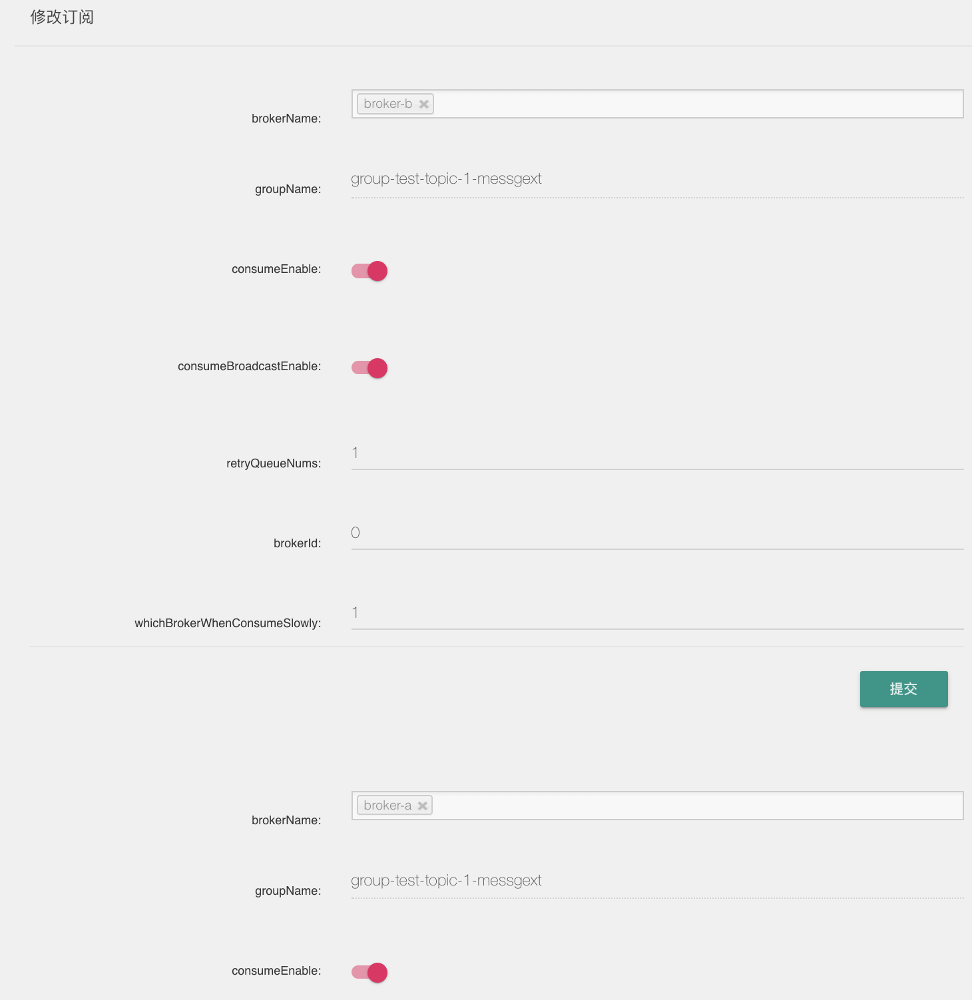
