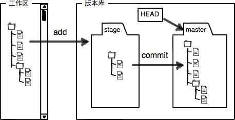

[toc]

## 版本库（Repository）

工作区（Working Directory）就是你在电脑里能看到的目录。

工作区有一个隐藏目录`.git`，这个不算工作区，而是Git的版本库。

Git的版本库里存了很多东西，其中最重要的就是称为stage（或者叫index）的暂存区，还有Git为我们自动创建的第一个分支`master`，以及指向`master`的一个指针叫`HEAD`。

把文件往Git版本库里添加的时候，是分两步执行的：

第一步是用`git add`把文件添加进去，实际上就是把文件修改添加到暂存区；

第二步是用`git commit`提交更改，实际上就是把暂存区的所有内容提交到当前分支。



## help

```
git --help
git rm --help
```

## base

git init

git add -A

git status

git commit -m "add"

git log

git log --pretty=oneline

## status

新文件未被add过，需要add：

Untracked files:

Changes not staged for commit:

## checkout

### 丢弃工作区的修改

对于已经commit的`git checkout -- file`可以丢弃工作区的修改

命令`git checkout -- readme.txt`意思就是，把`readme.txt`文件在工作区的修改全部撤销，这里有两种情况：

一种是`readme.txt`自修改后还没有被放到暂存区，现在，撤销修改就回到和版本库一模一样的状态；

一种是`readme.txt`已经添加到暂存区后，又作了修改，现在，撤销修改就回到添加到暂存区后的状态。

总之，就是让这个文件回到最近一次`git commit`或`git add`时的状态。

## remote

git remote add gitee https://gitee.com/douzh/kbase.git

git remote -v

git remote rm gitee

## push

git push gitee master

## reset

在Git中，用`HEAD`表示当前版本，上一个版本就是`HEAD^`，上上一个版本就是`HEAD^^`，当然往上100个版本写100个`^`比较容易数不过来，所以写成`HEAD~100`。

git reset --hard HEAD^

git reset --hard 1094a

## tag

删除本地

git tag -d tagname

删除远端

git push origin :refs/tags/tagname

创建后推送远端

git push --tags

删除所有远程标签

git show-ref --tag | awk '{print ":" $2}' | xargs git push origin

删除一类远程标签

git show-ref --tag | grep 2021 | awk '{print ":" $2}' | xargs git push origin

删除所有本地标签

git tag -l | xargs git tag -d

查看本地tag

git tag -l 

查看远程tag

git show-ref --tag


## reflog

Git提供了一个命令`git reflog`用来记录你的每一次命令

```
f04f67c (HEAD -> master, origin/master) HEAD@{0}: commit: topic配置化
50f73f4 HEAD@{1}: commit: 修改日志配制
9c6dbea HEAD@{2}: commit: 修改日志配制
8da2751 HEAD@{3}: commit: 修改日志配制
279daf0 HEAD@{4}: commit: 修改日志配制
1302ae0 HEAD@{5}: commit: 修改日志配制
cbcecb6 (origin/sms_consumer, sms_consumer) HEAD@{6}: merge sms_consumer: Fast-forward
```

