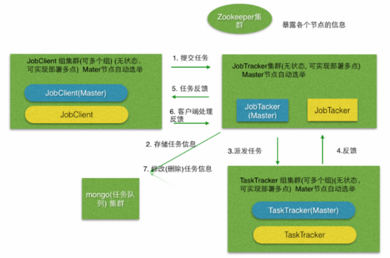

## LTS介绍

> LTS(light-task-scheduler)主要用于解决分布式任务调度问题，支持实时任务，定时任务，Cron任务，Repeat任务。有较好的伸缩性，扩展性，健壮稳定性而被多家公司使用，同时也希望开源爱好者一起贡献。

主要功能

*   支持分布式，解决多点故障，支持动态扩容，容错重试等
*   Spring扩展支持，SpringBoot支持，Spring Quartz Cron任务的无缝接入支持
*   节点监控支持，任务执行监控支持，JVM监控支持
*   后台运维操作支持, 可以动态提交，更改，停止 任务

项目地址

*   github地址:[https://github.com/ltsopensource/light-task-scheduler](https://github.com/ltsopensource/light-task-scheduler)
*   oschina地址:[http://git.oschina.net/hugui/light-task-scheduler](http://git.oschina.net/hugui/light-task-scheduler)
*   例子: [https://github.com/ltsopensource/lts-examples](https://github.com/ltsopensource/lts-examples)
*   文档地址(正在更新中): [https://www.gitbook.com/book/qq254963746/lts/details](https://www.gitbook.com/book/qq254963746/lts/details)

## LTS技术架构

> LTS 着力于解决分布式任务调度问题，将任务的提交者和执行者解耦，解决任务执行的单点故障，支持动态扩容，出错重试等机制。代码程序设计上，参考了优秀开源项目Dubbo，Hadoop的部分思想。

LTS目前支持四种任务

*   实时任务：提交了之后立即就要执行的任务。
*   定时任务：在指定时间点执行的任务，譬如 今天3点执行（单次）。
*   Cron任务：CronExpression，和quartz类似（但是不是使用quartz实现的）譬如 0 0/1 \* ?
*   Repeat任务：譬如每隔5分钟执行一次，重复50次就停止。

架构设计上，LTS框架中包含以下五种类型的节点

*   JobClient :主要负责提交任务, 并接收任务执行反馈结果。
*   JobTracker :负责任务调度，接收并分配任务。
*   TaskTracker :负责执行任务，执行完反馈给JobTracker。
*   LTS-Monitor :主要负责收集各个节点的监控信息，包括任务监控信息，节点JVM监控信息
*   LTS-Admin :管理后台）主要负责节点管理，任务队列管理，监控管理等。

架构图

## 工作流程

*   JobClient 提交一个 任务 给 JobTracker, 这里我提供了两种客户端API, 一种是如果JobTracker 不存在或者提交失败，直接返回提交失败。另一种客户端是重试客户端, 如果提交失败，先存储到本地leveldb(可以使用NFS来达到同个节点组共享leveldb文件的目的,多线程访问，做了文件锁处理)，返回给客户端提交成功的信息，待JobTracker可用的时候，再将任务提交。
*   JobTracker 收到JobClient提交来的任务，先生成一个唯一的JobID。然后将任务储存在Mongo集群中。JobTracker 发现有（任务执行的）可用的TaskTracker节点(组) 之后，将优先级最大，最先提交的任务分发给TaskTracker。这里JobTracker会优先分配给比较空闲的TaskTracker节点，达到负载均衡。
*   TaskTracker 收到JobTracker分发来的任务之后，执行。执行完毕之后，再反馈任务执行结果给JobTracker（成功or 失败\[失败有失败错误信息\]），如果发现JobTacker不可用，那么存储本地leveldb，等待TaskTracker可用的时候再反馈。反馈结果的同时，询问JobTacker有没有新的任务要执行。
*   JobTacker收到TaskTracker节点的任务结果信息，生成并插入(mongo)任务执行日志。根据任务信息决定要不要反馈给客户端。不需要反馈的直接删除, 需要反馈的（同样JobClient不可用存储文件，等待可用重发）。
*   JobClient 收到任务执行结果，进行自己想要的逻辑处理。

