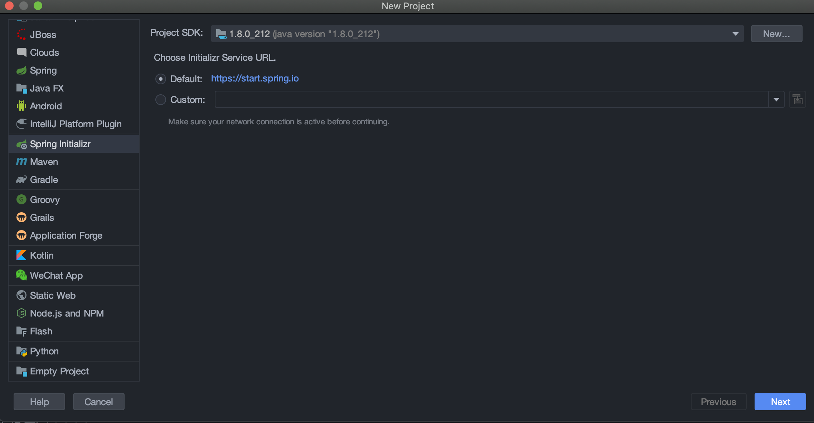
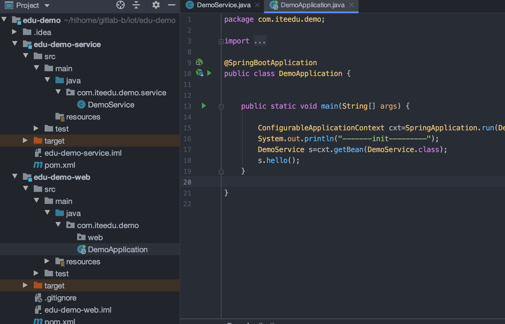

## 创建父类工程
选择Spring Initializr，Initializr默认选择Default，点击Next



删除无用的.mvn目录、src目录、mvnw及mvnw.cmd文件，最终只留.gitignore和pom.xml

看一下jdk版本是否正确：

```xml
    <properties>
        <java.version>1.8</java.version>
    </properties>
```

packaging设置成pom

```xml
<packaging>pom</packaging>
```

删除 dependencies 标签及其中的依赖，因为 Spring Boot 提供的父工程已包含，并且父 pom 原则上都是通过 dependencyManagement 标签管理依赖包。

删除 build 标签及其中的所有内容，spring-boot-maven-plugin 插件作用是打一个可运行的包，多模块项目仅仅需要在入口类 所在的模块添加打包插件，这里父模块不需要打包运行。而且该插件已被包含在 Spring Boot 提供的父工程中，这里删掉即可。

## 创建子类工程（Service与web）

选择项目根目录右键呼出菜单，选择New -> Module

选择Maven，点击Next

新模块会在父POM里自动添加，如未添加可手工添加

```xml
    <modules>
        <module>edu-demo-web</module>
        <module>edu-demo-service</module>
    </modules>
```


## 测试



```java
package com.iteedu.demo;

import com.iteedu.demo.service.DemoService;
import org.springframework.beans.factory.annotation.Autowired;
import org.springframework.boot.SpringApplication;
import org.springframework.boot.autoconfigure.SpringBootApplication;
import org.springframework.context.ConfigurableApplicationContext;

@SpringBootApplication
public class DemoApplication {


	public static void main(String[] args) {

        ConfigurableApplicationContext cxt=SpringApplication.run(DemoApplication.class, args);
	    System.out.println("-------init---------");
        DemoService s=cxt.getBean(DemoService.class);
        s.hello();
	}

}

package com.iteedu.demo.service;

import org.springframework.stereotype.Service;

@Service
public class DemoService {

    public void hello(){
        System.out.println("-------hello---------");
    }

}

```


