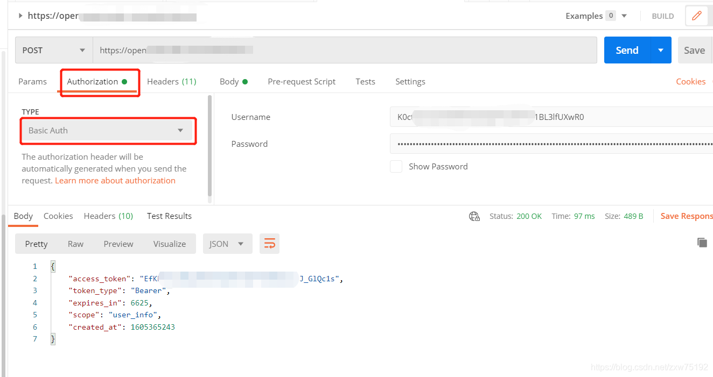
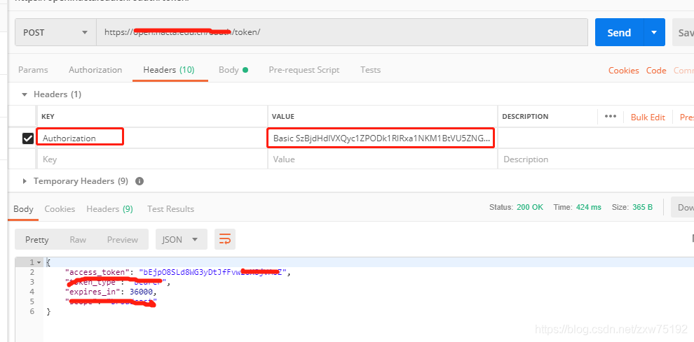

### curl 中的-u/--user username:password 在postman中如何使用

username:password形式使用的是http authentication 中的basic形式

比如说  curl -X "POST" "https://xxxxx/oauth/token/" \
    --user username:secret \
    -d "scope=baseinfo"

将username:secret进行base64加密得到  dXNlcm5hbWU6c2VjcmV0  然后前面加上一个Basic和空格,

构造一个字符串形如: Basic dXNlcm5hbWU6c2VjcmV0

然后添加到postman的header中Authorization作为键,该字符串为值
