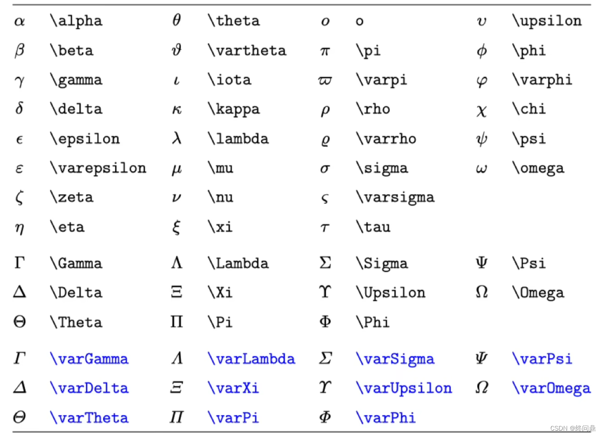
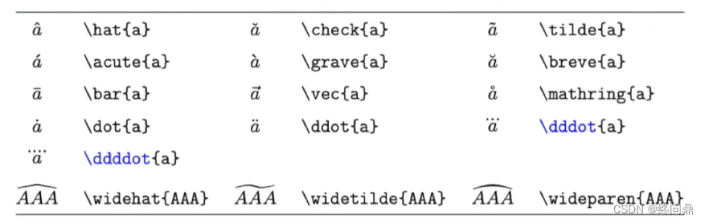
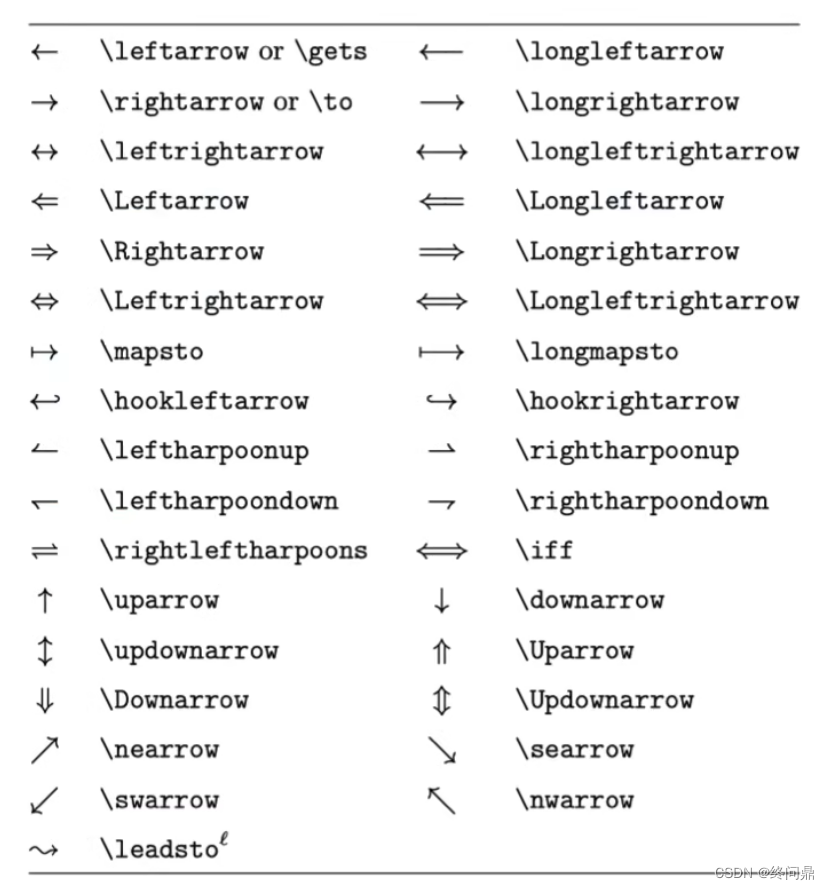

# LaTeX 的 Markdown 语法

- 上下标: 上标 ^ 下标 _
- 分式: \frac{分子}{分母} 
- 分式单个：\frac 分子 分母
- 根式: \sqrt 默认是平方根 \sqrt[ 根的次数]{数值}

## 希腊字母

大写的首字母将全拼首字母大写即可。



## 运算符

- 加，减，正负，负正，乘，点乘，除

```
+. -, $\pm$, $\mp$, $\times$, $\cdot$, $\div$
```

+. -, $\pm$, $\mp$, $\times$, $\cdot$, $\div$

- 大小于，大于等于，小于等于，远大于，远小于，不等于，约等于，恒等于

```
$>$,  $<$, $\ge$, $\le$, $\gg$, $\ll$, $\ne$, $\approx$, $\equiv$
```

$>$,  $<$, $\ge$, $\le$, $\gg$, $\ll$, $\ne$, $\approx$, $\equiv$

- 交集，并集，属于，不属于，子集，真子集，空集

```
$\cap$, $\cup$, $\in$, $\notin$, $\subseteq$, $\subsetneqq$, $\varnothing$
```
$\cap$, $\cup$, $\in$, $\notin$, $\subseteq$, $\subsetneqq$, $\varnothing$

- 对任意，存在，不存在, 因为，所以

```
$\forall$, $\exists$, $\nexists$, $\because$, $\therefore$
```

$\forall$, $\exists$, $\nexists$, $\because$, $\therefore$

- 实数集，有理数集，自然数，整数集， 正整数集

```
$\ R$, $\ Q$, $\ N$, $\ Z$, $\Z_+$
```

$\ R$, $\ Q$, $\ N$, $\ Z$, $\Z_+$

- 傅里叶，花体傅里叶， 横向省略号，竖向省略号，斜向省略号

```
$\mathcal F$, $\mathscr F$, $\cdots$, $\vdots$, $\ddots$
```

$\mathcal F$, $\mathscr F$, $\cdots$, $\vdots$, $\ddots$

- 无穷，偏微分，梯度算子，正比于，度

```
$\infty$, $\partial$, $\nabla$, $\propto$, $\degree$
```

$\infty$, $\partial$, $\nabla$, $\propto$, $\degree$

- 三角函数, 对数

```
$\sin x$, $\sec x$, $\cosh x$, $\log_2 x$, $\ln n$
```

$\sin x$, $\sec x$, $\cosh x$, $\log_2 x$, $\ln n$

- 趋于，极限，强制位置(极限位置强制到下方)

```
$\to0$,  $\lim_{x \to0}$,  $\lim\limits_{x \to0}$
```

$\to0$,  $\lim_{x \to0}$,  $\lim\limits_{x \to0}$

## 大型运算符

- 求和，求积，积分，多重积分，回路积分，双重回路积分

```
$\sum$,  $\prod$,  $\int$, $\iint$, $\iiint$,$\oint$,$\oiint$
```

$\sum$,  $\prod$,  $\int$, $\iint$, $\iiint$,$\oint$,$\oiint$

一个例子：中间的,表示空格

```
$\int_{-\infty}^0 f(x)\, \text d x$
```
$\int_{-\infty}^0 f(x)\, \text d x$

- 空格

```
$a  a$
$a\  a$
$a\quad a$
$a\qquad a$
```

$a  a$  
$a\  a$  
$a\quad a$  
$a\qquad a$  

## 标注符号
单字符向量(固定长度箭头短)，多字符向量（箭头长度随着字符数量的增多变化），单均值，多字符均值



## 箭头



## 括号，定界符

大括号，左侧上取整，右侧上取整，左侧下取整，右侧下取整，绝对值

```
$\{ \}$， $\lceil$, $\rceil$, $\lfloor$, $\rfloor$, $| |$
```

$\{ \}$， $\lceil$, $\rceil$, $\lfloor$, $\rfloor$, $| |$

## 多行公式
多行环境:\代表换行，默认右对其，可以在等号前加&实现等号对齐，具体是&后一对齐

```
$$\begin{align}
a+b=c\\a+f=d\\cd=ef
\end{align}$$
```

$$\begin{align}
a+b=c\\a+f=d\\cd=ef
\end{align}$$


## 大括号，条件表达

```
$$f(x)=
 \begin{cases}
 \sin x, -1\le x\le2\\
 \cos x, else
 \end{cases}$$
```

$$f(x)=
 \begin{cases}
 \sin x, -1\le x\le2\\
 \cos x, else
 \end{cases}$$

此外还有单纯的括号加大：

```
$$
\left(a\right),   \big(a\big)  , \Big(a\Big),  \bigg(a\bigg),   \Bigg(a\Bigg)
$$
```

$$
\left(a\right),   \big(a\big)  , \Big(a\Big),  \bigg(a\bigg),   \Bigg(a\Bigg)
$$

## 矩阵

- 转置

```
$$ \bf B^T $$
```

$$ \bf B^T $$

- 无括号

```
$$
\begin{matrix}
a & b&c&\cdots&d\\
\vdots & \vdots & \vdots & \ddots &\vdots \\
e & k & f & \cdots & 0
\end{matrix} 
$$
```

$$
\begin{matrix}
a & b&c&\cdots&d\\
\vdots & \vdots & \vdots & \ddots &\vdots \\
e & k & f & \cdots & 0
\end{matrix} 
$$


- 方括号

```
$$
\begin{bmatrix}
a & b&c&\cdots&d\\
\vdots & \vdots & \vdots & \ddots &\vdots \\
e & k & f & \cdots & 0
\end{bmatrix} 
$$
```

$$
\begin{bmatrix}
a & b&c&\cdots&d\\
\vdots & \vdots & \vdots & \ddots &\vdots \\
e & k & f & \cdots & 0
\end{bmatrix} 
$$

- 圆形括号

```
$$
\begin{pmatrix}
a & b&c&\cdots&d\\
\vdots & \vdots & \vdots & \ddots &\vdots \\
e & k & f & \cdots & 0
\end{pmatrix} 
$$
```

$$
\begin{pmatrix}
a & b&c&\cdots&d\\
\vdots & \vdots & \vdots & \ddots &\vdots \\
e & k & f & \cdots & 0
\end{pmatrix} 
$$

- 行列式写法

```
$$ 
\begin{vmatrix}
a & b&c&\cdots&d\\
\vdots & \vdots & \vdots & \ddots &\vdots \\
e & k & f & \cdots & 0
\end{vmatrix} 
$$
```

$$ 
\begin{vmatrix}
a & b&c&\cdots&d\\
\vdots & \vdots & \vdots & \ddots &\vdots \\
e & k & f & \cdots & 0
\end{vmatrix} 
$$


